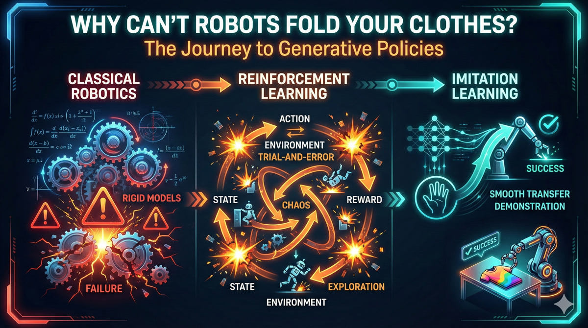

{.hero-image}

::: {.lesson-cta}
## 🚀 Start the Interactive Lesson

This lesson features custom visualizations and dialogue-based learning.

[Begin Lesson 1 →](/lessons/lesson-1-why-cant-robots-fold-clothes/index.html){.cta-button}
:::

## What You'll Learn

- **The Robot Manipulation Paradox**: Why robots that can do backflips struggle with simple household tasks
- **Classical Robotics Limitations**: The brittleness of hand-coded motion planning
- **Reinforcement Learning Challenges**: Why RL alone isn't enough for manipulation
- **Imitation Learning Breakthrough**: How learning from human demonstrations changes everything
- **Generative Policies**: The cutting-edge approach that's finally solving the problem

## Course Series

This is **Lesson 1** of the Robot Learning Bootcamp series. More lessons coming soon!
