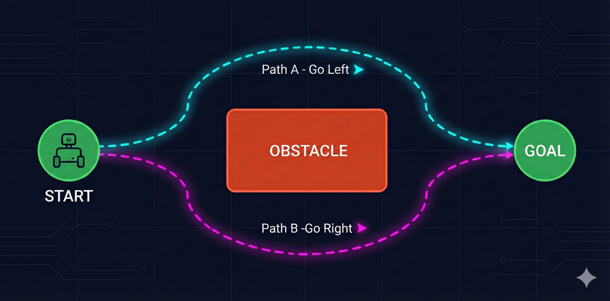
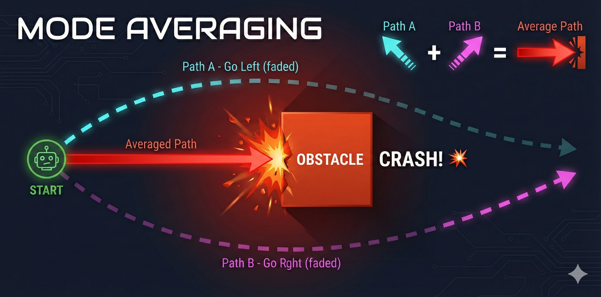
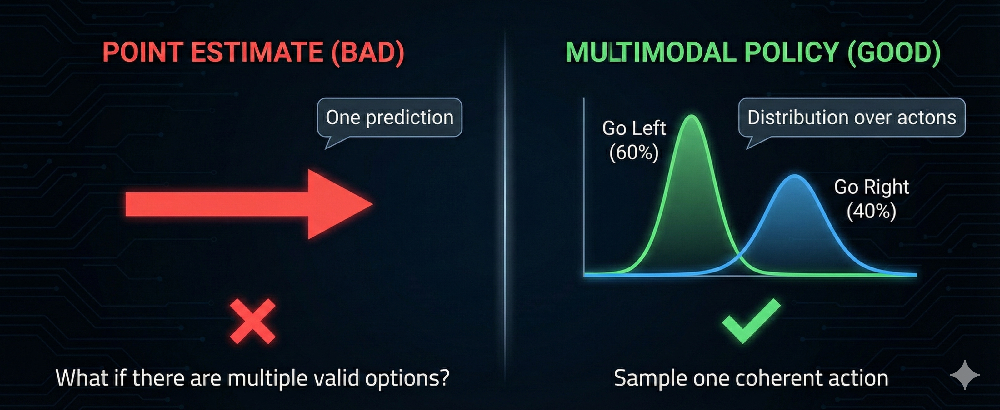
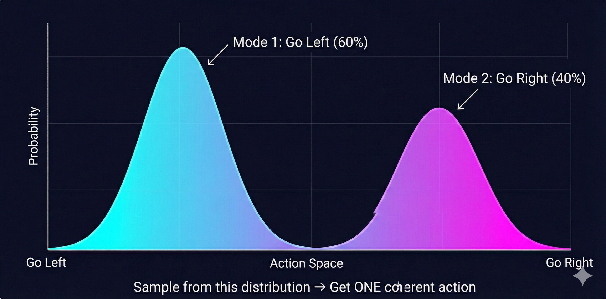

# Chapter 1: The Paradox {#chapter-1}

You've seen the videos. Boston Dynamics robots doing backflips. Humanoids playing table tennis at superhuman speed. Quadrupeds navigating obstacle courses that would trip most humans. The future of robotics looks incredible.

And yet... look around your home. Where's the robot that folds your laundry? The one that loads your dishwasher? The helpful assistant that tidies up after dinner?

Nowhere. Despite decades of robotics research and billions in investment, we don't have general-purpose household robots. We don't even have robots that can reliably *hold* clothes, let alone fold them.

::: {.callout-tip}
## Rajesh
Dr. Nova, this doesn't make sense. If robots can play football and do parkour, why can't they do something as simple as folding a shirt?
:::

::: {.callout-note}
## Dr. Nova Brooks
That's exactly the question that drove me to create this bootcamp. It's called *Moravec's Paradox* - and it reveals something profound about intelligence itself.
:::

::: {.callout-important}
## Moravec's Paradox

High-level reasoning is computationally *easy* for robots. Sensorimotor skills that humans find trivial - picking up objects, folding fabric, navigating cluttered rooms - require *enormous* computation and learning. Evolution spent billions of years optimizing our motor skills; we've had computers for less than a century.
:::

Here's another way to see the gap: think about how accessible AI has become for developers.

Three years ago, training your own language model required a research lab. Today, you can fine-tune GPT from your laptop with an API call. LLMs went from "only OpenAI can do this" to "I built one over the weekend" in record time. The barriers collapsed.

That *hasn't* happened for robotics.

::: {.callout-note}
## Dr. Nova Brooks
There's still this perception that robotics requires expensive hardware, specialized labs, and PhD-level expertise. A few companies are doing amazing work - but where's the "Hugging Face moment" for robotics? Where's the democratization?
:::

::: {.callout-tip}
## Rajesh
So what's actually blocking progress? Is it the hardware? The algorithms? The data?
:::

::: {.callout-note}
## Dr. Nova Brooks
All three - but not in the way you'd expect. Let me take you on a journey through how we've tried to solve this problem. It's a story of elegant failures, dangerous promises, and a breakthrough that still has a hidden flaw...
:::

::: {.callout-note appearance="minimal"}
## Your SO-ARM101 Journey

This is why we're using the SO-ARM101 for this bootcamp. At ~$300, it's one of the first truly accessible robot arms for learning. Four arms, 48 servos, bimanual manipulation - enough to tackle real tasks like clothes folding. By the end of this course, you'll understand *why* the robots in expo videos can't do what you'll teach your SO-ARM101 to do.
:::

---

# Chapter 2: The Beautiful Failure of Classical Robotics {#chapter-2}

::: {.callout-note}
## Dr. Nova Brooks
I have a confession. I used to *love* writing kinematic equations. There's something deeply satisfying about deriving the exact mathematical relationship between joint angles and end-effector position.
:::

Classical robotics is built on a beautiful idea: if you know the physics, you can compute the motion. Want to move a robot arm to a specific point? Just solve the equations.

```
[1] FORWARD KINEMATICS: Given angles → Find position

     θ₁ = 30°          Where does the
        ╲              gripper end up?
         ╲ L₁                ↓
          ╲
           ○ θ₂ = 45°      x = L₁·cos(θ₁) + L₂·cos(θ₁+θ₂)
            ╲              y = L₁·sin(θ₁) + L₂·sin(θ₁+θ₂)
             ╲ L₂
              ╲
               ⬡ ← gripper at (x, y)
```

::: {.callout-tip}
## Rajesh
That's just trigonometry! I remember this from physics class.
:::

::: {.callout-note}
## Dr. Nova Brooks
Exactly! Forward kinematics is straightforward - give me joint angles, I'll tell you where the gripper is. The math is clean, predictable, elegant. But here's where it gets interesting...
:::

**Think about it:** If forward kinematics is "given angles, find position"... what if you need to do it backwards? Given a target position, which angles should you use?

This is **inverse kinematics** (IK), and it's where the elegance starts to crack.

Unlike FK, IK often has multiple solutions - or no solution at all. Your robot might be able to reach a point with its elbow up *or* elbow down. Or the point might be outside its reach entirely. Suddenly, simple trigonometry becomes a constrained optimization problem.

::: {.callout-note appearance="minimal"}
## SO-ARM101: 6 Degrees of Freedom

Your SO-ARM101 has 6 joints per arm. For FK, you chain 6 transformation matrices together - still manageable. But for IK? With 6 joints, you're solving a system with multiple solutions, joint limits, and singularities (positions where the math breaks down). Now imagine coordinating *two* arms for bimanual manipulation...
:::

::: {.callout-note}
## Dr. Nova Brooks
But here's the thing - I could live with complicated IK. What really breaks classical robotics is something more fundamental. Let me show you with a simple example.
:::

Consider a simple pendulum. The equation of motion is textbook physics:

```
θ̈ = -(g/L) · sin(θ)

where:
  θ = angle from vertical
  g = gravitational acceleration
  L = pendulum length
```

::: {.callout-tip}
## Rajesh
Simple enough. So you simulate the equation and the pendulum swings correctly?
:::

::: {.callout-note}
## Dr. Nova Brooks
In simulation? Yes. In reality? It drifts. Within minutes, your predicted position diverges from the actual pendulum. Why?
:::

::: {.callout-warning}
## The Hidden Variables

That beautiful equation ignores: **air resistance** (the pendulum doesn't swing in a vacuum), **joint friction** (the pivot point has drag), **material deformation** (the rod isn't perfectly rigid), and **temperature effects** (metal expands, lubricant viscosity changes). The real world has infinite hidden variables.
:::

This is called **undermodeling** - your mathematical model doesn't capture enough of reality. And here's the cruel irony: you *can't* capture enough of reality. The real world is infinitely complex.

Now imagine trying to model a robot folding fabric. The cloth deforms unpredictably. Each fold changes the dynamics. The material properties vary across different clothes. You'd need to model every fiber.

::: {.callout-important}
## The Four Failures of Classical Robotics

**1. The Pipeline Problem:** Perception → State Estimation → Planning → Control. If *any* block fails, errors cascade through the entire system.

**2. Multimodal Data:** Classical equations can't incorporate camera images, force feedback, and joint angles simultaneously.

**3. Undermodeling:** You can never capture all real-world variables in equations.

**4. Ignoring Data:** We have massive robotics datasets now - classical methods don't use any of them.
:::

::: {.callout-tip}
## Rajesh
So the math is beautiful but it doesn't survive contact with reality. What's the alternative?
:::

::: {.callout-note}
## Dr. Nova Brooks
Around 2010, a new paradigm emerged. Instead of deriving equations, what if the robot could *learn* from experience? This is where reinforcement learning entered the picture...
:::

---

# Chapter 3: The Dangerous Promise of Reinforcement Learning {#chapter-3}

Reinforcement learning has a seductive premise: the robot doesn't need equations. It just needs to try things and learn from the results.

```
[2] REINFORCEMENT LEARNING LOOP

┌──────────────────────────────────────┐
│                                      │
│   Robot tries action                 │
│         ↓                            │
│   Environment responds               │
│         ↓                            │
│   Robot gets reward/punishment       │
│         ↓                            │
│   Robot updates strategy             │
│         ↓                            │
│   (repeat millions of times)         │
│                                      │
└──────────────────────────────────────┘
```

::: {.callout-note}
## Dr. Nova Brooks
This is how DeepMind's agents mastered Atari games and Go. No one programmed the strategy - the system discovered it through trial and error. So why not robots?
:::

Let's think through what this means for a real robot. Imagine you want to teach your SO-ARM101 to pour coffee - specifically, to pour a heart shape in the foam, like a skilled barista.

**The Coffee Pouring Task:** You tell the robot: "Try pouring. I'll give you a reward when you make a good heart shape." What could go wrong?

::: {.callout-tip}
## Rajesh
I guess the robot would spill a lot of coffee at first while it figures out how to pour?
:::

::: {.callout-note}
## Dr. Nova Brooks
That's one problem. But it gets worse. Picture the first few thousand attempts...
:::

::: {.callout-warning}
## The Coffee Disaster

Trial 1: Robot tilts cup too fast → hot milk sprays across table

Trial 47: Robot grips cup too hard → cup shatters

Trial 203: Robot finds local optimum → pours directly onto its own sensors

Trial 1,847: Still no heart shape. Kitchen is destroyed. Robot arm has burn marks from hot milk.
:::

This is the **safety problem**. RL requires exploration - trying random actions to discover what works. In a video game, random exploration is fine. In physical reality, random exploration means broken robots, damaged environments, and possibly injured humans.

::: {.callout-tip}
## Rajesh
Okay, but couldn't you train in simulation first and then transfer to the real robot?
:::

::: {.callout-note}
## Dr. Nova Brooks
That helps with safety. But there are deeper problems. Let me ask you: how would you even define the *reward* for "good heart shape"?
:::

This is the **reward design problem**. It's surprisingly hard to specify what you want.

Is a heart shape defined by symmetry? Curvature? Contrast against the coffee? Human aesthetic judgment? Different baristas make different hearts - which one is "correct"?

And even if you could define the reward perfectly, there's the **sparse reward problem**. The robot only gets positive feedback when it makes a recognizable heart. That might take tens of thousands of random attempts. Until then? Zero signal. The robot is wandering in the dark.

::: {.callout-important}
## Why RL Struggles with Real Robots

**Safety:** Random exploration damages real hardware and environments.

**Reward Design:** Specifying exactly what you want is often harder than solving the task manually.

**Sparse Rewards:** Complex tasks give feedback only at the end - the robot gets no signal during learning.

**Generalization:** An RL policy trained on one coffee cup often fails on a different cup. Each variation requires retraining.
:::

::: {.callout-tip}
## Rajesh
So classical robotics is too brittle, and RL is too dangerous and data-hungry. Is there a third option?
:::

::: {.callout-note}
## Dr. Nova Brooks
Yes. And it's surprisingly simple. What if instead of learning from scratch through trial and error... the robot just watched an expert and copied them?
:::

---

# Chapter 4: Learning Like Humans - The Imitation Breakthrough {#chapter-4}

Think about how humans actually learn motor skills. Did you learn to write by randomly scribbling until you accidentally made letters? Did you learn to pour water by spilling it thousands of times until you got lucky?

No. Someone showed you. You watched, you imitated, you refined.

::: {.callout-note}
## Dr. Nova Brooks
This is the core insight of *imitation learning*: instead of learning from rewards, learn from demonstrations. Someone who already knows how to do the task shows the robot, and the robot learns to replicate their behavior.
:::

| ❌ Reinforcement Learning | ✅ Imitation Learning |
|---------------------------|----------------------|
| Robot tries random actions → Gets reward signal → Slowly learns over millions of attempts | Expert demonstrates task → Robot observes → Robot learns to copy the expert's behavior |

Let's go back to our coffee pouring task. With imitation learning, you don't need to define a reward function. You don't need the robot to explore randomly. You just... pour the coffee yourself while the robot watches.

```
[3] IMITATION LEARNING: Observation-Action Pairs

Time    Observation (what robot sees)    Action (what expert did)
────    ───────────────────────────────  ───────────────────────
t=0     Cup at position (0, 0)           Move arm to (10, 5)
t=1     Cup at position (10, 5)          Tilt wrist 15°
t=2     Milk starting to pour            Tilt wrist 25°
t=3     Pattern forming                  Move arm left slowly
...     ...                              ...

Robot learns: "When I see THIS → I should do THAT"
```

::: {.callout-tip}
## Rajesh
Wait - so it's basically supervised learning? You have input-output pairs and you train a model to predict outputs from inputs?
:::

::: {.callout-note}
## Dr. Nova Brooks
Exactly! At its core, imitation learning is supervised learning over trajectories. The "input" is what the robot observes. The "output" is what action to take. We call this learned mapping a *policy*.
:::

```python
# The Policy Function
Policy: π(observation) → action

Input (observation):
  - Joint angles: [θ₁, θ₂, θ₃, θ₄, θ₅, θ₆]  (proprioceptive)
  - Camera image: 640×480 RGB                  (visual)
  - Force sensors: [f₁, f₂, ...]               (tactile)

Output (action):
  - Target joint positions for next timestep
  - Or: motor torques to apply
```

::: {.callout-note appearance="minimal"}
## SO-ARM101: Leader-Follower Setup

This is where your SO-ARM101's bimanual setup shines. You have **Leader arms** (that you control) and **Follower arms** (that replicate). To collect demonstrations: you move the Leader arms to fold clothes, and the system records every joint angle and camera frame. Then you train a policy to map observations → actions. The Follower arms learn to replicate your movements.
:::

The elegance of this approach is stunning. No reward engineering. No dangerous exploration. No need to derive physics equations. You just show the robot what to do.

And here's what makes it practical: we now have *massive* datasets of robot demonstrations. The LeRobot library on Hugging Face hosts datasets from research labs around the world - manipulation tasks, locomotion, tool use. The data revolution that transformed NLP is finally reaching robotics.

::: {.callout-tip}
## Rajesh
This seems almost too good to be true. You just record demonstrations and train a neural network?
:::

::: {.callout-note}
## Dr. Nova Brooks
You're right to be suspicious. There's a hidden flaw in this beautiful picture. And discovering it is one of the key insights of this entire bootcamp...
:::

---

# Chapter 5: The Plot Twist - When Good Paths Average to Disaster {#chapter-5}

::: {.callout-note}
## Dr. Nova Brooks
Let me paint you a scenario. Imagine your robot needs to navigate around an obstacle - a simple box in its path.
:::

{#fig-obstacle}

You collect demonstrations from multiple humans. Some people go left around the box. Others go right. Both paths are perfectly valid - they both reach the goal.

You train your neural network on these demonstrations. It learns to predict actions from observations.

**What happens when the robot runs?** The robot sees the obstacle. It has learned from demonstrations that went both left AND right. What does it do?

::: {.callout-tip}
## Rajesh
Hmm... maybe it picks one path? Or it learns to generalize and find its own path?
:::

::: {.callout-note}
## Dr. Nova Brooks
Neither. Let me show you what actually happens...
:::

::: {.callout-warning}
## THE REVEAL

The neural network outputs the *average* of the two paths. Half-left plus half-right equals... **straight ahead**. The robot drives directly into the obstacle.
:::

{#fig-mode-avg}

::: {.callout-important}
## The Multimodal Action Problem

When the same observation can lead to multiple valid actions, a standard neural network averages them together. This **mode averaging** produces an action that might not be valid at all. Two good solutions, averaged, become one terrible solution.
:::

::: {.callout-tip}
## Rajesh
That's... terrifying. So every time there's more than one way to do something, the robot will pick a nonsensical middle ground?
:::

::: {.callout-note}
## Dr. Nova Brooks
Think about how common this is in real tasks. When folding clothes, do you fold the left sleeve first or the right? When placing an object, do you approach from above or the side? When pouring, do you tilt slowly or quickly?
:::

This is called the **multimodal targets problem**. The word "multimodal" here means "multiple valid modes of behavior" - not multiple sensor modalities.

And it explains why naive imitation learning fails on real tasks. The training data contains multiple valid strategies. The neural network, trained to minimize prediction error, learns to predict the *average* - which is often invalid.

::: {.callout-tip}
## Rajesh
So we need something that can represent multiple options, not just a single prediction?
:::

::: {.callout-note}
## Dr. Nova Brooks
Exactly. Instead of outputting *one* action, we need to output a *distribution* over possible actions. The robot should be able to say "there's a 60% chance I should go left and a 40% chance I should go right" - and then sample from that distribution.
:::

{#fig-comparison}

::: {.callout-important}
## The Cricket Bowling Analogy

Imagine you've mastered the arm motion for bowling a cricket ball. But you're blindfolded - you can't see where the batsman is standing. No matter how perfect your technique, you'll bowl to the wrong place. **Visual input isn't optional.** Coming from LLMs, we forget this - text models don't need to "see." But robots absolutely do. The observation must include what matters for the decision.
:::

---

# Chapter 6: Probability Distributions - The Real Solution {#chapter-6}

The key insight is this: robot policies shouldn't output a single action. They should output a *probability distribution* over actions.

::: {.callout-note}
## Dr. Nova Brooks
This is where **deep generative modeling** enters the picture. Instead of training a network to predict the average action, we train it to model the entire distribution of possible actions. Then, at runtime, we *sample* from that distribution.
:::

{#fig-bimodal}

This is the foundation of modern robot learning. Techniques like **Variational Autoencoders (VAEs)**, **diffusion models**, and **transformer-based architectures** can all learn to represent these multimodal distributions.

In our next lesson, we'll dive deep into VAEs - understanding how they encode observations into a latent space and decode them into action distributions. This is the mathematical machinery that makes modern robot learning possible.

::: {.callout-note appearance="minimal"}
## What This Means for Your SO-ARM101

When you train an ACT (Action Chunking Transformer) policy on your SO-ARM101, you're training a model that outputs distributions over action sequences. When folding a shirt, the model might see two valid starting points - left sleeve or right sleeve. Instead of trying to fold some averaged middle portion, it samples one coherent strategy and commits to it.
:::

---

# Chapter 7: The Future Is Already Here {#chapter-7}

Everything we've discussed - imitation learning with multimodal policies - is already producing results that seemed impossible a few years ago.

::: {.callout-note}
## Dr. Nova Brooks
Let me tell you about a company called Physical Intelligence. They released a model called π₀ (pi-zero) that can fold clothes. Not in a controlled lab. In real homes. With varied fabrics, lighting, and furniture.
:::

::: {.callout-tip}
## Rajesh
Wait - the thing we said was impossible at the start of this lesson?
:::

::: {.callout-note}
## Dr. Nova Brooks
The thing that's been impossible for *decades*. And they did it using the exact principles we've been discussing: learning from demonstrations with generative models that handle multimodal actions.
:::

The architecture behind this breakthrough combines several ideas we'll explore in this bootcamp:

**Vision-Language Models (VLMs):** Models that understand both images and text. Given a photo and a question, they can reason about what they see. This is the "eyes" of the robot.

**Vision-Language-Action Models (VLAs):** VLMs extended to output *actions*, not just text. Now the model can see an image, understand a command ("fold this shirt"), and output motor commands.

**The OpenX Dataset:** A massive collection of robot demonstrations from labs worldwide. Standardized format, diverse tasks, multiple robot morphologies. The ImageNet moment for robotics.

**Foundation Models for Robotics:** Pre-trained on massive data, fine-tuned on specific tasks. Just like GPT is pre-trained on text and fine-tuned for conversation, robot foundation models are pre-trained on diverse manipulation data.

::: {.callout-important}
## The Accessibility Revolution

Here's what's changing: you no longer need to train from scratch. Projects like **LeRobot** from Hugging Face provide pre-trained models, standardized datasets, and training pipelines. The SO-ARM101 + LeRobot combination is designed to be the entry point that finally democratizes robot learning.
:::

---

# Chapter 8: Your Journey Begins {#chapter-8}

::: {.callout-note}
## Dr. Nova Brooks
So let's recap the journey we've taken today...
:::

| Approach | Summary |
|----------|---------|
| **Classical Robotics** | Beautiful equations, but too brittle for the real world. Can't handle uncertainty, data, or multimodal sensing. |
| **Reinforcement Learning** | Learning from experience, but dangerous, data-hungry, and hard to specify rewards for complex tasks. |
| **Imitation Learning** | Learning from demonstrations - elegant and safe. But naive approaches fail on multimodal tasks. |
| **Generative Policies** | Output distributions, not point estimates. This solves the averaging problem and enables real-world performance. |

::: {.callout-tip}
## Rajesh
So the four lessons of this bootcamp will take us from this conceptual understanding to actually implementing these policies?
:::

::: {.callout-note}
## Dr. Nova Brooks
Exactly. Here's what's coming...
:::

::: {.callout-note}
## The Bootcamp Roadmap

**Lesson 2: Deep Generative Modeling (VAEs)**
How do we represent probability distributions over actions? We'll build VAEs from scratch and understand the encoder-decoder architecture.

**Lesson 3: Transformers for Sequences**
Robot actions come in sequences. We'll implement the Transformer architecture that powers modern sequence modeling.

**Lesson 4: ACT Policy Architecture**
Combining everything: VAEs + Transformers = Action Chunking Transformers. We'll implement the full policy architecture and train it on your SO-ARM101.
:::

::: {.callout-note appearance="minimal"}
## Your Assignment

Before the next lesson, make sure you understand:

- **Why mode averaging fails** - This is the key insight
- **Probability distributions** - What's a Gaussian? What does it mean to sample?
- **Your SO-ARM101** - Get familiar with the 6 degrees of freedom per arm

We're not asking you to implement anything yet. Just build intuition. The math comes next.
:::

::: {.callout-important}
## The Big Picture

Robots that fold clothes aren't science fiction anymore. The pieces are falling into place: affordable hardware (SO-ARM101), massive datasets (OpenX), pre-trained models (LeRobot), and the theoretical understanding (imitation learning with generative policies). You're learning this at exactly the right time. The "Hugging Face moment" for robotics is happening now.
:::

---

*Dr. Nova Brooks • Physical AI Laboratory*

*Part of the **Modern Robot Learning from Scratch Bootcamp***

*Next: Lesson 2 - Deep Generative Modeling with VAEs*
