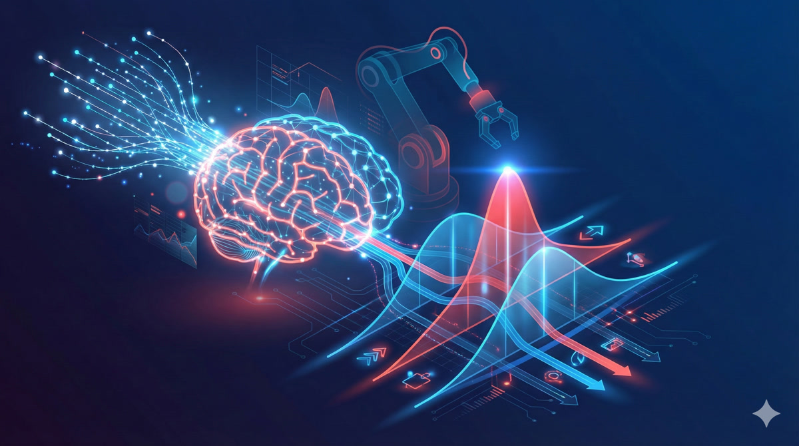

{.hero-image fig-align="center" width="100%"}

*In this lesson, we discover why predicting a single action fails for robots, and how thinking in probability distributions unlocks the power of modern robot learning.*

::: {.audio-cta}
🎧 **Prefer to listen?** Experience this lesson as an immersive classroom audio.

[Listen to Audio Version →](/lessons/lesson-2-understanding-policy-learning/classroom-player.html){.cta-button-secondary}
:::

# Chapter 1: The Multimodal Problem {#chapter-1}

::: {.callout-tip}
## Rajesh
Dr. Nova, I've been thinking about what we learned in Lesson 1. We said imitation learning is the practical path forward - collect demonstrations, train a neural network, deploy on the robot. But I tried implementing a simple policy that predicts actions from observations, and something weird happened.
:::

::: {.callout-note}
## Dr. Nova Brooks
Ah, you've discovered the multimodal problem! Tell me what happened.
:::

::: {.callout-tip}
## Rajesh
I collected 50 demonstrations of reaching around an obstacle. Sometimes I went left, sometimes I went right - both worked fine. But when I trained the network and deployed it... the robot went straight INTO the obstacle!
:::

::: {.callout-note}
## Dr. Nova Brooks
*laughs* That's the classic point estimate policy failure. Let me show you exactly why this happens.

![[1] The mode averaging disaster: when you average two good paths (left and right), you get one terrible path straight into the obstacle.](images/chapter-1-mode-averaging-labeled.jpg)

When your network outputs a single action - what we call a **point estimate** - it's essentially computing the average of all the actions it saw in training. For that obstacle scenario, half your demos went left, half went right. The average? Straight ahead. Directly into the obstacle.
:::

::: {.callout-important}
## The Point Estimate Problem
A point estimate policy outputs a single "best" action. But when expert behavior is **multimodal** (multiple valid solutions), averaging produces an action that may not match ANY of the valid modes - often the worst possible choice.
:::

::: {.callout-tip}
## Rajesh
So the problem isn't the neural network or the training process - it's the fundamental assumption that there's one "correct" action?
:::

::: {.callout-note}
## Dr. Nova Brooks
Exactly! Let me give you another example. Imagine your SO-ARM101 bimanual setup folding a shirt. Sometimes you demonstrate folding the left side first, sometimes the right side first. Both are valid. But a point estimate policy might try to fold BOTH sides simultaneously - tangling the fabric because it's averaging over incompatible strategies.

The solution? **Stop predicting THE action. Start predicting the DISTRIBUTION of possible actions.**
:::

![[2] Point estimate (left) outputs a single value. Distribution (right) captures all possibilities and their probabilities.](images/chapter-1-point-vs-distribution-labeled.jpg)

::: {.callout-tip}
## Rajesh
That's a huge shift in thinking! Instead of asking "what action should I take?", we're asking "what are ALL the actions I could take, and how likely is each one?"
:::

::: {.callout-note}
## Dr. Nova Brooks
You've got it. And this shift from point estimates to distributions is exactly what **deep generative modeling** gives us. It's the key technology that makes modern robot policies like ACT (Action Chunking with Transformers) actually work.
:::

# Chapter 2: Thinking in Distributions {#chapter-2}

::: {.callout-tip}
## Rajesh
Okay, I understand WHY we need distributions. But how do we actually work with them? A probability distribution seems so... abstract.
:::

::: {.callout-note}
## Dr. Nova Brooks
Let's build your intuition from something familiar. Imagine I measure the heights of 100 students in a classroom and plot them on a histogram.

![[3] From scattered samples (bottom) to histogram (middle) to smooth distribution (top) - the underlying pattern emerges.](images/chapter-2-samples-to-distribution-labeled.jpg)

What you'll see is that most students cluster around the average height, with fewer at the extremes. That histogram approximates a **probability distribution** - specifically, a Gaussian or "bell curve."
:::

::: {.callout-tip}
## Rajesh
So the distribution tells us: "If I pick a random student, what's the probability they're between 5'6" and 5'8"?"
:::

::: {.callout-note}
## Dr. Nova Brooks
Precisely! Now here's the key insight: we can think about almost ANYTHING as having an underlying probability distribution. Images. Text. Robot trajectories.

Consider all possible images of cats. There's some incredibly complex, high-dimensional distribution over "valid cat images." Most random pixel arrangements are NOT cats - they have zero probability under this distribution. But actual cat photos have high probability.
:::

![[4] An abstract probability landscape representing "all possible cats" - high probability regions glow brightly, low probability regions fade to darkness.](images/chapter-2-cat-distribution.jpg)

::: {.callout-important}
## Deep Generative Modeling Definition
**Deep Generative Modeling** uses neural networks to learn probability distributions from data. Given training samples, we learn P_theta (a parameterized distribution) that approximates the true data distribution P_data. We can then **sample** from P_theta to generate new, valid data.
:::

::: {.callout-tip}
## Rajesh
So for robot learning, we want to learn the distribution of "valid expert trajectories"?
:::

::: {.callout-note}
## Dr. Nova Brooks
Exactly! And more specifically, we want to learn P(actions | observations) - given what the robot currently sees, what's the distribution of appropriate actions?

The challenge is that this distribution can be incredibly complex - high-dimensional, multimodal, with intricate dependencies between timesteps. That's where deep generative models come in. They use neural networks to represent these complex distributions in tractable ways.
:::

# Chapter 3: KL Divergence Demystified {#chapter-3}

::: {.callout-tip}
## Rajesh
Okay, so we're trying to learn P_theta that matches P_data. But how do we measure if two distributions are "close" to each other? It's not like we can just subtract them.
:::

::: {.callout-note}
## Dr. Nova Brooks
Great question! The standard tool for this is **KL Divergence** - it measures how different two probability distributions are.

![[5] Two distributions P (blue curve = ground truth) and Q (orange curve = our model's approximation). KL divergence measures the gap between them - the colored area shows where they differ.](images/chapter-3-kl-divergence-labeled.jpg)

The formal definition is:

$$KL(P || Q) = \sum P(x) \cdot \log\frac{P(x)}{Q(x)}$$

But the intuition is more important than the math.
:::

::: {.callout-tip}
## Rajesh
What's the intuition?
:::

::: {.callout-note}
## Dr. Nova Brooks
Think of it as the "surprise" you'd experience if you assumed Q was true, but data actually came from P.

If Q assigns low probability to something P says is common, you'd be very surprised when it happens - that's a high KL divergence. If Q and P agree on what's likely and unlikely, minimal surprise - low KL divergence.
:::

![[6] KL divergence as the "energy" or "effort" needed to reshape one distribution into another.](images/chapter-3-kl-energy-labeled.jpg)

::: {.callout-important}
## KL Divergence Properties
- **Always non-negative**: KL(P||Q) ≥ 0
- **Zero only when identical**: KL(P||Q) = 0 ⟺ P = Q
- **Asymmetric**: KL(P||Q) ≠ KL(Q||P) in general
- **Not a true distance**: Doesn't satisfy triangle inequality
:::

::: {.callout-tip}
## Rajesh
So when we train a deep generative model, we're essentially minimizing the KL divergence between our learned distribution and the true data distribution?
:::

::: {.callout-note}
## Dr. Nova Brooks
That's the ideal, yes. In practice, we can't compute the true data distribution P_data directly - we only have samples from it. But clever training objectives (like the ELBO we'll discuss later) let us minimize KL divergence indirectly.

This is crucial for understanding VAEs: the regularization term in their loss function IS a KL divergence - specifically, forcing the learned latent distribution to be close to a standard Gaussian.
:::

# Chapter 4: The Secret Recipe (Latent Variables) {#chapter-4}

::: {.callout-tip}
## Rajesh
Before we dive into VAEs specifically, can you explain this concept of "latent variables" I keep seeing? What are they?
:::

::: {.callout-note}
## Dr. Nova Brooks
Let me explain with a thought experiment. Imagine you collect handwriting samples from 100 students - everyone writes the word "hello." Each sample looks different. Now, here's the question: **what hidden factors determine each person's handwriting style?**
:::

::: {.callout-tip}
## Rajesh
Hmm... maybe how much pressure they apply, whether they slant left or right, how fast they write, how neat they are?
:::

::: {.callout-note}
## Dr. Nova Brooks
Exactly! These hidden factors - pressure, slant, speed, neatness - are not directly visible in the final image. But they CAUSE the differences we observe. In machine learning, we call these **latent variables**.

![[7] A 2D latent space where x-axis represents slant and y-axis represents neatness. Each handwriting sample maps to a point in this space.](images/chapter-4-latent-space-labeled.jpg)
:::

::: {.callout-tip}
## Rajesh
So every handwriting sample can be described by a "secret recipe" of these hidden factors?
:::

::: {.callout-note}
## Dr. Nova Brooks
I love that analogy! Yes, think of it like a machine with hidden knobs:

![[8] The "secret recipe machine" - turn the knobs (latent variables) and the machine produces handwriting that matches those settings.](images/chapter-4-hidden-recipe-machine.jpg)

If I know Rohan writes with:
- Slant: slightly right
- Pressure: medium
- Speed: fast
- Neatness: low

Then I can uniquely identify his handwriting style. These knob settings ARE the latent variables.
:::

::: {.callout-important}
## Latent Variables (Z)
**Latent variables** are low-dimensional hidden factors that explain the variation in high-dimensional data. They're not directly observed but are inferred during training. The decoder can generate data from any point in latent space.
:::

::: {.callout-tip}
## Rajesh
And for robotics, the latent variables would capture things like... folding style? Speed preference? Which arm moves first?
:::

::: {.callout-note}
## Dr. Nova Brooks
Precisely! For your SO-ARM101 folding task, the latent space might encode:
- Overall movement speed
- Grip force preference
- Left-first vs right-first tendency
- Precision vs speed tradeoff

Different demonstrations from different people would map to different regions of this latent space. And crucially - you can SAMPLE from this space to generate new, valid trajectories with different styles!
:::

# Chapter 5: The Encoder - Compressing Reality {#chapter-5}

::: {.callout-tip}
## Rajesh
Okay, so latent variables are the "secret recipe." But how do we find them? Given a handwriting sample, how do we know its slant and neatness values?
:::

::: {.callout-note}
## Dr. Nova Brooks
That's the job of the **encoder**! The encoder is a neural network that takes high-dimensional data (like a 28×28 pixel image = 784 dimensions) and compresses it down to the latent representation.

![[9] The encoder compresses 784 pixels (left: 28×28 grid) down to just 2 latent values μ and σ (right). This 392x compression captures only the essential information.](images/chapter-5-encoder-labeled.jpg)
:::

::: {.callout-tip}
## Rajesh
Wait, 784 dimensions down to 2? That's an insane compression ratio!
:::

::: {.callout-note}
## Dr. Nova Brooks
It is! And that's exactly the point. The encoder learns to extract only the ESSENTIAL information - the factors that actually matter for reconstruction. All the redundancy, all the noise, gets thrown away.

For MNIST digits, you can capture the essential identity of a digit in just 2-10 dimensions. For robot trajectories (12 joints × 100 timesteps = 1200 dimensions), you might use 64 or 128 latent dimensions.
:::

::: {.callout-important}
## Encoder Architecture (MNIST Example)
- **Input**: 784 pixels (28×28 flattened image)
- **Hidden layer**: 400 neurons with ReLU
- **Output**: 4 values (2 for mean μ, 2 for variance σ)
- **Compression**: 784 → 400 → 4
:::

::: {.callout-tip}
## Rajesh
Hold on - you said the encoder outputs mean AND variance? Not just a point in latent space?
:::

::: {.callout-note}
## Dr. Nova Brooks
Ah, you've noticed the crucial detail! This is what makes it a **Variational** Autoencoder. The encoder doesn't output a single point - it outputs a DISTRIBUTION.

![[10] The encoder outputs a distribution (the fuzzy cloud) not a single point. This is the "variational" insight.](images/chapter-5-distribution-output-labeled.jpg)

It says: "This image probably came from somewhere in THIS REGION of latent space" - not "it came from exactly THIS point."
:::

::: {.callout-tip}
## Rajesh
But why? What's wrong with just outputting a point?
:::

::: {.callout-note}
## Dr. Nova Brooks
If every image maps to a single point, you get GAPS in your latent space. If you try to sample from those gaps, you get garbage - the decoder doesn't know what to do with latent values it's never seen.

But if images map to overlapping distributions (fuzzy blobs), the entire space gets "covered." Every point in latent space is near something meaningful, so sampling works everywhere. That's the magic of VAEs!
:::

# Chapter 6: The Decoder - Reconstructing the World {#chapter-6}

::: {.callout-tip}
## Rajesh
So the encoder compresses data into a latent distribution. What about the decoder?
:::

::: {.callout-note}
## Dr. Nova Brooks
The decoder does the reverse! It takes a point from latent space and reconstructs the original data.

![[11] The decoder expands 2 latent dimensions back to 784 pixels - the reverse of encoding.](images/chapter-6-decoder-labeled.jpg)

For MNIST, the decoder architecture might be:
- **Input**: 2 latent dimensions (sampled from encoder's distribution)
- **Hidden layer**: 400 neurons
- **Output**: 784 pixel values (reconstructed image)
:::

::: {.callout-tip}
## Rajesh
So if I move around in latent space, the decoder output changes smoothly?
:::

::: {.callout-note}
## Dr. Nova Brooks
Exactly! Watch what happens as we traverse the latent space:

![[12] Moving through latent space produces smooth transitions in the decoded output - different digits/styles emerge at different locations.](images/chapter-6-latent-traversal.jpg)

This is called **latent space interpolation**. You can smoothly morph between a "3" and an "8", or between fast-writing and slow-writing styles. The transitions are continuous, not abrupt.
:::

::: {.callout-important}
## Decoder as a Generative Model
The decoder is really a **generative model**: given any point z in latent space, it produces a data sample. Combined with the prior P(z), this gives us P(x) = ∫ P(x|z)P(z)dz - a full generative model over data!
:::

::: {.callout-tip}
## Rajesh
So to generate new handwriting, I just sample a random z from a Gaussian and decode it?
:::

::: {.callout-note}
## Dr. Nova Brooks
That's the idea! And this is incredibly powerful for robotics. Once you've trained the VAE on expert demonstrations, you can:

1. **Sample a latent code z** (representing a "style" or "intent")
2. **Decode it** to get a complete trajectory
3. **Execute on SO-ARM101**

Each sample gives you a different, but valid, way to accomplish the task.
:::

# Chapter 7: Why "Variational"? The Distribution Trick {#chapter-7}

::: {.callout-tip}
## Rajesh
You've mentioned the "variational" part several times. What exactly makes a VAE different from a regular autoencoder?
:::

::: {.callout-note}
## Dr. Nova Brooks
Great question! Let me show you the problem with regular autoencoders:

![[13] Left: THE PROBLEM - Plain autoencoder maps to isolated points with dead zones (gaps). Right: THE SOLUTION - VAE maps to overlapping distributions, filling the entire latent space.](images/chapter-7-sparse-vs-dense-labeled.jpg)

A plain autoencoder maps each input to a specific point in latent space. This creates GAPS - regions with no training data. If you try to decode from a gap, you get nonsense.
:::

::: {.callout-tip}
## Rajesh
Because the decoder never saw those latent values during training?
:::

::: {.callout-note}
## Dr. Nova Brooks
Exactly! Now here's the VAE insight: instead of mapping to points, map to **distributions** (fuzzy blobs). Make these distributions overlap.

![[14] Overlapping distributions fill the latent space - any point decodes to something meaningful.](images/chapter-7-overlap-labeled.jpg)

Now the entire latent space is "covered." Any point you sample is near training data from multiple inputs. The decoder can interpolate sensibly.
:::

::: {.callout-important}
## The Variational Difference
| Aspect | Plain Autoencoder | VAE |
|--------|-------------------|-----|
| Encoder output | Single point z | Distribution (μ, σ) |
| Latent space | Sparse, gaps | Dense, overlapping |
| Generation | Poor (gaps produce garbage) | Good (everywhere meaningful) |
| Loss function | Reconstruction only | Reconstruction + KL regularization |
:::

::: {.callout-tip}
## Rajesh
And the "variational" name comes from...?
:::

::: {.callout-note}
## Dr. Nova Brooks
From **variational inference** - a technique in Bayesian statistics for approximating intractable probability distributions. The VAE's training objective (ELBO) comes from variational inference theory.

But for practical purposes, just remember: "variational" means we output distributions instead of points, and we regularize those distributions to be nice Gaussians. This is what enables generation!
:::

# Chapter 8: Training VAEs - The ELBO {#chapter-8}

::: {.callout-tip}
## Rajesh
Okay, I understand the architecture: encoder outputs (μ, σ), we sample z, decoder reconstructs. But how do we actually train this? What's the loss function?
:::

::: {.callout-note}
## Dr. Nova Brooks
The ideal goal is to maximize the log-likelihood: log P(x) - the probability of our training data under the model. But this requires integrating over all possible z values, which is intractable.

Instead, we maximize a **lower bound** on log P(x) called the **ELBO** (Evidence Lower Bound):

$$\text{ELBO} = \underbrace{\mathbb{E}_{z \sim q}[\log P(x|z)]}_{\text{Reconstruction}} - \underbrace{KL(q(z|x) || P(z))}_{\text{Regularization}}$$
:::

![[15] The ELBO as a balance scale: reconstruction quality on one side, regularization (KL term) on the other. Both must be optimized together - too much either way hurts the model.](images/chapter-8-elbo-balance-labeled.jpg)

::: {.callout-tip}
## Rajesh
So there are two terms - reconstruction and regularization?
:::

::: {.callout-note}
## Dr. Nova Brooks
Exactly! Let me explain each:

**Reconstruction Loss**: Does the decoder output look like the input? For images, this is typically MSE or binary cross-entropy between input and reconstruction. This term pushes the VAE to encode information that's useful for reconstruction.

**KL Regularization**: Is the encoder's output distribution close to a standard Gaussian N(0,1)? This term prevents the encoder from creating crazy, scattered latent representations. It forces the latent space to be organized.
:::

![[16] The regularization term pulls scattered distributions toward a nice Gaussian shape.](images/chapter-8-regularization-labeled.jpg)

::: {.callout-important}
## ELBO Loss Implementation
```python
# Reconstruction: how well does output match input?
recon_loss = F.mse_loss(x_reconstructed, x_original)

# KL: how close is encoder output to N(0,1)?
kl_loss = -0.5 * torch.sum(1 + log_var - mu**2 - log_var.exp())

# Total ELBO loss (we minimize, so negate)
loss = recon_loss + beta * kl_loss
```
:::

::: {.callout-tip}
## Rajesh
What's that β (beta) term?
:::

::: {.callout-note}
## Dr. Nova Brooks
β is a hyperparameter that balances reconstruction vs regularization. Standard VAE uses β=1.

- **Higher β**: Stronger regularization → more Gaussian latent space → better generation, but possibly blurrier reconstructions
- **Lower β**: Better reconstruction → but latent space might have gaps → worse generation

This tradeoff is explored in the **β-VAE** paper. For robotics, you typically tune β based on whether you care more about accurate reproduction or diverse generation.
:::

# Chapter 9: From Digits to Robots {#chapter-9}

::: {.callout-tip}
## Rajesh
This all makes sense for MNIST digits. But how does it apply to robot learning?
:::

::: {.callout-note}
## Dr. Nova Brooks
Great question! Let's make the connection explicit. For robot policy learning, we want to learn:

$$P(\text{actions} | \text{observations})$$

This is EXACTLY what a **Conditional VAE (CVAE)** does! Instead of just generating data, we generate data CONDITIONED on some input.

![[17] Conditional VAE for robotics: KEY INSIGHT - observations condition BOTH the encoder AND decoder paths. The encoder learns style/intent (z), the decoder generates actions conditioned on observations + z.](images/chapter-9-conditional-vae-labeled.jpg)
:::

::: {.callout-tip}
## Rajesh
So the observation is like a "prompt" that tells the VAE what kind of output to generate?
:::

::: {.callout-note}
## Dr. Nova Brooks
Exactly! Here's how ACT (Action Chunking with Transformers) uses these ideas:

![[18] The ACT architecture: observations → transformer encoder with VAE latent → transformer decoder → action chunk.](images/chapter-9-act-preview-labeled.jpg)

1. **Observations** (camera images, joint angles) go through a vision transformer encoder
2. The **VAE component** captures "style" or "intent" in a latent variable z
3. The **transformer decoder** attends to observations and z to generate a CHUNK of future actions
4. The action chunk is executed on your SO-ARM101

The VAE latent captures things like "fold left first vs right first" or "fast vs careful." Sampling different z values at inference gives you different valid strategies!
:::

::: {.callout-important}
## From MNIST VAE to Robot Policy
| MNIST VAE | Robot Policy (ACT) |
|-----------|-------------------|
| Input: 28×28 image | Input: Camera images + joint angles |
| Latent: 2D (slant, neatness) | Latent: 64D (style, intent) |
| Output: Reconstructed image | Output: Action sequence (12 joints × 100 steps) |
| Loss: ELBO | Loss: ELBO + action prediction |
:::

::: {.callout-tip}
## Rajesh
So understanding VAEs is essential for understanding ACT?
:::

::: {.callout-note}
## Dr. Nova Brooks
Absolutely! ACT is built on VAE foundations. The encoder-decoder structure, the latent sampling, the ELBO training - it's all there. The difference is:

1. ACT conditions on observations (CVAE)
2. ACT uses transformers instead of MLPs
3. ACT outputs action chunks instead of images

But the core insight - learning distributions over outputs using latent variables - is exactly what we covered today. When you look at the ACT paper, you'll recognize every component!
:::

::: {.callout-tip}
## Rajesh
This is incredible. So the mode-averaging problem we started with - where going left AND right averages to going straight into the obstacle - is solved because...
:::

::: {.callout-note}
## Dr. Nova Brooks
Because we sample ONE coherent trajectory from the learned distribution! The distribution might have two modes (left and right), but when we sample, we commit to one of them. No averaging, no compromise, no crashing into obstacles.

That's the power of deep generative modeling for robot learning. Next lesson, we'll dive into the transformer architecture that makes ACT so powerful for generating coherent action sequences. But the foundation - thinking in distributions, learning with VAEs - that's what you learned today.
:::

::: {.callout-important}
## Key Takeaways from Lesson 2

1. **Point estimate policies fail** on multimodal behavior - averaging incompatible modes produces invalid actions

2. **Deep generative models** learn probability distributions, enabling sampling of coherent outputs

3. **KL divergence** measures distance between distributions - essential for training generative models

4. **Latent variables** are hidden factors that explain variation - the "secret recipe" for generating data

5. **VAE architecture**: Encoder (data → distribution) + Sampling + Decoder (latent → data)

6. **The "variational" trick**: Output distributions, not points, to fill latent space and enable generation

7. **ELBO training**: Balance reconstruction quality against latent space regularization

8. **For robotics**: Conditional VAEs predict P(actions | observations) - exactly what policies need

9. **ACT connection**: ACT uses VAE principles with transformer encoder/decoder for action chunk generation
:::

---

## Homework

1. **Run the MNIST VAE notebook**: Train a VAE on digits, visualize the latent space, experiment with generation

2. **Study Conditional VAEs**: Read [this excellent blog post](https://ijdykeman.github.io/ml/2016/12/21/cvae.html) on CVAEs - it's directly relevant to ACT

3. **Prepare for Transformers**: Review attention mechanisms, Q/K/V computation, encoder-decoder architectures - we'll need these for Lesson 3

---

*Next lesson: We'll dive into the Transformer architecture that powers ACT's action sequence generation. The VAE foundation you learned today will make that architecture click into place.*
