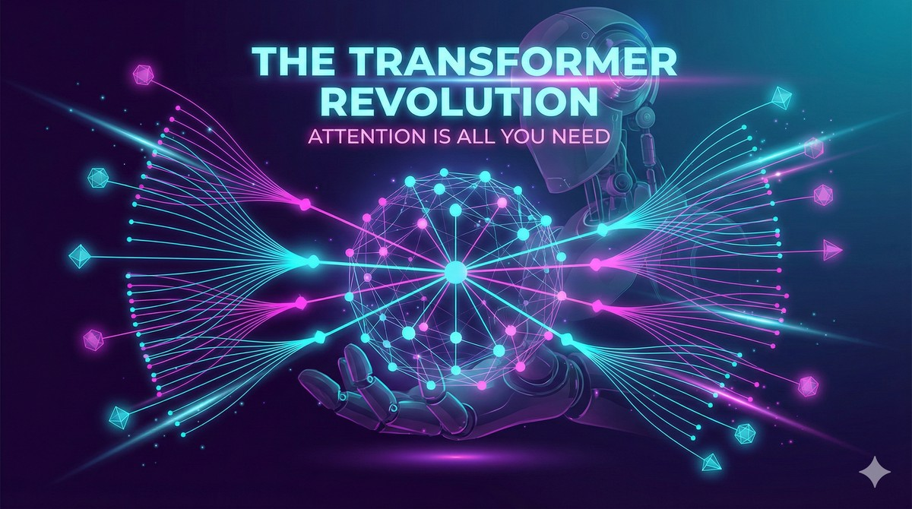
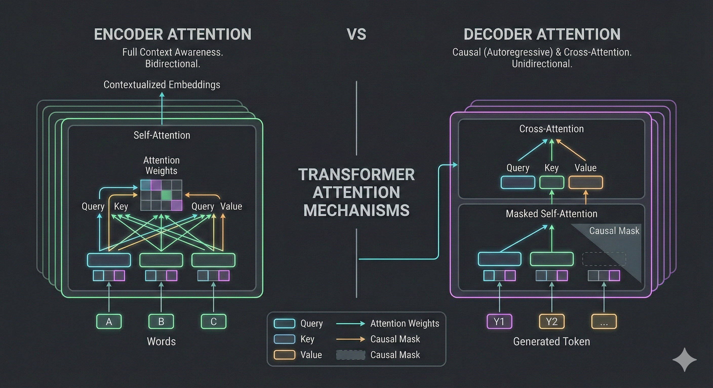
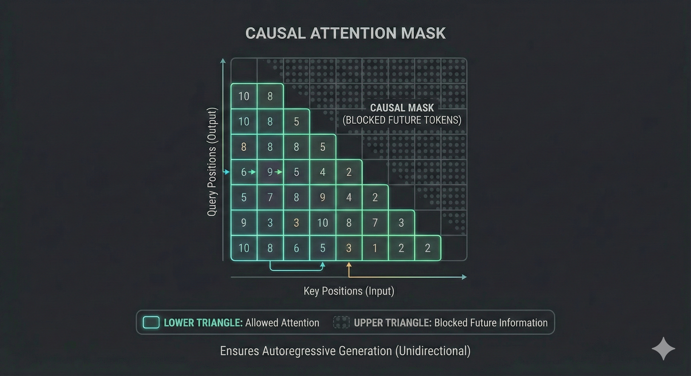
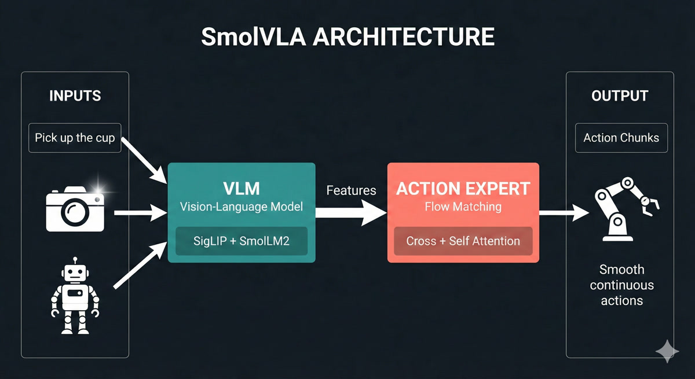

{.hero-image fig-align="center" width="100%"}

*In this lesson, we unlock the transformer architecture - the breakthrough that powers ChatGPT, modern robot policies, and nearly every frontier AI system. By the end, you'll read architecture diagrams like a native speaker.*

::: {.audio-cta}
🎧 **Prefer to listen?** Experience this lesson as an immersive classroom audio.

[Listen to Audio Version →](/lessons/lesson-3-the-transformer-revolution/classroom-player.html){.cta-button-secondary}
:::

# Chapter 1: The Revolution Arrives {#chapter-1}

::: {.callout-tip}
## Rajesh
Dr. Nova, I've been reviewing the architectures you mentioned at the end of Lesson 2 - OpenVLA, ACT, SmolVLA, GRoot. And honestly? I'm intimidated. There are all these boxes labeled "self-attention," "cross-attention," "Q, K, V"... I feel like everyone speaks a language I don't understand.
:::

::: {.callout-note}
## Dr. Nova Brooks
*smiles* That intimidation is exactly why I wanted to dedicate an entire lesson to transformers. Let me show you something.

![[1] Modern robotics architectures all share a common foundation - the transformer. OpenVLA, ACT, SmolVLA, GRoot - they all speak the same language.](images/chapter-1-architecture-overview.png)

Look at these four architectures. Different teams, different companies, different years. But what do they all have in common?
:::

::: {.callout-tip}
## Rajesh
They all mention "transformer" or "attention" somewhere...
:::

::: {.callout-note}
## Dr. Nova Brooks
Exactly! The transformer architecture is like the Latin of modern AI - once you learn it, you can read almost any architecture diagram. Let's do a quick recap of where we are in our journey.

In Lesson 2, we discovered that **point estimate policies** fail when there are multiple valid solutions. Averaging "go left" and "go right" gives you "go straight into the obstacle." We learned that **deep generative models** solve this by predicting probability distributions instead of single values. And we dove deep into **Variational Autoencoders** - how they compress data into a latent space and reconstruct it.
:::

::: {.callout-tip}
## Rajesh
Right - the encoder compresses images into latent variables Z, and the decoder reconstructs from Z. We even talked about how for robotics, our observations include both images AND joint angles from the SO-ARM101.
:::

::: {.callout-note}
## Dr. Nova Brooks
Perfect recall! Now here's the thing - VAEs are great for capturing hidden factors of variation. But they were designed for independent samples, not **sequences**. And robotics is fundamentally about sequences.

Think about it: robot actions form a trajectory over time. Language is a sequence of words. Even images, as we'll see, can be treated as sequences. And sequences have a special property - **the elements are related to each other**.
:::

::: {.callout-tip}
## Rajesh
So "I am in India" has relationships between the words - "I" relates to "am," "India" relates to the whole sentence...
:::

::: {.callout-note}
## Dr. Nova Brooks
Exactly! And capturing those relationships - those dependencies between elements in a sequence - is what transformers do brilliantly. Before transformers, people used Recurrent Neural Networks (RNNs), but they were slow and struggled with long sequences.

In 2017, a paper changed everything. It was titled "Attention Is All You Need," and it has over 210,000 citations. That's more than most professors accumulate in their entire careers, combined!

![[2] The "Attention Is All You Need" paper - the most influential AI paper of the decade. The transformer architecture diagram that we'll fully decode by the end of this lesson.](images/chapter-1-attention-paper.png)

By the end of today, you'll look at that architecture diagram and understand every single component. You'll be able to read robotics papers like a native speaker. Ready?
:::

::: {.callout-tip}
## Rajesh
Absolutely. Let's do this!
:::

# Chapter 2: Speaking the Language {#chapter-2}

::: {.callout-note}
## Dr. Nova Brooks
Let's start with a simple task that will help us understand every piece of the transformer. Imagine we want to teach an AI to **swap adjectives and nouns**.

Input: "red car" → Output: "car red"

Input: "blue bike" → Output: "bike blue"

Sounds trivial, right? But this simple task will teach us everything about transformers.
:::

::: {.callout-tip}
## Rajesh
Why such a simple example? Wouldn't a real NLP task be more relevant?
:::

::: {.callout-note}
## Dr. Nova Brooks
Because simplicity reveals the mechanics. Once you understand how transformers swap "red car" to "car red," understanding how they translate English to Hindi, or generate robot trajectories, becomes almost trivial.

First, we need to define our **vocabulary** - the set of all possible tokens our model can work with.
:::

```
VOCABULARY (18 tokens):
Colors:  white, blue, green, yellow, black, red, orange, purple
Objects: car, bike, tree, house, ball, bird, cat

Special: BOS (beginning of sentence)
         EOS (end of sentence)
         PAD (padding)
```

::: {.callout-tip}
## Rajesh
What are those special tokens for?
:::

::: {.callout-note}
## Dr. Nova Brooks
Great question! **BOS** tells the model "start generating now." **EOS** tells it "stop generating." And **PAD** makes all sequences the same length for batch processing.

Think about ChatGPT - when you ask a question, how does it know when to stop answering? It generates tokens until it produces an EOS token. Without it, LLMs would ramble forever!

Now, here's the first key insight: computers can't directly process words like "red" or "car." We need to convert them to numbers. This is called **embedding**.
:::

::: {.callout-important}
## Token Embeddings
An **embedding** is a vector representation of a token that captures its semantic meaning. Similar words have similar embeddings - "king" and "crown" are close together, while "king" and "banana" are far apart.
:::

::: {.callout-note}
## Dr. Nova Brooks
Imagine each token wearing a uniform - a vector of numbers that represents everything about that word. But this isn't just any uniform. Think of it like a sports jersey: the colors tell you the team, the number tells you the position, the patches might tell you achievements.

In the same way, an embedding vector encodes multiple aspects of a word's meaning. One dimension might capture "is this animate or inanimate?", another might encode "is this concrete or abstract?", another might reflect "what category does this belong to?". The full uniform - all the numbers together - gives a complete fingerprint of that word's meaning.

In our simple example, we might use 3-dimensional embeddings. In reality, models use 512, 768, or even higher dimensions - that's a lot of information encoded in each token's uniform!

![[3] Token embeddings place semantically similar words near each other in vector space. "King" and "crown" cluster together, while unrelated words are distant.](images/chapter-2-embedding-space.png)
:::

::: {.callout-tip}
## Rajesh
So "red" gets mapped to something like [0.2, 0.8, 0.1] and "car" gets [0.7, 0.3, 0.5]?
:::

::: {.callout-note}
## Dr. Nova Brooks
Exactly! Let me sketch what that looks like in 3D embedding space:

```
                          ┌─────────────────────────────────────┐
     Dimension 2          │                                     │
     (Color-ness?) 1.0    │          • "red"                    │
                          │           [0.2, 0.8, 0.1]           │
                     0.8  │                                     │
                          │                                     │
                     0.6  │                                     │
                          │                                     │
                     0.4  │                    • "car"          │
                          │                     [0.7, 0.3, 0.5] │
                     0.2  │                                     │
                          │                                     │
                     0.0  └────────────────────────────────────→
                          0.0   0.2   0.4   0.6   0.8   1.0
                                    Dimension 1 (Object-ness?)
```

See how "red" scores high on dimension 2 (which might encode color-related properties) while "car" scores high on dimension 1 (object-related properties)? These are learned representations - the model figures out what each dimension should encode through training.

But here's the problem. Consider these two sentences:

"The dog chased the car"

"The car chased the dog"

Same words, same token embeddings - but completely different meanings! The first is normal, the second is bizarre (unless it's a self-driving car with road rage).
:::

::: {.callout-tip}
## Rajesh
Oh! The position of each word matters. "Dog" in position 2 versus position 5 changes everything.
:::

::: {.callout-note}
## Dr. Nova Brooks
Brilliant! That's why we add **positional embeddings** - vectors that encode WHERE each token appears in the sequence. Position 0, position 1, position 2, and so on.

The final **input embedding** is: Token Embedding + Positional Embedding

Look at illustration [4] below. Here's what to focus on:

1. **The left side** shows the token embedding - the "semantic uniform" we discussed. This captures WHAT the word means.
2. **The middle** shows the positional embedding - a different vector that encodes WHERE the word appears (position 0, 1, 2...).
3. **The right side** shows the sum of both - this is what actually goes into the transformer. Each token now knows both what it means AND where it sits in the sequence.

![[4] The complete input embedding: token semantics plus positional information. Each token knows what it means AND where it is in the sequence.](images/chapter-2-input-embedding.png)

The key intuition: without positional embeddings, "dog bites man" and "man bites dog" would look identical to the transformer - same words, same embeddings. The positional information is what breaks this symmetry.

This embedding layer was actually known before transformers. It's standard practice in NLP. What transformers contributed is what happens NEXT - the attention mechanism.
:::

# Chapter 3: The Attention Mechanism {#chapter-3}

::: {.callout-note}
## Dr. Nova Brooks
Now for the magic - the attention mechanism. This is THE innovation that makes transformers work.

Consider our input: "the red car"

After embedding, each token has a vector. But here's the question: does the token "red" care about where it appears? Does it care about "the" or "car"?
:::

::: {.callout-tip}
## Rajesh
Well... "red" describes "car," so they're definitely related. And "the" kind of connects to both.
:::

::: {.callout-note}
## Dr. Nova Brooks
Exactly! Your brain instantly forms these connections. In a split second, you understand which words are related to which. The attention mechanism is our attempt to capture this computationally.

Let's build an **attention matrix** for "the dog chased the car":

![[5] The attention matrix - every token asks "how much do I care about you?" to every other token. Darker colors indicate stronger relationships.](images/chapter-3-attention-matrix.png)

Every row is a **query** asking: "How important are you to me?"
Every column is a **key** answering: "Here's how relevant I am."

The values in the matrix are **attention scores** - how much each token should focus on each other token.

Let me walk you through how to read this matrix with a concrete example. Look at the **"dog" row** (second row from top):

| dog attends to → | the | dog | chased | the | car |
|------------------|-----|-----|--------|-----|-----|
| Attention score  | 0.10 | 0.20 | **0.60** | 0.00 | 0.10 |

**How to interpret this:**
- "dog" pays **60% attention** to "chased" - makes sense! The dog is the one doing the chasing.
- "dog" pays **20% attention** to itself - some self-reference is normal.
- "dog" pays **10% attention** to "the" and "car" - minor context.
- "dog" pays **0% attention** to the second "the" - it's not relevant.

Notice: **each row sums to 1.0** (100%). It's a probability distribution - the token must divide its attention across all other tokens.

Now look at **"chased" row**: it attends 40% to "dog" (who's chasing) and 40% to "car" (what's being chased). The verb connects subject to object!
:::

::: {.callout-tip}
## Rajesh
So "dog" has high attention to "chased" because the dog is doing the chasing, and "chased" has high attention to "car" because that's what's being chased?
:::

::: {.callout-note}
## Dr. Nova Brooks
You're getting it! Now, to compute these attention scores, each token embedding is transformed into THREE vectors:

- **Query (Q)**: "What am I looking for?"
- **Key (K)**: "What do I contain?"
- **Value (V)**: "What information should I share?"

The attention score between token A and token B is computed by comparing A's Query with B's Key. It's like asking a question and seeing how well someone's expertise matches.
:::

::: {.callout-important}
## The QKV Intuition
- **Query**: The question a token asks - "Who should I pay attention to?"
- **Key**: The label each token wears - "Here's what I'm about"
- **Value**: The actual content each token shares when attended to
:::

::: {.callout-note}
## Dr. Nova Brooks
Let me show you exactly where Q, K, and V live in the full Transformer architecture. I'll highlight each component one at a time using the original diagram from the "Attention Is All You Need" paper:

**Step 1: Query (Q) - "What am I looking for?"**


The Query represents the "question" each token is asking. In self-attention, Q comes from the same sequence. In cross-attention (decoder attending to encoder), Q comes from the decoder - it's asking "what information do I need from the encoder?"

**Step 2: Key (K) - "What do I have to offer?"**


The Key is each token's "advertisement" - it describes what information that token has available. When we compute Q·K^T (Query times Key transposed), we're matching questions to advertisements to get attention scores.

**Step 3: Value (V) - "What information should I share?"**


The Value is the actual content that gets shared. After computing attention scores from Q and K, we multiply by V to get a weighted blend of information. High attention score = more of that token's Value in the output.
:::

::: {.callout-important}
## Interactive Animation: Self-Attention in Action

Now watch how Q, K, and V work together in this animated visualization. The animation shows three tokens ("the", "red", "car") and demonstrates each step of self-attention:

<iframe
    src="animations/self-attention-animation.html"
    width="100%"
    height="500px"
    style="border: none; border-radius: 8px; background: #000;"
    title="[6] Self-Attention Animation">
</iframe>

*Drag to rotate the view, scroll to zoom. Animation loops every 48 seconds showing all 5 steps.*
:::

::: {.callout-tip}
## Rajesh
I think I understand Query and Key - they determine the attention scores. But what's the purpose of Value? Why not just use the original embeddings?
:::

::: {.callout-note}
## Dr. Nova Brooks
Excellent question - the animation actually shows exactly why we need V! Let me give you a concrete intuition.

Think of it like a library system:

- **Query (Q)** is your search question: "I need information about dogs"
- **Key (K)** is the catalog label: "This section has books about animals"
- **Value (V)** is the actual content you take home: the specific pages and facts

Now here's the key insight: **what you search for isn't always what you need to take**.

Consider "The dog chased the car." When "chased" attends to "dog," what information does it need?

- The Q-K match says: "Yes, dog is relevant to chased - it's the subject"
- But "dog" contains LOTS of information: it's furry, it barks, it has four legs, it's an animal, it's a noun, it's the grammatical subject...
- The V projection learns to share ONLY the relevant part: "I'm the agent doing the action"

If we used raw embeddings instead of V, we'd mix in everything - the fur, the barking, all of it. The learned V matrix lets the model say: "When someone attends to me, here's specifically what I should share."
:::

::: {.callout-tip}
## Rajesh
Oh! So Q and K determine WHO pays attention to WHOM, but V determines WHAT information actually flows when that attention happens?
:::

::: {.callout-note}
## Dr. Nova Brooks
Exactly! You just articulated the key separation:

| Component | Purpose |
|-----------|---------|
| **Q × K^T** | Routing - "Who should I attend to?" |
| **V** | Content - "What do I share when attended to?" |

In the animation, you saw the V vectors (green) flowing and combining in Phase 3-4. Those aren't the original embeddings - they're specially projected to contain "shareable information."

The original embedding is your complete identity. V is what you choose to share in this conversation.
:::

::: {.callout-important}
## Interactive Animation: Why V Matters

Watch how the Value vector filters what information actually flows through attention. The "dog" token has many properties, but V selects only what's relevant to share:

<iframe
    src="animations/value-filter-animation.html"
    width="100%"
    height="550px"
    style="border: none; border-radius: 8px; background: #000;"
    title="[7] Value Filter Animation">
</iframe>

*Drag to rotate, scroll to zoom. Use Reset Animation to replay, Reset View to restore camera.*
:::

::: {.callout-tip}
## Rajesh
That animation makes it click! The attention score (0.8) decides "yes, pay attention to dog" - but V decides WHAT flows through that connection. Without V, we'd get everything about "dog" - the fur, the barking, all of it.
:::

::: {.callout-note}
## Dr. Nova Brooks
Exactly - you've got it. Now, once we have attention scores, we use them to create **context vectors**. Here's the geometric intuition:

<iframe
    src="animations/context-vector-animation.html"
    width="100%"
    height="500px"
    style="border: none; border-radius: 8px; background: #000;"
    title="[8] Context Vector Animation">
</iframe>

*[8] Watch how context vectors form through weighted blending of Value vectors. The animation shows "dog" attending 60% to "chased" - so its new representation is pulled toward "chased's" Value. Drag to rotate, scroll to zoom.*

For each token, we take a weighted sum of all Value vectors. The weights are the attention scores. If "dog" attends 80% to "chased" and 20% to everything else, its context vector is 80% influenced by "chased's" Value.
:::

::: {.callout-tip}
## Rajesh
So the context vector is like an updated version of the token that now "knows about" the other tokens it should care about?
:::

::: {.callout-note}
## Dr. Nova Brooks
Perfectly said! Before attention, each token only knows about itself - its uniform. After attention, each token has been transformed to incorporate information from related tokens.

Let me show you an interactive visualization that makes this crystal clear:

<iframe
    src="animations/token-transformation-animation.html"
    width="100%"
    height="500px"
    style="border: none; border-radius: 8px; background: #000;"
    title="[9] Token Transformation Animation">
</iframe>

*[9] Watch how "visualization" transforms by attending to "data" and "users". The animation shows the before/after: initially each token is isolated, but after attention, "visualization" is pulled toward the tokens it attends to - it now UNDERSTANDS its context! Drag to rotate, scroll to zoom.*

You can see here that "visualization" strongly attends to "data" and "users" - because data visualization is FOR users. The attention mechanism discovers these relationships automatically through training!
:::

::: {.callout-tip}
## Rajesh
This is beautiful. One question - you called this "self-attention." Why "self"?
:::

::: {.callout-note}
## Dr. Nova Brooks
Because every token attends to every OTHER token in the SAME sequence. The sequence is attending to itself. Later, we'll see "cross-attention" where tokens from one sequence attend to tokens from a DIFFERENT sequence.

And that completes the **self-attention layer**! Input: token embeddings. Output: context vectors that capture relationships.
:::

# Chapter 4: The Encoder {#chapter-4}

::: {.callout-note}
## Dr. Nova Brooks
Now let's assemble the complete **transformer encoder**. We've seen the pieces - let me show you how they fit together.

![[10] The transformer encoder block - embeddings flow through self-attention and feed-forward layers to produce rich context vectors.](images/chapter-4-encoder-block.png)

The encoder has three main components:

1. **Input Embedding Layer**: Token embeddings + positional embeddings
2. **Self-Attention Layer**: Computes Q, K, V and creates context vectors
3. **Feed-Forward Network**: A simple MLP that processes each context vector independently
:::

::: {.callout-tip}
## Rajesh
What does the feed-forward network do? I thought we already have context vectors from attention.
:::

::: {.callout-note}
## Dr. Nova Brooks
Excellent question! To understand why FFN is essential, I need to first show you something profound about attention that most explanations skip over.

Here's the critical insight: **attention is fundamentally LINEAR**. A weighted sum of vectors is still just a linear combination. No matter how many attention layers you stack, without something else, the network collapses to a single linear transformation.

You can't learn complex patterns with only linear operations!

Before I explain how FFN solves this, let me first complete the attention picture with **multi-head attention**.
:::

::: {.callout-important}
## Multi-Head Attention
In practice, we don't use just ONE attention head. We use **multi-head attention** - computing MULTIPLE attention matrices in parallel (typically 8 or 12 "heads"). Each head can learn to attend to different relationship types (syntactic, semantic, positional, etc.). The outputs are concatenated and projected back.

<iframe
    src="animations/multi-head-attention-animation.html"
    width="100%"
    height="500px"
    style="border: none; border-radius: 8px; background: #000;"
    title="[11] Multi-Head Attention Animation">
</iframe>

*[11] Watch how 4 attention heads process "the red car" in parallel - each head learns different relationship patterns (adjective→noun, grammatical structure, etc.), then all heads combine into a richer output. Drag to rotate, scroll to zoom.*
:::

::: {.callout-tip}
## Rajesh
So one head might learn "what adjectives modify which nouns" while another learns "what verbs connect to what subjects"?
:::

::: {.callout-note}
## Dr. Nova Brooks
Exactly! Different heads specialize in different relationship patterns.

But even with multi-head attention, we still have the linearity problem. That's where the **Feed-Forward Network (FFN)** comes in.
:::

::: {.callout-important}
## The FFN Intuition: Communication vs. Thinking

Think of the transformer encoder as having two distinct phases:

| Component | What It Does | Analogy |
|-----------|--------------|---------|
| **Attention** | Tokens COMMUNICATE - share information | A meeting where everyone talks |
| **FFN** | Each token THINKS - processes what it heard | Everyone goes home to analyze the discussion |

Without FFN, you'd have a network that can communicate but can't *think* about what it learned. It's like a meeting where people pass notes around, but no one ever processes the information!
:::

::: {.callout-note}
## Dr. Nova Brooks
The FFN has a fascinating "expand-compress" pattern:

**512 → 2048 → 512** (with non-linearity in the middle!)

1. **Expand (512 → 2048)**: Give each token "thinking space" - room to explore complex transformations
2. **Non-linearity (ReLU/GELU)**: The magic ingredient - this is what enables learning complex patterns
3. **Compress (2048 → 512)**: Distill the transformation back, keeping only what's useful

Here's something researchers discovered recently: FFN layers act as **"key-value memories"** - they store factual knowledge! When you ask ChatGPT "What is the capital of France?", it's the FFN layers that retrieve "Paris" from their learned memory.

<iframe
    src="animations/ffn-animation.html"
    width="100%"
    height="500px"
    style="border: none; border-radius: 8px; background: #000;"
    title="[12] Feed-Forward Network Animation">
</iframe>

*[12] Watch how the FFN transforms each token: expand to 4× dimensions, apply non-linearity (the spark!), then compress back. Attention mixes information BETWEEN tokens; FFN transforms WITHIN each token. Drag to rotate, scroll to zoom.*
:::

::: {.callout-note}
## Dr. Nova Brooks

Now, the encoder's job is to create a **rich representation** of the input sequence. It reads "the red car" and produces context vectors that understand: "red" modifies "car," "the" is an article, and together they describe a colored vehicle.

But the encoder doesn't generate output. It only encodes. For generation, we need the **decoder**.
:::

# Chapter 5: The Decoder {#chapter-5}

::: {.callout-note}
## Dr. Nova Brooks
The encoder creates understanding. The decoder creates output. Let's see how it generates "car red" from understanding "red car."

The decoder is where the **autoregressive magic** happens - generating one token at a time. Let's trace through it step by step.

**Step 1**: We start with just the BOS token.

{.lightbox}
:::

::: {.callout-tip}
## Rajesh
So the decoder input starts with just BOS, and we want it to predict "car"?
:::

::: {.callout-note}
## Dr. Nova Brooks
Exactly! First, BOS goes through self-attention (with just itself, since it's the only token so far). But here's the key - the decoder needs to know about the INPUT sequence "the red car."

This is where **cross-attention** comes in - and it's the crucial bridge between encoder and decoder.
:::

::: {.callout-important}
## Cross-Attention: The Bridge Between Worlds

Think of it like a **student taking an open-book exam**:

| Self-Attention | Cross-Attention |
|----------------|-----------------|
| Students discuss among themselves | Student looks at their notes |
| Same sequence talks to itself | Decoder talks to encoder |
| "What do WE know?" | "What did the INPUT mean?" |

In cross-attention:
- **Queries** come from the decoder (BOS asking "what should I generate?")
- **Keys and Values** come from the encoder (the context vectors for "the," "red," "car")

The decoder asks the encoder: "Given what you understood, what should I generate next?"

<iframe
    src="animations/cross-attention-animation.html"
    width="100%"
    height="500px"
    style="border: none; border-radius: 8px; background: #000;"
    title="[13] Cross-Attention Animation">
</iframe>

*[13] Watch cross-attention in action: the decoder's BOS token sends a query to the encoder, asking "what should come first?" The encoder's Keys determine relevance (car=0.7, red=0.2, the=0.1), and Values flow back weighted by attention. Drag to rotate, scroll to zoom.*
:::

::: {.callout-tip}
## Rajesh
Oh! So it's like the decoder is asking the encoder for help! The query says "what should come first?" and the encoder's attention scores point to "car" because that's what should be generated first in our swapped output!
:::

::: {.callout-note}
## Dr. Nova Brooks
Exactly! The cross-attention scores tell the decoder to focus on "car" (since that should come first in the output).

Let me show you the geometric interpretation:

{.lightbox}

The decoder's context vector becomes a weighted combination of the encoder's value vectors. High attention to "car" means the decoder's representation shifts toward "car's" meaning.
:::

::: {.callout-tip}
## Rajesh
And then after all the attention and feed-forward layers, how do we actually get the word "car" out?
:::

::: {.callout-note}
## Dr. Nova Brooks
**Vocabulary projection**! We take the final context vector and project it to the size of our vocabulary using a linear layer + softmax.

{.lightbox}

Each vocabulary word gets a probability. We pick the highest one - "car" with 0.92 probability. That becomes our first output token.

**Step 2**: Now we have "BOS car" as input to the decoder. We repeat the process to predict "red."

**Step 3**: With "BOS car red" as input, the model predicts EOS, signaling it's done.
:::

::: {.callout-tip}
## Rajesh
So LLMs like ChatGPT are doing this thousands of times to generate each response? One token at a time?
:::

::: {.callout-note}
## Dr. Nova Brooks
Exactly! And here's an important detail: ChatGPT and most modern LLMs are **decoder-only** architectures. They don't have a separate encoder - they use only the decoder with masked self-attention.

But for tasks like **translation** - "I am in India" → "मैं भारत में हूं" - you need BOTH encoder and decoder. Why?

{.lightbox}

The word order changes between languages. "India" is 4th in English but 2nd in Hindi. The encoder captures the SOURCE meaning, and cross-attention allows the decoder to attend to relevant source words regardless of their position.

Without the encoder, the decoder would have no way to "see" the full source sentence before generating. It would be like translating blind!
:::

::: {.callout-tip}
## Rajesh
Wait, you mentioned the decoder uses "masked" self-attention. What's being masked?
:::

::: {.callout-note}
## Dr. Nova Brooks
Great catch! This is a subtle but crucial difference between encoder and decoder.

In the **encoder**, every token can see every other token - "the" can attend to "car" even though "car" comes later. That's fine because we have the FULL input.

But in the **decoder**, we're GENERATING tokens one at a time. When predicting token 3, tokens 4, 5, 6... don't exist yet!

{.lightbox}
:::

::: {.callout-important}
## Masked Self-Attention: No Peeking!

The decoder uses a **causal mask** - each token can only attend to tokens BEFORE it (including itself), never AFTER.

| Position | Can Attend To |
|----------|---------------|
| BOS (1) | Just itself |
| car (2) | BOS, itself |
| red (3) | BOS, car, itself |

**Why?** Imagine training on "BOS car red EOS". If token 2 could see token 3, it would just copy "red" - that's cheating! The mask forces the model to actually PREDICT, not just copy.

This is why attention visualizations sometimes show a **triangular pattern** - the upper-right is masked (gray/blocked).

{.lightbox}
:::

## The Complete Picture

::: {.callout-note}
## Dr. Nova Brooks
Let me show you the entire encoder-decoder pipeline in action - from English input to Hindi output. Watch how each piece we discussed works together!
:::

<iframe
    src="animations/chapter5-capstone-animation.html"
    width="100%"
    height="500px"
    style="border: none; border-radius: 8px; background: #000;"
    title="[14] Chapter 5 Capstone: The Complete Decoder Journey">
</iframe>

*[14] The complete encoder-decoder translation pipeline: "the red car" enters the encoder (creating K, V), the decoder starts with BOS and uses cross-attention (Q) to query the encoder, softmax selects each Hindi word, and the autoregressive loop feeds each output back as input until EOS.*

::: {.callout-tip}
## Rajesh
So the encoder processes the input ONCE and provides the knowledge bank (K, V), while the decoder generates the output ONE TOKEN AT A TIME, constantly asking "what should I say next?" through cross-attention. That's beautiful!
:::

# Chapter 6: Vision Transformers {#chapter-6}

::: {.callout-tip}
## Rajesh
So the encoder-decoder architecture is beautiful for sequences. But here's my question - what if my input ISN'T a sequence? What if it's a 2D image from the SO-ARM101 camera? Can transformers even work on that?
:::

::: {.callout-note}
## Dr. Nova Brooks
That's the exact question researchers asked after the transformer paper. And in 2020, the **Vision Transformer (ViT)** answered with a brilliant insight: **MAKE IT a sequence!**

Think about it - transformers don't care WHAT the tokens are. They just need tokens with embeddings. Words? Fine. Robot joint angles? Sure. Image patches? Absolutely!

The trick is turning non-sequential data into tokens. And the title of the ViT paper says it all: "An image is worth 16x16 words."
:::

::: {.callout-tip}
## Rajesh
Wait - so we're using the SAME encoder architecture we just learned, just with different inputs?
:::

::: {.callout-note}
## Dr. Nova Brooks
Exactly! That's the beautiful insight. Let me show you how it works.

{.lightbox}

Take a 224×224 image, divide it into 16×16 pixel patches. You get 14×14 = 196 patches. Each patch becomes a "token" with its own embedding - just like words!

Let me show you the complete process:
:::

<iframe
    src="animations/patch-tokenization-animation.html"
    width="100%"
    height="450px"
    style="border: none; border-radius: 8px; background: #000;"
    title="[15] ViT Patch Tokenization: Image → Patches → Tokens">
</iframe>

*[15] The patch tokenization process: A 224×224 image is divided into a 14×14 grid of 16×16 patches. Each patch is flattened and projected into an embedding - creating 196 tokens for the transformer.*

::: {.callout-tip}
## Rajesh
So instead of words, we have image patches? And each patch gets embedded into a vector?
:::

::: {.callout-note}
## Dr. Nova Brooks
Exactly! Each patch is flattened (16×16×3 = 768 values for RGB) and passed through a linear layer to create a **patch embedding** of whatever dimension we want (e.g., 512).
:::

::: {.callout-tip}
## Rajesh
Why specifically 16×16? Why not 8×8 or 32×32?
:::

::: {.callout-note}
## Dr. Nova Brooks
Great question - it's a tradeoff between detail and computation!

| Patch Size | Tokens (224×224 image) | Detail | Attention Cost |
|------------|----------------------|--------|----------------|
| 8×8 | 784 patches | High detail | O(784²) ≈ 615K ops |
| **16×16** | **196 patches** | **Balanced** | **O(196²) ≈ 38K ops** |
| 32×32 | 49 patches | Low detail | O(49²) ≈ 2.4K ops |

Remember - self-attention is O(n²) where n = number of tokens. Smaller patches give more detail but MUCH more computation. 16×16 was the sweet spot for ImageNet-scale training in 2020.

Modern variants like **SwinTransformer** use hierarchical attention to get the best of both worlds - but that's a story for another lesson!
:::

::: {.callout-note}
## Dr. Nova Brooks
Now, just like text, **position matters**! Remember our sin/cos positional encodings from [Chapter 2](#chapter-2)? The same principle applies here.

Shuffling the patches gives a completely different image - we need to tell the transformer WHERE each patch came from.

{.lightbox}

So we add **positional embeddings** to patches too. The original ViT used **learned 2D positional embeddings** - each (row, col) position has its own learnable vector, rather than the fixed sin/cos we saw for text.
:::

::: {.callout-tip}
## Rajesh
Okay, but here's my question. For text, we're predicting the next token. For images... what's the output? We're not predicting "the next patch."
:::

::: {.callout-note}
## Dr. Nova Brooks
Great observation! For classification tasks, we need a single vector representing the ENTIRE image. But self-attention gives us context vectors for EACH patch. How do we get one summary vector?

The solution is the **CLS token** - a special learnable token prepended to the sequence.

{.lightbox}
:::

::: {.callout-tip}
## Rajesh
Wait - we just ADD a fake token? And it magically summarizes the image?
:::

::: {.callout-note}
## Dr. Nova Brooks
It's not magic - it's learned! The CLS token is initialized randomly but trained end-to-end. Through self-attention, it learns to attend to ALL the important patches.

Look at how CLS attention works:

{.lightbox}

The CLS token's attention scores determine how much information it takes from each patch. For a "dog vs cat" classifier, CLS learns to attend heavily to patches containing the animal's face and body.

After the encoder, we ONLY use the CLS context vector and pass it through a **classification head** (a simple MLP) to get class probabilities.
:::

::: {.callout-tip}
## Rajesh
Wait - so the CLS token is using the SAME Q, K, V mechanism we learned for text in [Chapter 3](#chapter-3)?
:::

::: {.callout-note}
## Dr. Nova Brooks
Exactly! Let me connect it explicitly:

| Component | Text (Chapters 3-5) | Vision (Chapter 6) |
|-----------|---------------------|-------------------|
| **Token** | Word embedding | Patch embedding |
| **Query (Q)** | "What am I looking for?" | CLS asking "Which patches matter?" |
| **Key (K)** | "Here's what I contain" | Each patch's signature |
| **Value (V)** | "Here's my information" | Patch's visual content |
| **Attention** | Word-to-word relevance | Patch-to-CLS relevance |

The CLS token's Query asks each patch's Key: "Are you relevant for classification?" High-relevance patches contribute more of their Value to the final CLS representation.

**Same mechanism, different tokens!** This is why understanding transformers once means you can read ANY architecture diagram.

Watch the CLS token learn what to attend to:
:::

<iframe
    src="animations/cls-attention-animation.html"
    width="100%"
    height="450px"
    style="border: none; border-radius: 8px; background: #000;"
    title="[16] CLS Token Attention: Q, K, V in Vision">
</iframe>

*[16] CLS token attention in action: The CLS token (yellow) creates a Query asking "which patches matter?" Each patch provides Keys and Values. For a dog classifier, face and body patches (red) get HIGH attention weights (0.42, 0.38), while background patches get low attention.*

::: {.callout-important}
## ViT Architecture Summary
1. Split image into patches (e.g., 16×16 pixels)
2. Linearly embed each patch to create patch embeddings
3. Add positional embeddings
4. Prepend a learnable CLS token
5. Pass through transformer encoder
6. Use CLS token's output for classification
:::

<iframe
    src="animations/vit-forward-pass-animation.html"
    width="100%"
    height="450px"
    style="border: none; border-radius: 8px; background: #000;"
    title="[17] Complete ViT Forward Pass">
</iframe>

*[17] The complete Vision Transformer pipeline: Image → patches → embeddings + positional encoding → CLS token prepended → self-attention (same as text!) → CLS output → classification head → "Dog: 94%". Same encoder architecture we learned - just with patches as tokens!*

::: {.callout-tip}
## Rajesh
This is elegant! But training a ViT from scratch must require massive datasets...
:::

::: {.callout-note}
## Dr. Nova Brooks
You're right - ViT was originally trained on ImageNet-21K (14 million images). But here's the beautiful thing: **pre-trained ViTs can be fine-tuned** for new tasks with very little data.

Google released "google/vit-base-patch16-224" which you can use directly. Just replace the classification head with your number of classes and fine-tune on your dataset.

{.lightbox}

I have a notebook where we classify plant disease images using a pre-trained ViT. We start at 94% accuracy and reach 97% after just 3 epochs of fine-tuning. The pre-trained model already understands "how images work" - we just teach it our specific classes.

{.lightbox}

Green labels show correct predictions (True = Pred). The model correctly identifies "angular_leaf_spot" across diverse images. Notice one misprediction in red where it confused "angular_leaf_spot" with "bean_rust" - but 96% accuracy from just 3 epochs of fine-tuning is remarkable!
:::

# Chapter 7: Transformers Meet Robots {#chapter-7}

::: {.callout-note}
## Dr. Nova Brooks
Now for the payoff - how does all this apply to robotics?

Remember our SO-ARM101 bimanual setup. The robot's observation includes:
- **Camera images** from 2 arm-mounted cameras (480×640×3 pixels each)
- **Proprioceptive data** - 24 joint angles total (6 per arm × 4 arms)
- **Gripper states** - open/closed for each arm

And the output is a sequence of **actions** - target joint positions over time for coordinated bimanual manipulation.
:::

::: {.callout-tip}
## Rajesh
Wait - so we have Blue arms (leader + follower for right hand) and Orange arms (leader + follower for left hand)? That's a lot of joint data to process!
:::

::: {.callout-note}
## Dr. Nova Brooks
Exactly! And here's where everything we learned comes together. Watch how robot data becomes tokens - using the SAME patterns from earlier chapters:
:::

::: {.callout-important}
## Interactive Animation: Robot Observation Tokenization

Watch how SO-ARM101's camera images and joint angles become tokens for the transformer:

<iframe
    src="animations/robot-observation-tokenization.html"
    width="100%"
    height="500px"
    style="border: none; border-radius: 8px; background: #000;"
    title="[18] Robot Observation Tokenization">
</iframe>

*[18] Camera images use ViT patch tokenization (Chapter 6). Joint angles become proprioceptive tokens. Blue = right side arms, Orange = left side arms. Both token types share the same embedding space! Drag to rotate, scroll to zoom.*
:::

::: {.callout-tip}
## Rajesh
So robot control is sequence-to-sequence! Camera patches plus joint tokens become a unified observation sequence, and we output a sequence of actions!
:::

::: {.callout-note}
## Dr. Nova Brooks
You've got it! Robotics IS **sequence modeling**. And transformers are exceptional at sequences.

Let me show you exactly how this maps to our transformer knowledge:

| Robot Concept | Transformer Equivalent | Chapter Reference |
|---------------|------------------------|-------------------|
| Camera image | ViT patches → tokens | Chapter 6 |
| Joint angles | Proprioceptive tokens | Same embedding space |
| Position in sequence | Positional encoding | Chapter 2 |
| "Which joints matter for this action?" | Self-attention | Chapter 3 |
| Action generation | Decoder with cross-attention | Chapter 5 |

Now let me show you how modern robotics architectures use everything we learned. But first - there's a subtle challenge we need to address.
:::

::: {.callout-tip}
## Rajesh
Wait - in Chapter 5, we learned how decoders generate text token by token. Each word predicts the next. Can't we just do the same thing for robot actions?
:::

::: {.callout-note}
## Dr. Nova Brooks
Great question! Let's start there. The **autoregressive** approach - generating one action at a time, each based on previous ones - is exactly how some robot architectures work. It's the natural extension of what we learned in Chapter 5.

Let me show you what this looks like:
:::

::: {.callout-important}
## Interactive Animation: Autoregressive Action Generation

Watch how autoregressive action generation works - the same token-by-token approach from text generation, applied to robot actions:

<iframe
    src="animations/action-sequence-generation.html"
    width="100%"
    height="500px"
    style="border: none; border-radius: 8px; background: #000;"
    title="[19] Autoregressive Action Generation">
</iframe>

*[19] The decoder asks "what action next?" via Query (Q). High attention to relevant observation tokens pulls their Values into the action prediction. Each action feeds back as input for the next - just like text generation! Drag to rotate, scroll to zoom.*
:::

::: {.callout-tip}
## Rajesh
I see! Action₁ is generated first, then Action₂ looks at Action₁ to decide what comes next, then Action₃ looks at both... It's exactly like generating a sentence word by word!
:::

::: {.callout-note}
## Dr. Nova Brooks
Exactly! And this works - architectures like **OpenVLA** use this approach successfully.

{.lightbox}

OpenVLA uses a 7-billion parameter LLaMA model to generate actions autoregressively. But here's the thing...
:::

::: {.callout-tip}
## Rajesh
I'm sensing a "but" coming...
:::

::: {.callout-note}
## Dr. Nova Brooks
You're right! Think about what autoregressive means for robot motion:

- When generating Action₁, the model has **no idea** what Action₁₀ will be
- Each action only "sees" past actions through the attention mask
- There's no **global planning** - no guarantee that the whole trajectory will be smooth

Imagine drawing a curve point by point, where each point only knows about the points before it. You might end up with jerky, disconnected movements - especially problematic for delicate tasks like folding clothes!
:::

::: {.callout-tip}
## Rajesh
Oh! So even if each individual action is correct, the whole sequence might not flow smoothly? Each timestep is kind of independent...
:::

::: {.callout-note}
## Dr. Nova Brooks
Precisely! Robot arms need **continuous, fluid motion**. When your SO-ARM101 folds a shirt, you don't want jerky discrete steps - you want smooth trajectories that flow naturally.

This is where a different approach shines: **Flow Matching**.

Here's the key insight: What if instead of generating actions one-by-one, we generated the **entire action sequence at once**?
:::

::: {.callout-tip}
## Rajesh
Generate everything at once? But how would that even work? Where do you start?
:::

::: {.callout-note}
## Dr. Nova Brooks
Great question! Flow matching starts with something surprising: **random noise**.

Think of it like this:

1. **Start with noise**: Imagine scattering random dots on a page - one for each timestep in your action sequence
2. **Learn a "flow"**: The model learns a velocity field - arrows that tell each dot where to move
3. **Follow the arrows**: All dots move *together*, flowing toward valid action positions
4. **End with a trajectory**: The noise has been "denoised" into a smooth, coherent action sequence

It's like GPS navigation: no matter where you start, the field guides you to the destination. But here, ALL points in your trajectory are guided SIMULTANEOUSLY.
:::

::: {.callout-tip}
## Rajesh
Wait - so all timesteps move together according to the same learned field? That's why it's smooth - they're not independent!
:::

::: {.callout-note}
## Dr. Nova Brooks
Now you've got it!

| Approach | How It Works | Result |
|----------|--------------|--------|
| **Autoregressive** | Generate t₁, then t₂, then t₃... | Each step independent, no future knowledge |
| **Flow Matching** | Start with noise for ALL steps, flow together | Global coherence, inherent smoothness |

The velocity field is learned to produce **valid trajectories** - so smoothness comes naturally. It's not about denoising being magical; it's about generating everything **at once** instead of piece by piece.

Now let me show you a modern architecture that uses this approach:

**SmolVLA Architecture:**
{.lightbox}
:::

::: {.callout-tip}
## Rajesh
Now THIS makes sense! Let me see if I can read it...
:::

::: {.callout-note}
## Dr. Nova Brooks
Let me walk you through SmolVLA's two-stage architecture:

**Stage 1: VLM (Vision-Language Model)** - The "Understanding" Stage:

- Camera images enter a **SigLIP vision encoder** (like ViT from Chapter 6!) - patches become tokens
- Text instruction "fold the shirt" goes through **SmolLM2** language model
- Robot joint angles are projected as additional tokens
- All these combine through self-attention to build a rich understanding of the situation

**Stage 2: Action Expert** - The "Doing" Stage:

- Takes the VLM's features through **cross-attention** (Chapter 5!) - "what in the scene is relevant?"
- Uses **self-attention** across timesteps - "how should my actions relate to each other?"
- Applies **flow matching** to generate the entire action chunk at once
- Output: Smooth, continuous trajectories - not jerky discrete steps

For our SO-ARM101: The VLM sees workspace cameras + "fold the shirt" + current joint states. The Action Expert outputs smooth action chunks - coordinated bimanual trajectories for both Blue and Orange arms!
:::

::: {.callout-important}
## Interactive Animation: SmolVLA Flow Matching

Watch how SmolVLA's flow matching transforms random noise into smooth, continuous robot actions - all generated at once!

<iframe
    src="animations/smolvla-flow-matching-animation.html"
    width="100%"
    height="500px"
    style="border: none; border-radius: 8px; background: #000;"
    title="[20] SmolVLA Flow Matching">
</iframe>

*[20] SmolVLA's two-stage architecture: The VLM (SigLIP + SmolLM2) builds rich features from camera images, text instructions, and robot state. The Action Expert uses flow matching to denoise random noise into smooth action trajectories - generating entire chunks simultaneously. Drag to rotate, scroll to zoom.*
:::

::: {.callout-tip}
## Rajesh
So the VLM builds understanding using everything we learned - ViT patches, self-attention, embeddings. And the Action Expert uses cross-attention to query that understanding. But instead of autoregressive token-by-token generation, it uses flow matching to generate the whole chunk at once - that's why the motion is smooth!
:::

::: {.callout-note}
## Dr. Nova Brooks
You've connected it all! And notice - both approaches use the same building blocks we learned. The difference is in HOW they generate the output sequence.

Now let me show you how NVIDIA approaches this same problem - with billions of dollars of research behind it.
:::

::: {.callout-tip}
## Rajesh
SmolVLA is elegant - just 450 million parameters and it matches much bigger models. But what about NVIDIA's GR00T architecture I've been hearing about? They've invested billions in robotics AI...
:::

::: {.callout-note}
## Dr. Nova Brooks
Great question! NVIDIA took a fundamentally different approach with GR00T, inspired by how humans actually think.

Remember Daniel Kahneman's "Thinking Fast and Slow"? He showed that humans have two cognitive systems:

- **System 2**: Slow, deliberate reasoning ("Let me think about this...")
- **System 1**: Fast, automatic execution ("Just do it!")

GR00T implements BOTH systems in one architecture:

**System 2 - The "Thinker" (Eagle-2 VLM, 2B parameters):**

- Processes camera images, language instructions, robot state
- Builds deep understanding of the scene and task
- Plans the overall approach
- "What should I do to fold this shirt?"

**System 1 - The "Doer" (Diffusion Transformer, 550M parameters):**

- Takes System 2's understanding as input
- Generates actions at **120Hz** - incredibly smooth!
- Uses diffusion (similar to flow matching) for coherent trajectories
- "Move arm smoothly along this path"

{.lightbox}

::: {.callout-important}
## Interactive Animation [21]: GR00T's Dual-System Architecture

Watch how System 2 (VLM) processes inputs slowly while System 1 (Diffusion) generates actions at 120Hz - inspired by Kahneman's "Thinking Fast and Slow."

<iframe
    src="animations/gr00t-dual-system-architecture-animation.html"
    width="100%"
    height="500px"
    style="border: none; border-radius: 8px; background: #000;"
    title="GR00T Dual-System Architecture Animation">
</iframe>

*Drag to rotate, scroll to zoom. Use "Reset View" to restore camera, "Reset Animation" to restart.*
:::

::: {.callout-important}
## Deep Dive Guided Widget [22]: Understanding GR00T's Dual-System

Explore the complete GR00T architecture through 7 interactive sections. Learn why "Think Slow, Act Fast" is the key insight behind NVIDIA's approach.

<iframe
    src="animations/groot-dual-system.html"
    width="100%"
    height="700px"
    style="border: none; border-radius: 8px; background: #0a0a1a;"
    title="GR00T Dual-System Guided Widget">
</iframe>

*Use navigation arrows or dots to explore all 7 sections. Each section includes 3D animations and detailed explanations. Drag to rotate, scroll to zoom. Use "Reset View" and "Reset Animation" buttons on the left panel.*
:::
:::

::: {.callout-tip}
## Rajesh
Wait - 120Hz? SmolVLA generates at maybe 30Hz. Why does GR00T need to be 4× faster?
:::

::: {.callout-note}
## Dr. Nova Brooks
Think about it - GR00T is designed for **humanoid robots**. A humanoid has:

- 30+ joints that need coordination
- Balance requirements (can't pause mid-step!)
- Bimanual manipulation (both arms working together)

At 30Hz, you get 33ms between commands. At 120Hz, you get 8ms. For a humanoid walking while carrying a cup of coffee, those extra 25ms per cycle could mean the difference between smooth motion and spilled coffee!

For your SO-ARM101 bimanual setup - folding clothes with coordinated left-right motion - this smoothness matters too. Though honestly, for tabletop manipulation, SmolVLA's 30Hz is usually sufficient.
:::

::: {.callout-tip}
## Rajesh
So GR00T is like having a careful planner AND a skilled athlete in one system. The planner figures out WHAT to do, the athlete executes HOW to do it smoothly.
:::

::: {.callout-note}
## Dr. Nova Brooks
Perfect analogy! And here's another key insight - NVIDIA built GR00T to work with their entire robotics ecosystem:

| Component | What It Does | GR00T Benefit |
|-----------|--------------|---------------|
| **Isaac Sim** | Photorealistic simulation | Train without wearing out real hardware |
| **Isaac Lab** | Modular RL/IL framework | Standardized training pipelines |
| **GR00T-Dreams** | Synthetic data generation | 300 demos → unlimited variations |
| **Jetson Thor** | Edge deployment | Run GR00T on the robot itself |

For your bootcamp with SO-ARM101, this ecosystem is powerful:

1. **Simulate** bimanual folding in Isaac Sim (no hardware wear)
2. **Train** policies with Isaac Lab
3. **Deploy** to real arms via Jetson or your RTX 5090
:::

::: {.callout-tip}
## Rajesh
Okay, so we have SmolVLA, OpenVLA, and GR00T. They all use transformers. How do I know which one to pick for a given task?
:::

::: {.callout-note}
## Dr. Nova Brooks
This is exactly the right question! Here's my decision framework:

| If You Have... | Choose | Because |
|----------------|--------|---------|
| Consumer GPU, simple manipulation | **SmolVLA** | 450M params, proven efficient |
| Complex humanoid coordination | **GR00T** | Dual-system, 120Hz, bimanual |
| Maximum generalization needed | **OpenVLA** | 7B params, broadest training |
| NVIDIA hardware ecosystem | **GR00T** | Native Isaac integration |
| Limited training data (<30K demos) | **SmolVLA** | Data-efficient architecture |
| Need to run on robot CPU | **SmolVLA** | Can run without GPU |

::: {.callout-important}
## Interactive Animation [23]: Architecture Comparison

See how each architecture generates actions differently: OpenVLA token-by-token, SmolVLA all-at-once via flow matching, and GR00T with its 120Hz dual-system output.

<iframe
    src="animations/architecture-comparison-animation.html"
    width="100%"
    height="500px"
    style="border: none; border-radius: 8px; background: #000;"
    title="Architecture Comparison Animation">
</iframe>

*Drag to rotate, scroll to zoom. Use "Reset View" to restore camera, "Reset Animation" to restart.*
:::

For YOUR SO-ARM101 clothes folding task, I'd actually recommend **both**:

1. **Start with SmolVLA** - quick iteration, runs on single GPU
2. **Graduate to GR00T** - once you need smoother bimanual coordination
3. **Use Isaac Sim** - simulate before deploying to real arms

The architectures aren't competitors - they're tools for different situations.
:::

::: {.callout-tip}
## Rajesh
So SmolVLA is like a compact car - efficient, gets the job done for most tasks. GR00T is like a performance vehicle - more power when you need precision at speed. And OpenVLA is like a truck - maximum capacity for hauling diverse experiences.
:::

::: {.callout-note}
## Dr. Nova Brooks
That's a great mental model! And notice - they all use the same engine parts:

- Vision transformers for seeing
- Self-attention for understanding
- Cross-attention for connecting observation to action

What differs is HOW they generate actions:

- **OpenVLA**: Autoregressive (token by token)
- **SmolVLA**: Flow matching (all at once)
- **GR00T**: Diffusion transformer (also all at once, but at 120Hz)

You now understand enough to read any VLA paper and know what's happening!
:::

---

## The Journey So Far {#the-journey}

::: {.callout-tip}
## Rajesh
Dr. Nova, before we wrap up... can we take a moment to appreciate what we've built in this chapter? I feel like something just clicked.
:::

::: {.callout-note}
## Dr. Nova Brooks
*smiles* I was hoping you'd say that. Let's trace your journey:

**Chapter 4** - You learned that attention is just "who should I ask for help?" Query asks, Keys answer, Values get pulled in. The mystery became mechanics.

**Chapter 5** - You saw encoders and decoders as conversation partners. The encoder says "here's what I see," the decoder says "here's what I'll do." Cross-attention bridges them.

**Chapter 6** - Images became token sequences. ViT showed you that "an image is worth 16×16 words" - patches become embeddings become understanding.

**Chapter 7** - Today, you connected it ALL to robotics:

- The robot's observation IS the encoder input
- The action sequence IS the decoder output
- Autoregressive vs flow matching IS about how you generate that sequence

And now you understand three production architectures:

- **OpenVLA**: The brute-force approach (7B params, autoregressive)
- **SmolVLA**: The elegant approach (450M params, flow matching)
- **GR00T**: The cognitive approach (dual-system, diffusion)

You didn't just learn about transformers. You learned to THINK in transformers.
:::

::: {.callout-tip}
## Rajesh
*pauses*

When I started this bootcamp, architecture diagrams terrified me. All those boxes and arrows felt like hieroglyphics.

Now I look at a new VLA paper and think: "Oh, there's the ViT encoder. There's the cross-attention. They're using flow matching for the action head."

I can actually READ these papers. The diagrams aren't scary - they're maps.
:::

::: {.callout-note}
## Dr. Nova Brooks
That transformation - from "what is this?" to "I know exactly what this is" - is the real goal of this bootcamp.

When you implement ACT in Lesson 4, you won't be copying mysterious code. You'll be assembling building blocks you understand:

- "This ViT encoder is doing Chapter 6"
- "This cross-attention is doing Chapter 5"
- "This VAE injection is doing Lesson 2"

Every line will make sense. That's the power of intuition.
:::

::: {.callout-tip}
## Rajesh
Dr. Nova... thank you. For not just telling me what things are, but helping me understand WHY they work.

I'm ready for Lesson 4. Let's make SO-ARM101 fold some clothes!
:::

::: {.callout-note}
## Dr. Nova Brooks
*nods*

That's exactly what we'll do. But first, let me give you a preview of what's coming.
:::

---

## Next Lesson Preview {#next-preview}

::: {.callout-note}
## Dr. Nova Brooks
Now, here's a teaser for our next lesson. The policy we'll implement - **ACT (Action Chunking with Transformers)** - combines EVERYTHING we've learned across both lessons:

| Component | Source | Purpose |
|-----------|--------|---------|
| **VAE** | Lesson 2 | Handle multimodal demonstrations |
| **ViT encoder** | Chapter 6 | Process camera images |
| **Transformer encoder** | Chapter 4 | Fuse observation tokens |
| **Transformer decoder** | Chapter 5 | Generate action sequence |
| **CLS token** | Chapter 6 | Summarize visual features |
| **Cross-attention** | Chapter 5 | Bridge observation → action |

{.lightbox}
:::

::: {.callout-tip}
## Rajesh
Wait - the VAE latent variable goes INTO the transformer encoder? I would have thought the encoder produces the latent variable!
:::

::: {.callout-note}
## Dr. Nova Brooks
That's the beautiful twist - and it connects directly to Lesson 2!

Remember the **multimodal targets problem**? When you average "fold sleeve in" and "fold sleeve out," you get a disaster. The VAE from Lesson 2 solves this by learning a distribution over demonstration *styles*.

In ACT:
- **During training**: The VAE encoder sees the FULL demonstration trajectory and produces latent variable **z** - this captures "which style of folding is this?"
- **z becomes a special token**: It's prepended to the transformer encoder's input, like a "style instruction"
- **During inference**: We sample z from the prior distribution, asking "generate a valid folding style"

Same observation + different z samples = different (but all valid!) action sequences. The transformer handles the sequence-to-sequence mapping; the VAE handles the multimodality.
:::

::: {.callout-tip}
## Rajesh
Oh! So z is like a "style token" that tells the transformer WHICH valid solution to generate! That's why we needed both VAE AND transformer - they solve different problems!
:::

::: {.callout-note}
## Dr. Nova Brooks
Exactly! You just connected Lesson 2 to Lesson 3 perfectly.

For homework:
1. **Read the original transformer paper** - "Attention Is All You Need" - you'll understand every word now
2. **Read the ViT paper** - "An Image Is Worth 16x16 Words" - Chapter 6 was this paper!
3. **Think about ACT** - How would the observation tokens, z token, and decoder interact?

You now speak transformer. Those intimidating diagrams? They're your native language. The revolution continues!
:::
