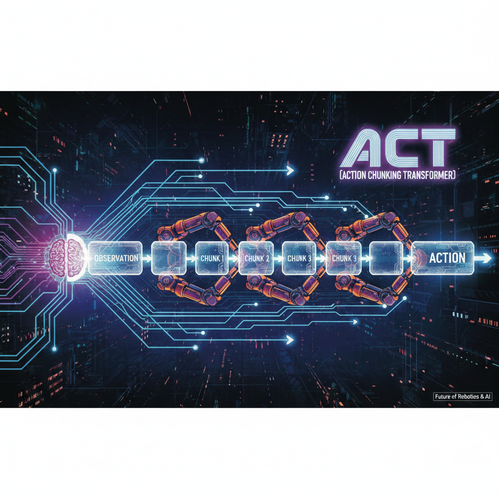{.hero-image fig-align="center" width="100%"}

*In this lesson, we unlock the transformer architecture - the breakthrough that powers ChatGPT, modern robot policies, and nearly every frontier AI system. By the end, you'll read architecture diagrams like a native speaker.*

::: {.audio-cta}
🎧 **Prefer to listen?** Experience this lesson as an immersive classroom audio.

[Listen to Audio Version →](/lessons/lesson-3-the-transformer-revolution/classroom-player.html){.cta-button-secondary}
:::

# Chapter 1: The Revolution Arrives {#chapter-1}

::: {.callout-tip}
## Rajesh
Dr. Nova, I've been reviewing the architectures you mentioned at the end of Lesson 2 - OpenVLA, ACT, SmallVA, GRoot. And honestly? I'm intimidated. There are all these boxes labeled "self-attention," "cross-attention," "Q, K, V"... I feel like everyone speaks a language I don't understand.
:::

::: {.callout-note}
## Dr. Nova Brooks
*smiles* That intimidation is exactly why I wanted to dedicate an entire lesson to transformers. Let me show you something.

![[1] Modern robotics architectures all share a common foundation - the transformer. OpenVLA, ACT, SmallVA, GRoot - they all speak the same language.](images/chapter-1-architecture-overview.png)

Look at these four architectures. Different teams, different companies, different years. But what do they all have in common?
:::

::: {.callout-tip}
## Rajesh
They all mention "transformer" or "attention" somewhere...
:::

::: {.callout-note}
## Dr. Nova Brooks
Exactly! The transformer architecture is like the Latin of modern AI - once you learn it, you can read almost any architecture diagram. Let's do a quick recap of where we are in our journey.

In Lesson 2, we discovered that **point estimate policies** fail when there are multiple valid solutions. Averaging "go left" and "go right" gives you "go straight into the obstacle." We learned that **deep generative models** solve this by predicting probability distributions instead of single values. And we dove deep into **Variational Autoencoders** - how they compress data into a latent space and reconstruct it.
:::

::: {.callout-tip}
## Rajesh
Right - the encoder compresses images into latent variables Z, and the decoder reconstructs from Z. We even talked about how for robotics, our observations include both images AND joint angles from the SO-ARM101.
:::

::: {.callout-note}
## Dr. Nova Brooks
Perfect recall! Now here's the thing - VAEs are great for capturing hidden factors of variation. But they were designed for independent samples, not **sequences**. And robotics is fundamentally about sequences.

Think about it: robot actions form a trajectory over time. Language is a sequence of words. Even images, as we'll see, can be treated as sequences. And sequences have a special property - **the elements are related to each other**.
:::

::: {.callout-tip}
## Rajesh
So "I am in India" has relationships between the words - "I" relates to "am," "India" relates to the whole sentence...
:::

::: {.callout-note}
## Dr. Nova Brooks
Exactly! And capturing those relationships - those dependencies between elements in a sequence - is what transformers do brilliantly. Before transformers, people used Recurrent Neural Networks (RNNs), but they were slow and struggled with long sequences.

In 2017, a paper changed everything. It was titled "Attention Is All You Need," and it has over 210,000 citations. That's more than most professors accumulate in their entire careers, combined!

![[2] The "Attention Is All You Need" paper - the most influential AI paper of the decade. The transformer architecture diagram that we'll fully decode by the end of this lesson.](images/chapter-1-attention-paper.png)

By the end of today, you'll look at that architecture diagram and understand every single component. You'll be able to read robotics papers like a native speaker. Ready?
:::

::: {.callout-tip}
## Rajesh
Absolutely. Let's do this!
:::

# Chapter 2: Speaking the Language {#chapter-2}

::: {.callout-note}
## Dr. Nova Brooks
Let's start with a simple task that will help us understand every piece of the transformer. Imagine we want to teach an AI to **swap adjectives and nouns**.

Input: "red car" → Output: "car red"

Input: "blue bike" → Output: "bike blue"

Sounds trivial, right? But this simple task will teach us everything about transformers.
:::

::: {.callout-tip}
## Rajesh
Why such a simple example? Wouldn't a real NLP task be more relevant?
:::

::: {.callout-note}
## Dr. Nova Brooks
Because simplicity reveals the mechanics. Once you understand how transformers swap "red car" to "car red," understanding how they translate English to Hindi, or generate robot trajectories, becomes almost trivial.

First, we need to define our **vocabulary** - the set of all possible tokens our model can work with.
:::

```
VOCABULARY (18 tokens):
Colors:  white, blue, green, yellow, black, red, orange, purple
Objects: car, bike, tree, house, ball, bird, cat

Special: BOS (beginning of sentence)
         EOS (end of sentence)
         PAD (padding)
```

::: {.callout-tip}
## Rajesh
What are those special tokens for?
:::

::: {.callout-note}
## Dr. Nova Brooks
Great question! **BOS** tells the model "start generating now." **EOS** tells it "stop generating." And **PAD** makes all sequences the same length for batch processing.

Think about ChatGPT - when you ask a question, how does it know when to stop answering? It generates tokens until it produces an EOS token. Without it, LLMs would ramble forever!

Now, here's the first key insight: computers can't directly process words like "red" or "car." We need to convert them to numbers. This is called **embedding**.
:::

::: {.callout-important}
## Token Embeddings
An **embedding** is a vector representation of a token that captures its semantic meaning. Similar words have similar embeddings - "king" and "crown" are close together, while "king" and "banana" are far apart.
:::

::: {.callout-note}
## Dr. Nova Brooks
Imagine each token wearing a uniform - a vector of numbers that represents everything about that word. But this isn't just any uniform. Think of it like a sports jersey: the colors tell you the team, the number tells you the position, the patches might tell you achievements.

In the same way, an embedding vector encodes multiple aspects of a word's meaning. One dimension might capture "is this animate or inanimate?", another might encode "is this concrete or abstract?", another might reflect "what category does this belong to?". The full uniform - all the numbers together - gives a complete fingerprint of that word's meaning.

In our simple example, we might use 3-dimensional embeddings. In reality, models use 512, 768, or even higher dimensions - that's a lot of information encoded in each token's uniform!

![[3] Token embeddings place semantically similar words near each other in vector space. "King" and "crown" cluster together, while unrelated words are distant.](images/chapter-2-embedding-space.png)
:::

::: {.callout-tip}
## Rajesh
So "red" gets mapped to something like [0.2, 0.8, 0.1] and "car" gets [0.7, 0.3, 0.5]?
:::

::: {.callout-note}
## Dr. Nova Brooks
Exactly! Let me sketch what that looks like in 3D embedding space:

```
                          ┌─────────────────────────────────────┐
     Dimension 2          │                                     │
     (Color-ness?) 1.0    │          • "red"                    │
                          │           [0.2, 0.8, 0.1]           │
                     0.8  │                                     │
                          │                                     │
                     0.6  │                                     │
                          │                                     │
                     0.4  │                    • "car"          │
                          │                     [0.7, 0.3, 0.5] │
                     0.2  │                                     │
                          │                                     │
                     0.0  └────────────────────────────────────→
                          0.0   0.2   0.4   0.6   0.8   1.0
                                    Dimension 1 (Object-ness?)
```

See how "red" scores high on dimension 2 (which might encode color-related properties) while "car" scores high on dimension 1 (object-related properties)? These are learned representations - the model figures out what each dimension should encode through training.

But here's the problem. Consider these two sentences:

"The dog chased the car"

"The car chased the dog"

Same words, same token embeddings - but completely different meanings! The first is normal, the second is bizarre (unless it's a self-driving car with road rage).
:::

::: {.callout-tip}
## Rajesh
Oh! The position of each word matters. "Dog" in position 2 versus position 5 changes everything.
:::

::: {.callout-note}
## Dr. Nova Brooks
Brilliant! That's why we add **positional embeddings** - vectors that encode WHERE each token appears in the sequence. Position 0, position 1, position 2, and so on.

The final **input embedding** is: Token Embedding + Positional Embedding

Look at illustration [4] below. Here's what to focus on:

1. **The left side** shows the token embedding - the "semantic uniform" we discussed. This captures WHAT the word means.
2. **The middle** shows the positional embedding - a different vector that encodes WHERE the word appears (position 0, 1, 2...).
3. **The right side** shows the sum of both - this is what actually goes into the transformer. Each token now knows both what it means AND where it sits in the sequence.

![[4] The complete input embedding: token semantics plus positional information. Each token knows what it means AND where it is in the sequence.](images/chapter-2-input-embedding.png)

The key intuition: without positional embeddings, "dog bites man" and "man bites dog" would look identical to the transformer - same words, same embeddings. The positional information is what breaks this symmetry.

This embedding layer was actually known before transformers. It's standard practice in NLP. What transformers contributed is what happens NEXT - the attention mechanism.
:::

# Chapter 3: The Attention Mechanism {#chapter-3}

::: {.callout-note}
## Dr. Nova Brooks
Now for the magic - the attention mechanism. This is THE innovation that makes transformers work.

Consider our input: "the red car"

After embedding, each token has a vector. But here's the question: does the token "red" care about where it appears? Does it care about "the" or "car"?
:::

::: {.callout-tip}
## Rajesh
Well... "red" describes "car," so they're definitely related. And "the" kind of connects to both.
:::

::: {.callout-note}
## Dr. Nova Brooks
Exactly! Your brain instantly forms these connections. In a split second, you understand which words are related to which. The attention mechanism is our attempt to capture this computationally.

Let's build an **attention matrix** for "the dog chased the car":

![[5] The attention matrix - every token asks "how much do I care about you?" to every other token. Darker colors indicate stronger relationships.](images/chapter-3-attention-matrix.png)

Every row is a **query** asking: "How important are you to me?"
Every column is a **key** answering: "Here's how relevant I am."

The values in the matrix are **attention scores** - how much each token should focus on each other token.

Let me walk you through how to read this matrix with a concrete example. Look at the **"dog" row** (second row from top):

| dog attends to → | the | dog | chased | the | car |
|------------------|-----|-----|--------|-----|-----|
| Attention score  | 0.10 | 0.20 | **0.60** | 0.00 | 0.10 |

**How to interpret this:**
- "dog" pays **60% attention** to "chased" - makes sense! The dog is the one doing the chasing.
- "dog" pays **20% attention** to itself - some self-reference is normal.
- "dog" pays **10% attention** to "the" and "car" - minor context.
- "dog" pays **0% attention** to the second "the" - it's not relevant.

Notice: **each row sums to 1.0** (100%). It's a probability distribution - the token must divide its attention across all other tokens.

Now look at **"chased" row**: it attends 40% to "dog" (who's chasing) and 40% to "car" (what's being chased). The verb connects subject to object!
:::

::: {.callout-tip}
## Rajesh
So "dog" has high attention to "chased" because the dog is doing the chasing, and "chased" has high attention to "car" because that's what's being chased?
:::

::: {.callout-note}
## Dr. Nova Brooks
You're getting it! Now, to compute these attention scores, each token embedding is transformed into THREE vectors:

- **Query (Q)**: "What am I looking for?"
- **Key (K)**: "What do I contain?"
- **Value (V)**: "What information should I share?"

The attention score between token A and token B is computed by comparing A's Query with B's Key. It's like asking a question and seeing how well someone's expertise matches.
:::

::: {.callout-important}
## The QKV Intuition
- **Query**: The question a token asks - "Who should I pay attention to?"
- **Key**: The label each token wears - "Here's what I'm about"
- **Value**: The actual content each token shares when attended to
:::

::: {.callout-note}
## Dr. Nova Brooks
Let me show you exactly where Q, K, and V live in the full Transformer architecture. I'll highlight each component one at a time using the original diagram from the "Attention Is All You Need" paper:

**Step 1: Query (Q) - "What am I looking for?"**

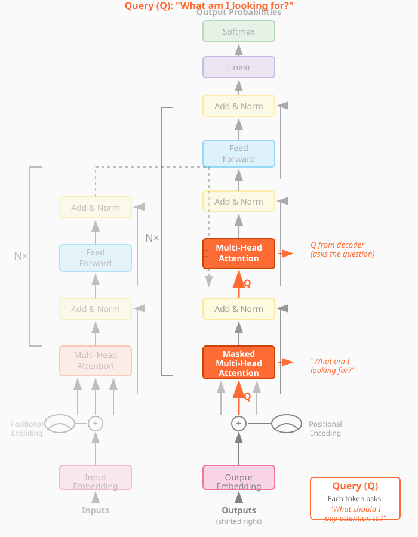

The Query represents the "question" each token is asking. In self-attention, Q comes from the same sequence. In cross-attention (decoder attending to encoder), Q comes from the decoder - it's asking "what information do I need from the encoder?"

**Step 2: Key (K) - "What do I have to offer?"**

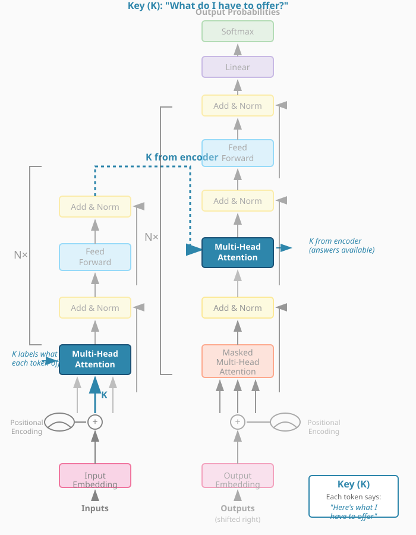

The Key is each token's "advertisement" - it describes what information that token has available. When we compute Q·K^T (Query times Key transposed), we're matching questions to advertisements to get attention scores.

**Step 3: Value (V) - "What information should I share?"**

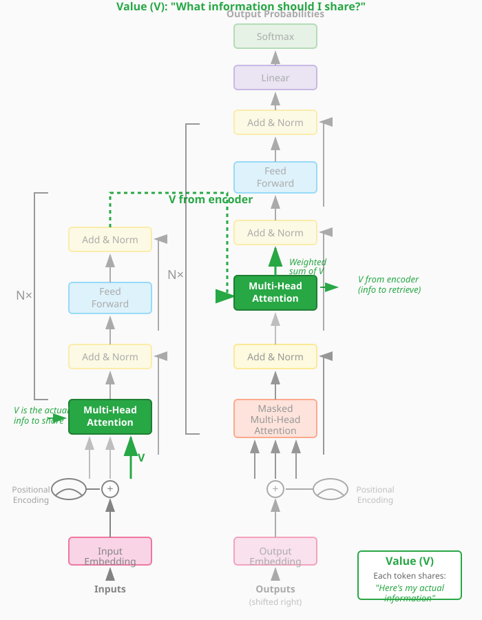

The Value is the actual content that gets shared. After computing attention scores from Q and K, we multiply by V to get a weighted blend of information. High attention score = more of that token's Value in the output.
:::

::: {.callout-important}
## Interactive Animation: Self-Attention in Action

Now watch how Q, K, and V work together in this animated visualization. The animation shows three tokens ("the", "red", "car") and demonstrates each step of self-attention:

<iframe
    src="animations/self-attention-animation.html"
    width="100%"
    height="500px"
    style="border: none; border-radius: 8px; background: #000;"
    title="Self-Attention Animation">
</iframe>

*Drag to rotate the view, scroll to zoom. Animation loops every 48 seconds showing all 5 steps.*
:::

::: {.callout-tip}
## Rajesh
I think I understand Query and Key - they determine the attention scores. But what's the purpose of Value? Why not just use the original embeddings?
:::

::: {.callout-note}
## Dr. Nova Brooks
Excellent question - the animation actually shows exactly why we need V! Let me give you a concrete intuition.

Think of it like a library system:

- **Query (Q)** is your search question: "I need information about dogs"
- **Key (K)** is the catalog label: "This section has books about animals"
- **Value (V)** is the actual content you take home: the specific pages and facts

Now here's the key insight: **what you search for isn't always what you need to take**.

Consider "The dog chased the car." When "chased" attends to "dog," what information does it need?

- The Q-K match says: "Yes, dog is relevant to chased - it's the subject"
- But "dog" contains LOTS of information: it's furry, it barks, it has four legs, it's an animal, it's a noun, it's the grammatical subject...
- The V projection learns to share ONLY the relevant part: "I'm the agent doing the action"

If we used raw embeddings instead of V, we'd mix in everything - the fur, the barking, all of it. The learned V matrix lets the model say: "When someone attends to me, here's specifically what I should share."
:::

::: {.callout-tip}
## Rajesh
Oh! So Q and K determine WHO pays attention to WHOM, but V determines WHAT information actually flows when that attention happens?
:::

::: {.callout-note}
## Dr. Nova Brooks
Exactly! You just articulated the key separation:

| Component | Purpose |
|-----------|---------|
| **Q × K^T** | Routing - "Who should I attend to?" |
| **V** | Content - "What do I share when attended to?" |

In the animation, you saw the V vectors (green) flowing and combining in Phase 3-4. Those aren't the original embeddings - they're specially projected to contain "shareable information."

The original embedding is your complete identity. V is what you choose to share in this conversation.
:::

::: {.callout-important}
## Interactive Animation: Why V Matters

Watch how the Value vector filters what information actually flows through attention. The "dog" token has many properties, but V selects only what's relevant to share:

<iframe
    src="animations/value-filter-animation.html"
    width="100%"
    height="550px"
    style="border: none; border-radius: 8px; background: #000;"
    title="Value Filter Animation">
</iframe>

*Drag to rotate, scroll to zoom. Use Reset Animation to replay, Reset View to restore camera.*
:::

::: {.callout-tip}
## Rajesh
That animation makes it click! The attention score (0.8) decides "yes, pay attention to dog" - but V decides WHAT flows through that connection. Without V, we'd get everything about "dog" - the fur, the barking, all of it.
:::

::: {.callout-note}
## Dr. Nova Brooks
Exactly - you've got it. Now, once we have attention scores, we use them to create **context vectors**. Here's the geometric intuition:

<iframe
    src="animations/context-vector-animation.html"
    width="100%"
    height="500px"
    style="border: none; border-radius: 8px; background: #000;"
    title="[6] Context Vector Animation">
</iframe>

*[6] Watch how context vectors form through weighted blending of Value vectors. The animation shows "dog" attending 60% to "chased" - so its new representation is pulled toward "chased's" Value. Drag to rotate, scroll to zoom.*

For each token, we take a weighted sum of all Value vectors. The weights are the attention scores. If "dog" attends 80% to "chased" and 20% to everything else, its context vector is 80% influenced by "chased's" Value.
:::

::: {.callout-tip}
## Rajesh
So the context vector is like an updated version of the token that now "knows about" the other tokens it should care about?
:::

::: {.callout-note}
## Dr. Nova Brooks
Perfectly said! Before attention, each token only knows about itself - its uniform. After attention, each token has been transformed to incorporate information from related tokens.

Let me show you an interactive visualization that makes this crystal clear:

<iframe
    src="animations/token-transformation-animation.html"
    width="100%"
    height="500px"
    style="border: none; border-radius: 8px; background: #000;"
    title="[7] Token Transformation Animation">
</iframe>

*[7] Watch how "visualization" transforms by attending to "data" and "users". The animation shows the before/after: initially each token is isolated, but after attention, "visualization" is pulled toward the tokens it attends to - it now UNDERSTANDS its context! Drag to rotate, scroll to zoom.*

You can see here that "visualization" strongly attends to "data" and "users" - because data visualization is FOR users. The attention mechanism discovers these relationships automatically through training!
:::

::: {.callout-tip}
## Rajesh
This is beautiful. One question - you called this "self-attention." Why "self"?
:::

::: {.callout-note}
## Dr. Nova Brooks
Because every token attends to every OTHER token in the SAME sequence. The sequence is attending to itself. Later, we'll see "cross-attention" where tokens from one sequence attend to tokens from a DIFFERENT sequence.

And that completes the **self-attention layer**! Input: token embeddings. Output: context vectors that capture relationships.
:::

# Chapter 4: The Encoder {#chapter-4}

::: {.callout-note}
## Dr. Nova Brooks
Now let's assemble the complete **transformer encoder**. We've seen the pieces - let me show you how they fit together.

![[8] The transformer encoder block - embeddings flow through self-attention and feed-forward layers to produce rich context vectors.](images/chapter-4-encoder-block.png)

The encoder has three main components:

1. **Input Embedding Layer**: Token embeddings + positional embeddings
2. **Self-Attention Layer**: Computes Q, K, V and creates context vectors
3. **Feed-Forward Network**: A simple MLP that processes each context vector independently
:::

::: {.callout-tip}
## Rajesh
What does the feed-forward network do? I thought we already have context vectors from attention.
:::

::: {.callout-note}
## Dr. Nova Brooks
Excellent question! To understand why FFN is essential, I need to first show you something profound about attention that most explanations skip over.

Here's the critical insight: **attention is fundamentally LINEAR**. A weighted sum of vectors is still just a linear combination. No matter how many attention layers you stack, without something else, the network collapses to a single linear transformation.

You can't learn complex patterns with only linear operations!

Before I explain how FFN solves this, let me first complete the attention picture with **multi-head attention**.
:::

::: {.callout-important}
## Multi-Head Attention
In practice, we don't use just ONE attention head. We use **multi-head attention** - computing MULTIPLE attention matrices in parallel (typically 8 or 12 "heads"). Each head can learn to attend to different relationship types (syntactic, semantic, positional, etc.). The outputs are concatenated and projected back.

<iframe
    src="animations/multi-head-attention-animation.html"
    width="100%"
    height="500px"
    style="border: none; border-radius: 8px; background: #000;"
    title="[9] Multi-Head Attention Animation">
</iframe>

*[9] Watch how 4 attention heads process "the red car" in parallel - each head learns different relationship patterns (adjective→noun, grammatical structure, etc.), then all heads combine into a richer output. Drag to rotate, scroll to zoom.*
:::

::: {.callout-tip}
## Rajesh
So one head might learn "what adjectives modify which nouns" while another learns "what verbs connect to what subjects"?
:::

::: {.callout-note}
## Dr. Nova Brooks
Exactly! Different heads specialize in different relationship patterns.

But even with multi-head attention, we still have the linearity problem. That's where the **Feed-Forward Network (FFN)** comes in.
:::

::: {.callout-important}
## The FFN Intuition: Communication vs. Thinking

Think of the transformer encoder as having two distinct phases:

| Component | What It Does | Analogy |
|-----------|--------------|---------|
| **Attention** | Tokens COMMUNICATE - share information | A meeting where everyone talks |
| **FFN** | Each token THINKS - processes what it heard | Everyone goes home to analyze the discussion |

Without FFN, you'd have a network that can communicate but can't *think* about what it learned. It's like a meeting where people pass notes around, but no one ever processes the information!
:::

::: {.callout-note}
## Dr. Nova Brooks
The FFN has a fascinating "expand-compress" pattern:

**512 → 2048 → 512** (with non-linearity in the middle!)

1. **Expand (512 → 2048)**: Give each token "thinking space" - room to explore complex transformations
2. **Non-linearity (ReLU/GELU)**: The magic ingredient - this is what enables learning complex patterns
3. **Compress (2048 → 512)**: Distill the transformation back, keeping only what's useful

Here's something researchers discovered recently: FFN layers act as **"key-value memories"** - they store factual knowledge! When you ask ChatGPT "What is the capital of France?", it's the FFN layers that retrieve "Paris" from their learned memory.

<iframe
    src="animations/ffn-animation.html"
    width="100%"
    height="500px"
    style="border: none; border-radius: 8px; background: #000;"
    title="[10] Feed-Forward Network Animation">
</iframe>

*[10] Watch how the FFN transforms each token: expand to 4× dimensions, apply non-linearity (the spark!), then compress back. Attention mixes information BETWEEN tokens; FFN transforms WITHIN each token. Drag to rotate, scroll to zoom.*
:::

::: {.callout-note}
## Dr. Nova Brooks

Now, the encoder's job is to create a **rich representation** of the input sequence. It reads "the red car" and produces context vectors that understand: "red" modifies "car," "the" is an article, and together they describe a colored vehicle.

But the encoder doesn't generate output. It only encodes. For generation, we need the **decoder**.
:::

# Chapter 5: The Decoder {#chapter-5}

::: {.callout-note}
## Dr. Nova Brooks
The encoder creates understanding. The decoder creates output. Let's see how it generates "car red" from understanding "red car."

The decoder is where the **autoregressive magic** happens - generating one token at a time. Let's trace through it step by step.

**Step 1**: We start with just the BOS token.

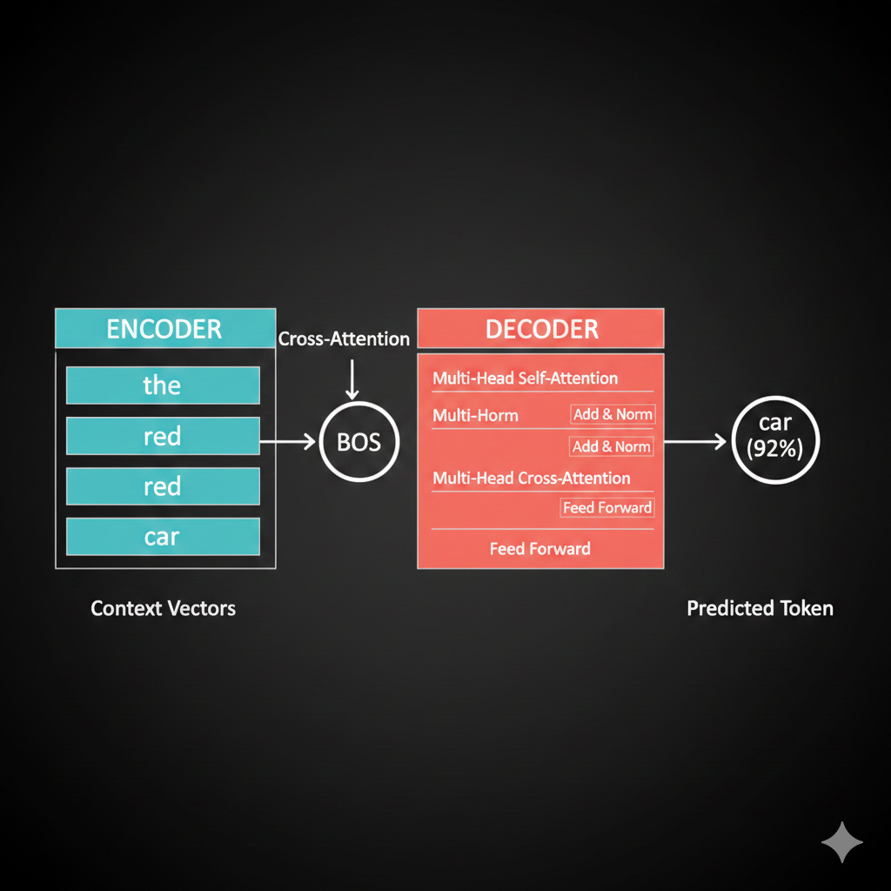{.lightbox}
:::

::: {.callout-tip}
## Rajesh
So the decoder input starts with just BOS, and we want it to predict "car"?
:::

::: {.callout-note}
## Dr. Nova Brooks
Exactly! First, BOS goes through self-attention (with just itself, since it's the only token so far). But here's the key - the decoder needs to know about the INPUT sequence "the red car."

This is where **cross-attention** comes in.

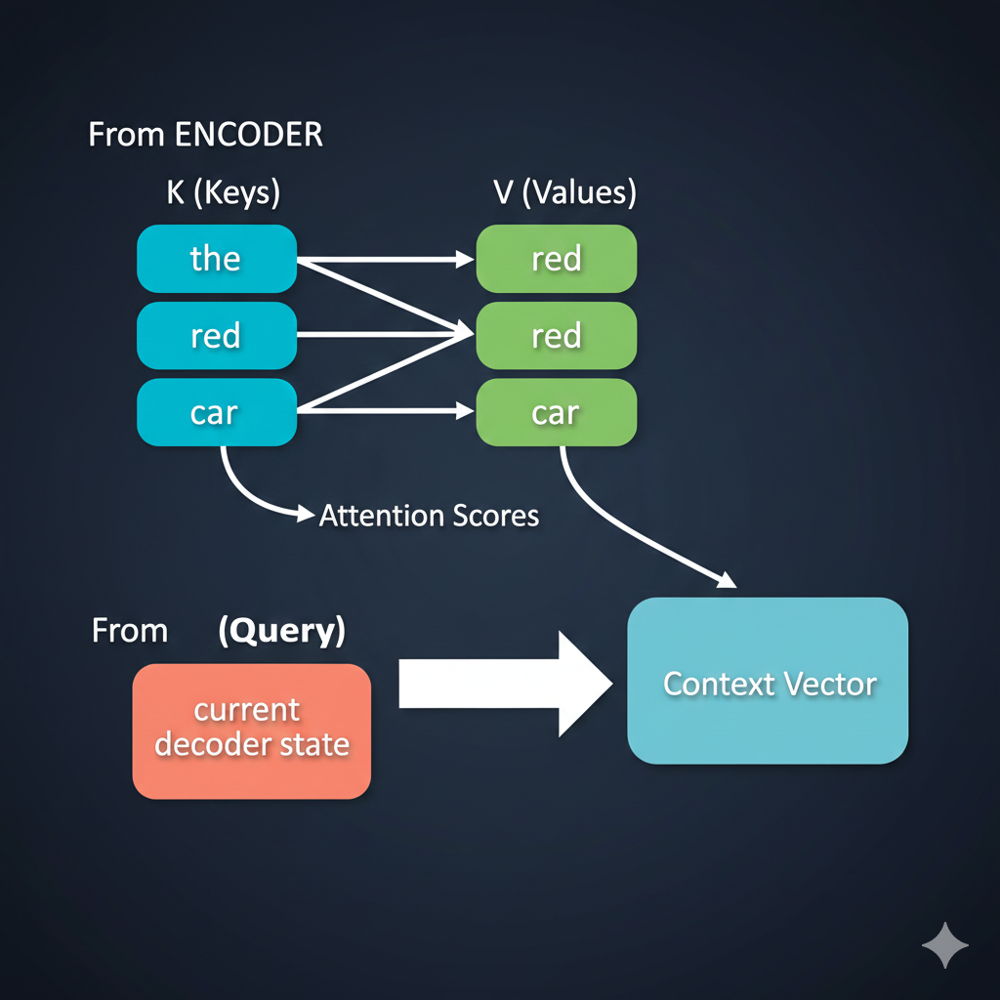{.lightbox}

In cross-attention:
- **Queries** come from the decoder (BOS)
- **Keys and Values** come from the encoder's output (the context vectors for "the," "red," "car")

The decoder token asks: "Given what the encoder understood, what should I generate next?"
:::

::: {.callout-tip}
## Rajesh
Oh! So the query is "what should come first?" and it attends to the encoder's understanding of the input. Since we want to swap, it should attend most to "car"!
:::

::: {.callout-note}
## Dr. Nova Brooks
Exactly! The cross-attention scores tell the decoder to focus on "car" (since that should come first in the output).

Let me show you the geometric interpretation:

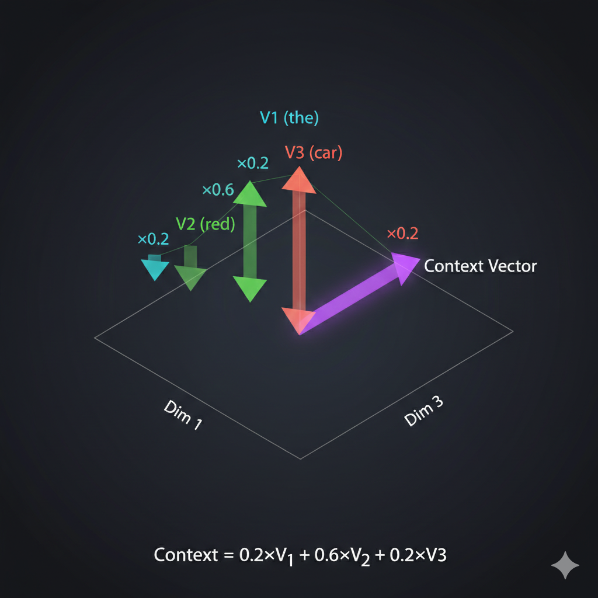{.lightbox}

The decoder's context vector becomes a weighted combination of the encoder's value vectors. High attention to "car" means the decoder's representation shifts toward "car's" meaning.
:::

::: {.callout-tip}
## Rajesh
And then after all the attention and feed-forward layers, how do we actually get the word "car" out?
:::

::: {.callout-note}
## Dr. Nova Brooks
**Vocabulary projection**! We take the final context vector and project it to the size of our vocabulary using a linear layer + softmax.

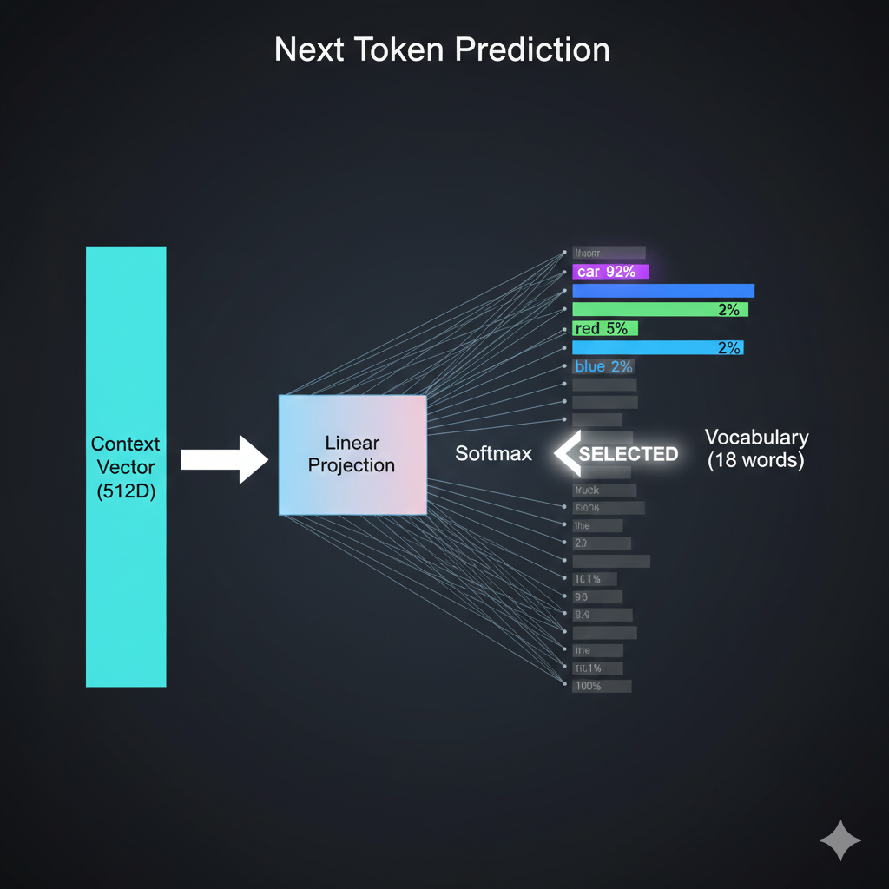{.lightbox}

Each vocabulary word gets a probability. We pick the highest one - "car" with 0.92 probability. That becomes our first output token.

**Step 2**: Now we have "BOS car" as input to the decoder. We repeat the process to predict "red."

**Step 3**: With "BOS car red" as input, the model predicts EOS, signaling it's done.
:::

::: {.callout-tip}
## Rajesh
So LLMs like ChatGPT are doing this thousands of times to generate each response? One token at a time?
:::

::: {.callout-note}
## Dr. Nova Brooks
Exactly! And here's an important detail: ChatGPT and most modern LLMs are **decoder-only** architectures. They don't have a separate encoder - they use only the decoder with masked self-attention.

But for tasks like **translation** - "I am in India" → "मैं भारत में हूं" - you need BOTH encoder and decoder. Why?

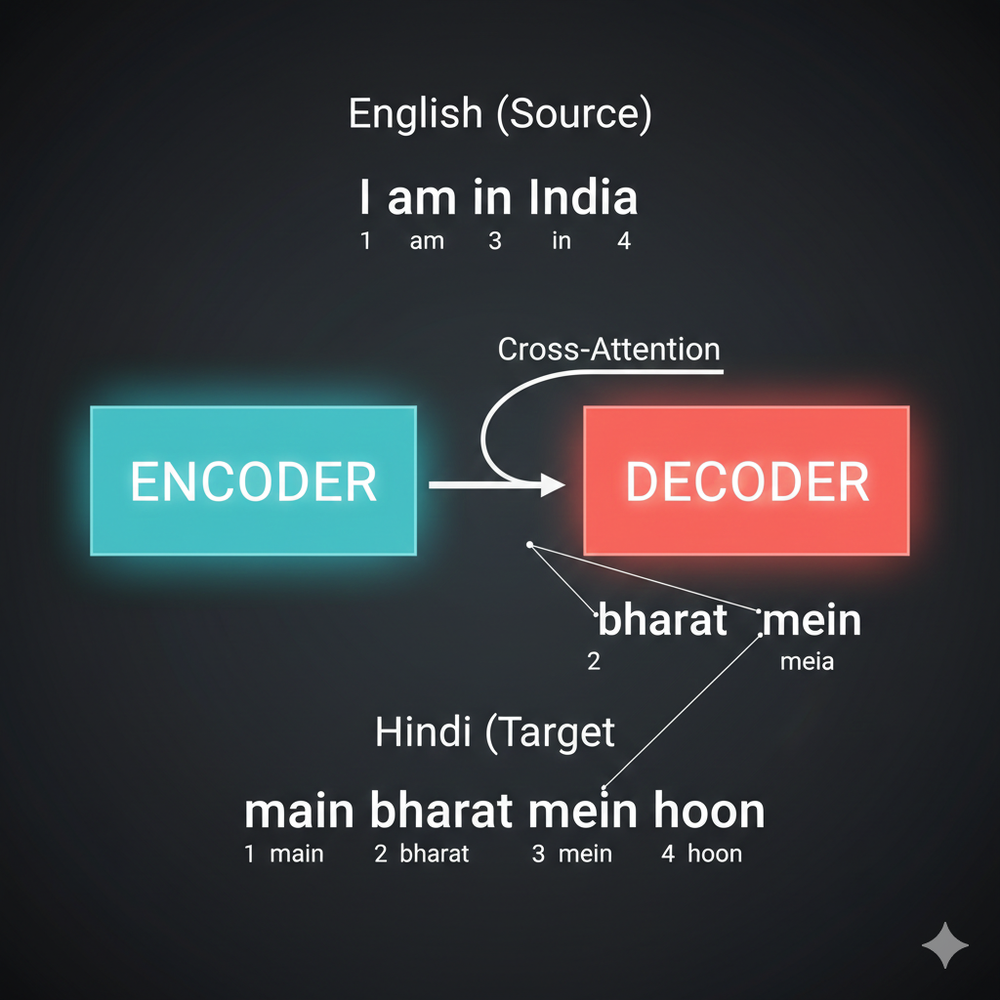{.lightbox}

The word order changes between languages. "India" is 4th in English but 2nd in Hindi. The encoder captures the SOURCE meaning, and cross-attention allows the decoder to attend to relevant source words regardless of their position.

Without the encoder, the decoder would have no way to "see" the full source sentence before generating. It would be like translating blind!
:::

::: {.callout-important}
## Masked Self-Attention
In the decoder, each token can only attend to tokens BEFORE it (not after). This prevents "cheating" - when generating token 5, you can't peek at what token 6 should be. This is why some attention matrices show gray/blocked regions beyond the diagonal.
:::

# Chapter 6: Vision Transformers {#chapter-6}

::: {.callout-tip}
## Rajesh
This all makes sense for text - words are naturally sequential. But images? How do you apply transformers to something that's a 2D grid of pixels?
:::

::: {.callout-note}
## Dr. Nova Brooks
That's exactly what researchers asked after the transformer paper. And in 2020, the **Vision Transformer (ViT)** paper answered: "An image is worth 16x16 words."

The trick is beautifully simple: **treat image patches as tokens**.

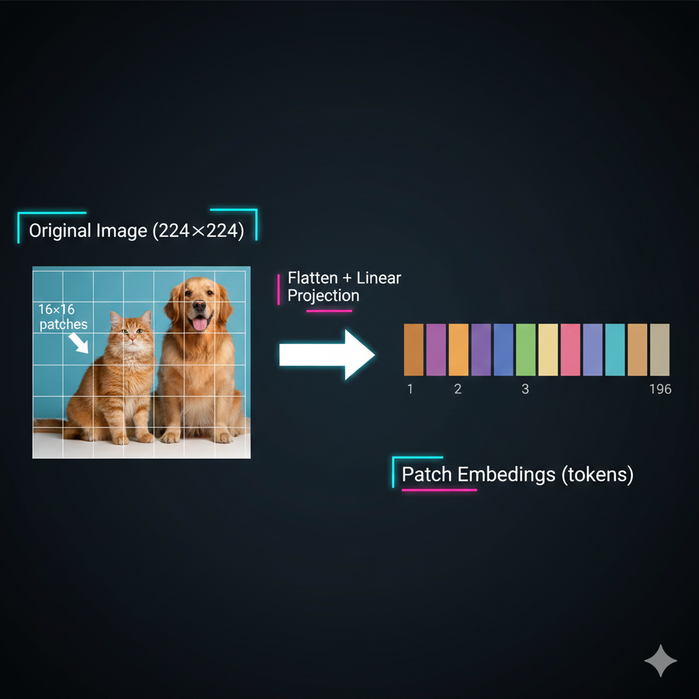{.lightbox}

Take a 224×224 image, divide it into 16×16 pixel patches. You get 14×14 = 196 patches. Each patch becomes a "token" with its own embedding.
:::

::: {.callout-tip}
## Rajesh
So instead of words, we have image patches? And each patch gets embedded into a vector?
:::

::: {.callout-note}
## Dr. Nova Brooks
Exactly! Each patch is flattened (16×16×3 = 768 values for RGB) and passed through a linear layer to create a **patch embedding** of whatever dimension we want (e.g., 512).

And just like text, **position matters**! Shuffling the patches gives a very different image.

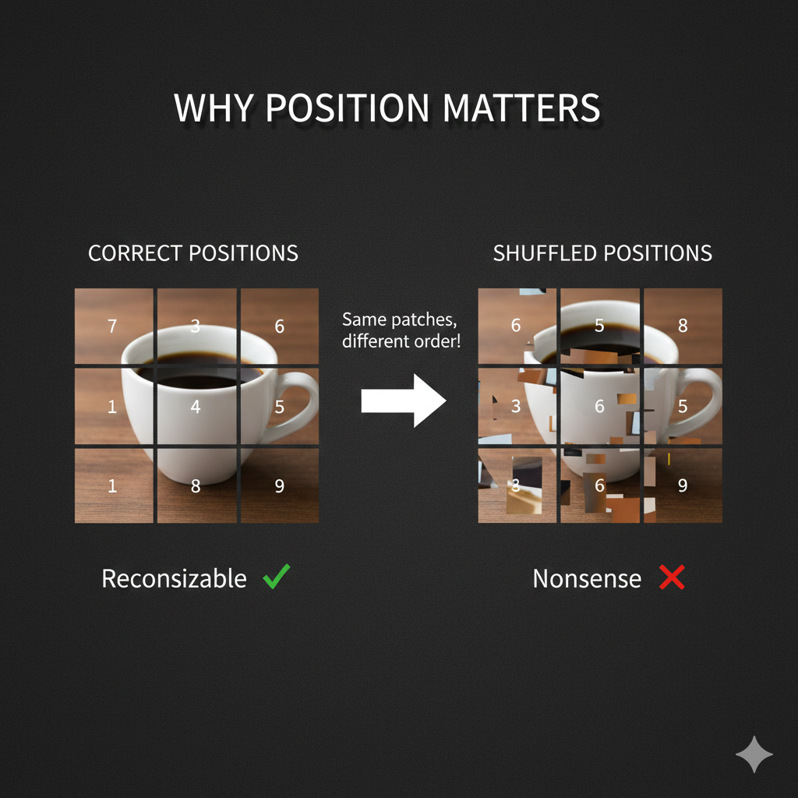{.lightbox}

So we add **positional embeddings** to patches too. Patch at position (0,0) has a different positional embedding than patch at (2,3).
:::

::: {.callout-tip}
## Rajesh
Okay, but here's my question. For text, we're predicting the next token. For images... what's the output? We're not predicting "the next patch."
:::

::: {.callout-note}
## Dr. Nova Brooks
Great observation! For classification tasks, we need a single vector representing the ENTIRE image. But self-attention gives us context vectors for EACH patch. How do we get one summary vector?

The solution is the **CLS token** - a special learnable token prepended to the sequence.

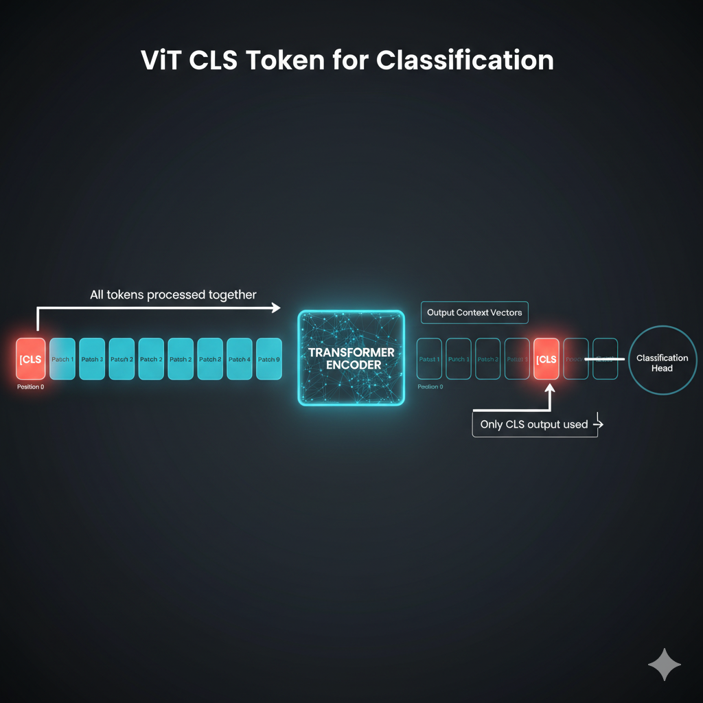{.lightbox}
:::

::: {.callout-tip}
## Rajesh
Wait - we just ADD a fake token? And it magically summarizes the image?
:::

::: {.callout-note}
## Dr. Nova Brooks
It's not magic - it's learned! The CLS token is initialized randomly but trained end-to-end. Through self-attention, it learns to attend to ALL the important patches.

Look at how CLS attention works:

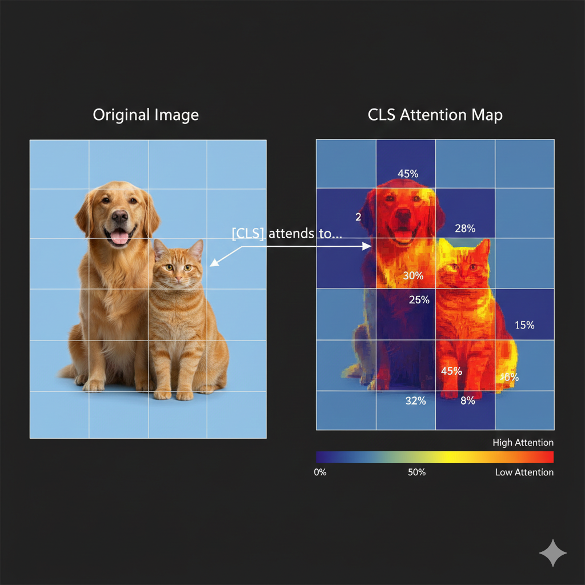{.lightbox}

The CLS token's attention scores determine how much information it takes from each patch. For a "dog vs cat" classifier, CLS learns to attend heavily to patches containing the animal's face and body.

After the encoder, we ONLY use the CLS context vector and pass it through a **classification head** (a simple MLP) to get class probabilities.
:::

::: {.callout-important}
## ViT Architecture Summary
1. Split image into patches (e.g., 16×16 pixels)
2. Linearly embed each patch to create patch embeddings
3. Add positional embeddings
4. Prepend a learnable CLS token
5. Pass through transformer encoder
6. Use CLS token's output for classification
:::

::: {.callout-tip}
## Rajesh
This is elegant! But training a ViT from scratch must require massive datasets...
:::

::: {.callout-note}
## Dr. Nova Brooks
You're right - ViT was originally trained on ImageNet-21K (14 million images). But here's the beautiful thing: **pre-trained ViTs can be fine-tuned** for new tasks with very little data.

Google released "google/vit-base-patch16-224" which you can use directly. Just replace the classification head with your number of classes and fine-tune on your dataset.

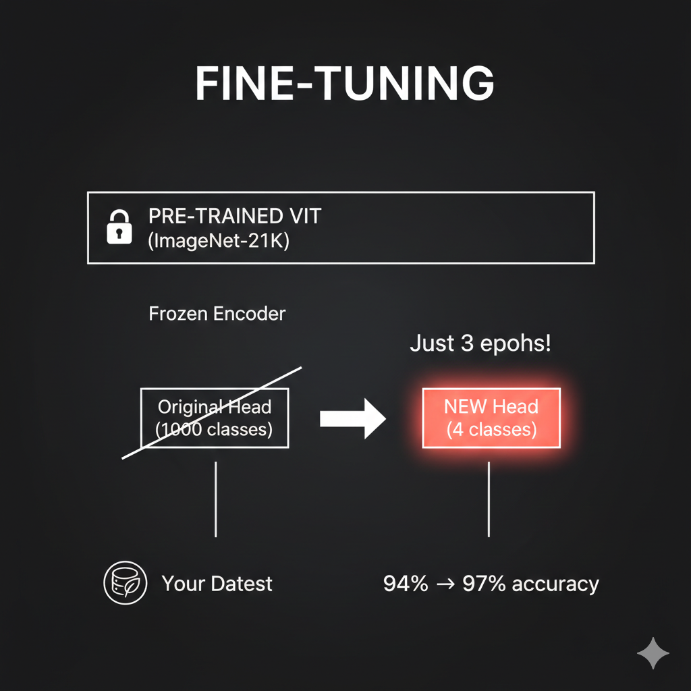{.lightbox}

I have a notebook where we classify plant disease images using a pre-trained ViT. We start at 94% accuracy and reach 97% after just 3 epochs of fine-tuning. The pre-trained model already understands "how images work" - we just teach it our specific classes.
:::

# Chapter 7: Transformers Meet Robots {#chapter-7}

::: {.callout-note}
## Dr. Nova Brooks
Now for the payoff - how does all this apply to robotics?

Remember our SO-ARM101 setup. The robot's observation includes:
- **Images** from cameras (480×640×3 pixels)
- **Proprioceptive data** - 6 joint angles per arm

And the output is a sequence of **actions** - target joint positions over time.
:::

::: {.callout-tip}
## Rajesh
So robot control is sequence-to-sequence! Observations come in as a sequence (image frames, joint states), and we output a sequence of actions!
:::

::: {.callout-note}
## Dr. Nova Brooks
Exactly! Robotics is **sequence modeling**. And transformers are exceptional at sequences.

Now let me show you how modern robotics architectures use everything we learned:

**SmallVA Architecture:**
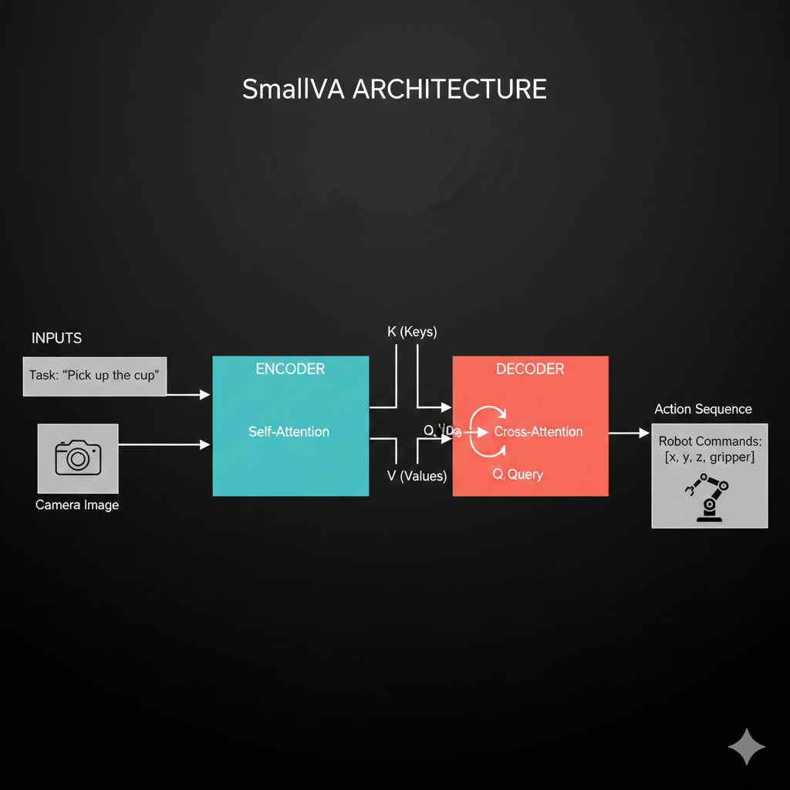{.lightbox}

See how the encoder processes images and text (task instructions) using self-attention? The output becomes Keys and Values for the decoder. The decoder generates actions through cross-attention to these observations.
:::

::: {.callout-tip}
## Rajesh
And the Q, K, V labels make sense now! K and V come from the encoder, Q comes from the decoder.
:::

::: {.callout-note}
## Dr. Nova Brooks
You're reading architecture diagrams like a native speaker!

**NVIDIA's GRoot:**
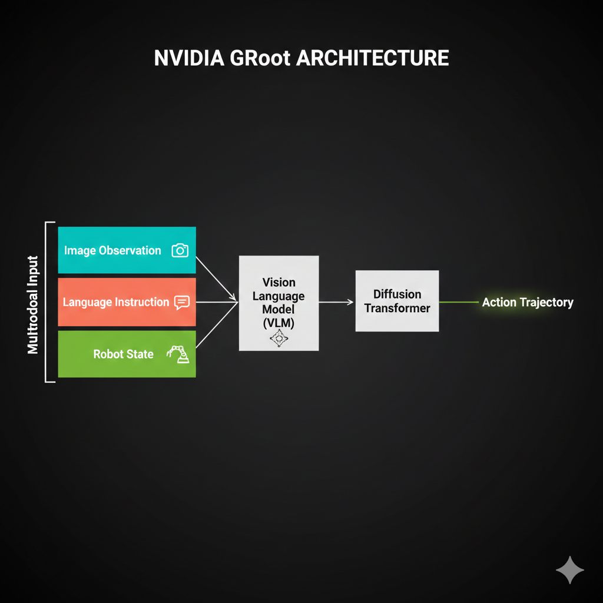{.lightbox}

GRoot uses a Vision Language Model (which is just a transformer processing both images and text) to create an encoding. Then a "diffusion transformer" generates actions. We'll learn about diffusion models in a later lesson - just note that transformers appear everywhere.

**OpenVLA:**
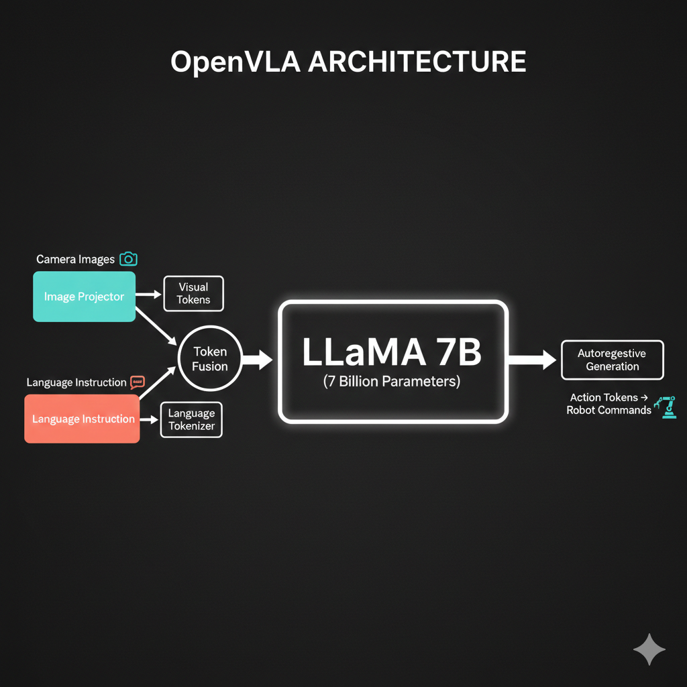{.lightbox}

OpenVLA uses a 7-billion parameter LLaMA model (decoder-only transformer) to generate actions. Images are projected to the same embedding space as language tokens, and the combined sequence is processed autoregressively.
:::

::: {.callout-tip}
## Rajesh
They're all using the same building blocks - just arranged differently! And I can actually follow what's happening now.
:::

::: {.callout-note}
## Dr. Nova Brooks
That's the power of understanding transformers deeply.

Now, here's a teaser for our next lesson. The policy we'll implement - **ACT (Action Chunking with Transformers)** - combines everything:

- **VAE** for handling multimodality (from Lesson 2)
- **Transformer encoder** for processing observations
- **Transformer decoder** for generating action sequences
- **CLS token** for image encoding

{.lightbox}
:::

::: {.callout-tip}
## Rajesh
Wait - the VAE latent variable goes INTO the transformer encoder? I would have thought the encoder produces the latent variable!
:::

::: {.callout-note}
## Dr. Nova Brooks
That's the beautiful twist in ACT! The VAE captures the multimodal nature of expert demonstrations (different ways to fold clothes), and its latent variable z is passed as a special token to the transformer encoder.

During training, we have access to the full demonstration trajectory, so we can encode it with the VAE. During inference, we sample z from the prior distribution.

But that's for next lesson. For now, you have homework:

1. **Read the original transformer paper** - "Attention Is All You Need"
2. **Read the ViT paper** - "An Image Is Worth 16x16 Words"
3. **Think about ACT** - How would you combine VAE + Transformer Encoder + Transformer Decoder?

You now speak transformer. The intimidating diagrams? They're your native language now.
:::

::: {.callout-tip}
## Rajesh
I can't believe how much clearer everything is. Those architecture diagrams that terrified me at the start? I can actually read them now!
:::

::: {.callout-note}
## Dr. Nova Brooks
That's the transformation - pun intended. Next lesson, we implement ACT and make our SO-ARM101 arms move with learned policies.

The revolution continues!
:::
