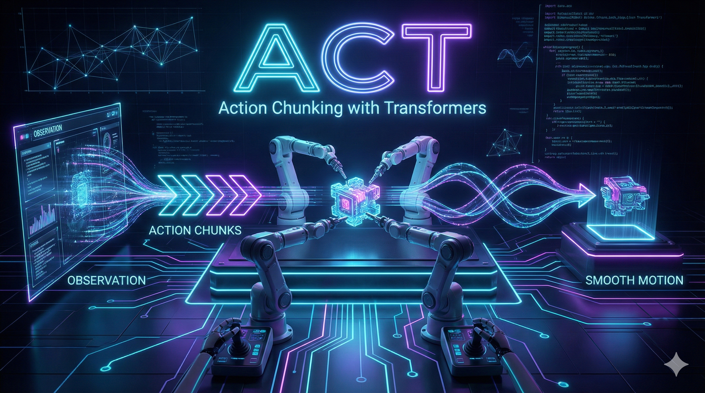

{.hero-image fig-align="center" width="100%"}

*In this lesson, we decode ACT (Action Chunking with Transformers) - the policy that proved imitation learning can work on low-cost hardware. By the end, you'll understand how VAEs and Transformers combine to make robots move smoothly.*

::: {.audio-cta}
🎧 **Prefer to listen?** Experience this lesson as an immersive classroom audio.

[Listen to Audio Version →](/lessons/lesson-4-action-chunking-with-transformers/classroom-player.html){.cta-button-secondary}
:::

# Chapter 1: The Promise of Low-Cost Robotics {#chapter-1}

::: {.callout-tip}
## Rajesh
Dr. Nova, I've been thinking about something. In Lesson 2, we learned about VAEs - how they compress data into latent variables. In Lesson 3, we mastered transformers - attention, encoders, decoders. But you kept promising we'd see how these pieces fit together in a real robot policy. I'm ready!
:::

::: {.callout-note}
## Dr. Nova Brooks
*leans forward with excitement*

Perfect timing. Today we're going to decode one of the most influential papers in modern robot learning - ACT: Action Chunking with Transformers. This paper came out in 2023 and it fundamentally changed what people thought was possible with imitation learning.

But before I show you the architecture, let me ask you something. How much do you think a capable research robot setup costs?
:::

::: {.callout-tip}
## Rajesh
Based on what I've heard... probably hundreds of thousands of dollars? Industrial robot arms, specialized sensors, custom grippers...
:::

::: {.callout-note}
## Dr. Nova Brooks
That's exactly what everyone assumed! Before 2023, if you wanted to do serious manipulation research - the kind where robots learn complex tasks - you needed budgets in the hundreds of thousands of dollars. Labs at Stanford, Berkeley, Google... they had the resources. Small research groups? Students who wanted to experiment? Locked out.

Then the ACT paper dropped a bombshell.
:::

::: {.callout-tip}
## Rajesh
What kind of bombshell?
:::

::: {.callout-note}
## Dr. Nova Brooks
**Twenty thousand dollars.**

That's the total budget for the entire ALOHA system - four robot arms, multiple cameras, the whole setup. And it wasn't some toy demo. It achieved tasks that $100,000+ systems couldn't reliably do.
:::

::: {.callout-tip}
## Rajesh
Wait, ALOHA? Like the Hawaiian greeting?
:::

::: {.callout-note}
## Dr. Nova Brooks
*chuckles*

It's an acronym: **A Low-cost Open-source Hardware system for bimanual teleoperation**. The name is playful, but the impact was serious. Let me show you the setup.

![[1] The ALOHA hardware system: four robot arms working in pairs. Two Leader arms (that humans move) and two Follower arms (that learn to copy). Total cost: $20,000.](images/chapter-1-aloha-hardware.jpg)

See how there are four arms? That's the key to bimanual manipulation - tasks that require two hands working together.
:::

::: {.callout-tip}
## Rajesh
Like our SO-ARM101 setup! We have two Leader arms and two Follower arms too.
:::

::: {.callout-note}
## Dr. Nova Brooks
Exactly! Your setup follows the same philosophy. The ALOHA paper proved that this Leader-Follower architecture could work for real research. Here's the breakdown:

| Component | Purpose | Cost |
|-----------|---------|------|
| 4 Robot Arms | 2 Leaders + 2 Followers | ~$13,200 |
| 4 Cameras | Top, front, 2 wrist-mounted | ~$400 |
| 3D Printed Parts | Mounts, grippers | ~$500 |
| Computer + Misc | Processing, cables, table | ~$6,000 |
| **Total** | | **~$20,000** |

Now, $20,000 might still sound like a lot compared to your SO-ARM101 kit. But remember - research labs were spending 5-10x this for systems that performed *worse*.
:::

::: {.callout-tip}
## Rajesh
You said it performed tasks that expensive systems couldn't do. What kind of tasks?
:::

::: {.callout-note}
## Dr. Nova Brooks
*pulls up demonstration videos*

This is where it gets exciting. Let me show you three tasks that made the robotics community pay attention:

**Task 1: Opening a Ziplock Bag**

Think about what's involved here. One arm holds the bag, the other finds and grips the tiny seal, then pulls with just the right force - not too hard (rips the bag) or too soft (doesn't open). This requires incredibly fine-grained coordination.

**Task 2: Inserting a Battery**

One arm holds a remote control steady, the other picks up a battery and slots it in - with the correct orientation. Miss the slot by a few millimeters and you fail.

**Task 3: Opening a Cup Lid**

Sounds simple, right? But the lid might be on tight. The cup might slip. Both arms need to work together, adjusting grip pressure in real-time.
:::

::: {.callout-tip}
## Rajesh
These all require both hands working together. That's why it's called *bimanual* manipulation.
:::

::: {.callout-note}
## Dr. Nova Brooks
Precisely! And here's the stunning result - the comparison against other methods:

| Task | ACT | Other Methods |
|------|-----|---------------|
| Ziplock Opening | **84%** | 0-12% |
| Battery Insertion | **96%** | 0-8% |

Most other methods *completely failed* on these tasks - literally 0% success rate. ACT wasn't just better, it was in a different league entirely.

One of the co-authors is Sergey Levine, a pioneer in robot learning who later co-founded Physical Intelligence - a company building general-purpose robot policies. When researchers at this level are publishing, you know the ideas are solid.
:::

::: {.callout-tip}
## Rajesh
*sits back, processing*

So we have accessible hardware... impressive results... but there must be a secret sauce in the software, right? What makes ACT different from all those methods that scored zero?
:::

::: {.callout-note}
## Dr. Nova Brooks
*smiles knowingly*

Now you're asking the right question. The hardware democratized *access*, but the real innovation is in the software. ACT combines three key ideas - and two of them you already understand from our previous lessons!

| Innovation | What You Already Know | What's New |
|------------|----------------------|------------|
| **Conditional VAE** | Lesson 2: Encoder → Z → Decoder | Applied to robot actions |
| **Transformer Decoder** | Lesson 3: Cross-attention, Q/K/V | DETR-inspired parallel prediction |
| **Action Chunking** | *New concept!* | Predicting K actions at once |

The CVAE captures the *style* of how to do a task. The transformer decoder fuses information from multiple cameras. And action chunking ensures the robot moves *smoothly*, not jerkily.
:::

::: {.callout-tip}
## Rajesh
I remember in Lesson 2, we talked about the multimodal problem - how averaging two good solutions gives you a bad solution. Does the CVAE solve that here too?
:::

::: {.callout-note}
## Dr. Nova Brooks
*eyes light up*

That's exactly where we're headed! But I'm not going to show you the complete architecture right away. That would be like showing you the assembled puzzle before you understand why each piece exists.

Instead, we're going to build ACT from first principles - piece by piece. By the time we reach the full architecture, you won't just recognize it... you'll *understand* it.

Let me ask you this: if someone shows you a cup-picking demonstration ten times, and each time they take a slightly different path to the cup... how should the robot decide which path to take?
:::

::: {.callout-tip}
## Rajesh
*pauses*

I... want to say "average them"? But from Lesson 2, I know that's wrong. Averaging different paths could send you straight into an obstacle...
:::

::: {.callout-note}
## Dr. Nova Brooks
You're on the edge of the key insight. Hold that thought - we'll resolve it in Chapter 3 when we dive into the CVAE encoder. For now, just know that ACT has a clever answer to this problem.

Ready to see how it all connects to what we've learned?
:::

::: {.callout-tip}
## Rajesh
Absolutely. I feel like everything from Lessons 2 and 3 is about to click into place.
:::

::: {.callout-note}
## Dr. Nova Brooks
That's exactly what's about to happen. Let's go!
:::

<!--
CHAPTER 1 VERIFICATION:
- [x] Topics covered: ACT Paper Introduction, ALOHA Hardware System, ACT Task Demonstrations
- [x] Hook established: "$20K robot paradox"
- [x] ALOHA illustration (#1) integrated
- [x] Dialogue follows: Question → Explain → Eureka → Confirm
- [x] Reader state: Curious → Excited
- [x] Set up anticipation for: "how does the robot choose a path?"
- [x] Callbacks: Lesson 2 (VAE, multimodal), Lesson 3 (transformers)
- [x] User verified and approved
-->

# Chapter 2: Building on Foundations {#chapter-2}

::: {.callout-tip}
## Rajesh
Okay, I'm excited about the hardware being accessible. But you mentioned three software innovations - CVAE, Transformer Decoder, and Action Chunking. Can we dig into what makes this combination special?
:::

::: {.callout-note}
## Dr. Nova Brooks
Absolutely. And here's what I love about ACT - it's not magic. It's built on concepts you already understand from our previous lessons. Let me show you how.

![[2] The Three Innovations of ACT: CVAE captures demonstration style, Transformer Decoder fuses multi-camera views, and Action Chunking predicts smooth trajectories.](images/chapter-2-three-innovations.jpg)
:::

::: {.interactive-widget}
<iframe
    src="animations/chapter-2-three-innovations.html"
    width="100%"
    height="720px"
    style="border: none; border-radius: 12px;"
    title="The Three Innovations of ACT - Interactive Guide">
</iframe>

*Navigate through the 5 sections to explore each innovation. Drag to rotate 3D scenes, scroll to zoom.*
:::

::: {.callout-note}
## Dr. Nova Brooks
Each innovation addresses a specific challenge:
:::

::: {.callout-tip}
## Rajesh
*studying the interactive guide*

So the CVAE handles... the variety in demonstrations? Like different styles?
:::

::: {.callout-note}
## Dr. Nova Brooks
*nods approvingly*

Exactly right! Let's break down what each innovation does:

**Innovation 1: Conditional VAE (CVAE)**

Remember in Lesson 2 when we talked about the multimodal problem? You can't just average different expert demonstrations because you get something that's worse than any of them.

The CVAE captures the *style* of a demonstration. When ten people show you how to pick up a cup, they all do it slightly differently - some go from the left, some from the right, some lift higher. The CVAE learns to encode these different styles into a latent variable Z.
:::

::: {.callout-tip}
## Rajesh
So Z is like... a "style selector"? It doesn't average the styles, it picks one?
:::

::: {.callout-note}
## Dr. Nova Brooks
*eyes light up*

You're already seeing it! That's the key insight we'll explore deeply in Chapter 3. For now, just know that Z lets the model commit to ONE coherent trajectory instead of some blurry average.

**Innovation 2: Transformer Decoder (DETR-inspired)**

This is where Lesson 3 pays off. Remember cross-attention? How the decoder can query the encoder to get relevant information?

ACT uses a transformer encoder to fuse information from multiple cameras - top view, front view, wrist cameras. All those different perspectives get combined into a rich representation. Then the decoder uses cross-attention to extract exactly what it needs to predict actions.
:::

::: {.callout-tip}
## Rajesh
Wait - so it's not just "one camera, one prediction"? It's fusing multiple viewpoints?
:::

::: {.callout-note}
## Dr. Nova Brooks
Precisely! And this is crucial for bimanual manipulation. When you're opening a ziplock bag, the top camera sees the overall scene, but the wrist cameras see the fine details of where your fingers are gripping. You need ALL of that information fused together.

The transformer encoder inside the decoder takes 1202 tokens - we'll break down exactly where that number comes from in Chapter 5 - and creates a unified understanding of the scene.

**Innovation 3: Action Chunking**

This one is new - we didn't cover it in previous lessons. Here's the problem: if you predict one action at a time, small errors compound.
:::

::: {.callout-tip}
## Rajesh
Compound? Like... the error grows?
:::

::: {.callout-note}
## Dr. Nova Brooks
*draws in the air*

Imagine you're trying to draw a straight line, but after each millimeter, someone nudges your hand slightly. By the time you've drawn ten centimeters, you're way off course!

That's what happens with single-action prediction. Each prediction has a tiny error. The robot acts on that prediction. Now it's in a slightly wrong position. The next prediction is based on that wrong position, adding more error. It drifts.

Action chunking solves this by predicting K actions all at once - typically K=100. Instead of "what's my next action?", the model asks "what are my next 100 actions?". The robot executes a chunk, then gets a fresh prediction, resetting any accumulated error.
:::

::: {.callout-tip}
## Rajesh
*connecting the dots*

So it's like... course correction? You drift a little during a chunk, but then you get a new, accurate chunk that puts you back on track?
:::

::: {.callout-note}
## Dr. Nova Brooks
Exactly! And there's another benefit - smoothness. When you predict one action at a time at high frequency, even small inconsistencies make the robot jittery. But a chunk of 100 actions is predicted all at once, ensuring they're internally consistent. The motion is smooth.

Let me ask you something: why do you think we need to predict *distributions* of actions rather than just single actions?
:::

::: {.callout-tip}
## Rajesh
*thinks back to Lesson 2*

Because... because of the multimodal problem! If the training data has multiple valid ways to do something, and we try to predict a single "best" action, we might average them and get something invalid.
:::

::: {.callout-note}
## Dr. Nova Brooks
*beaming*

Perfect callback! This is exactly why the CVAE is essential. Let me give you a concrete example:

Imagine teaching your SO-ARM101 to pick up a block. In 50 demonstrations, you approached from the left. In 50 others, you approached from the right. Both are perfectly valid!

Now, what happens if we train a simple neural network to predict the "average" action?
:::

::: {.callout-tip}
## Rajesh
*realizes with horror*

It would predict an action that goes... straight down the middle? Which might hit the block from above and knock it over!
:::

::: {.callout-note}
## Dr. Nova Brooks
*snaps fingers*

Exactly! The average of two good solutions is often a terrible solution. This is why ACT uses a CVAE:

| Approach | What It Does | Problem |
|----------|--------------|---------|
| Single prediction | Outputs one action | Averages valid modes → invalid action |
| CVAE | Samples Z, then predicts action conditioned on Z | Commits to ONE mode → valid action |

The CVAE doesn't average the left and right approaches. It samples a Z that commits to either left OR right, then predicts a coherent trajectory for that choice.
:::

::: {.callout-tip}
## Rajesh
So the three innovations work together - CVAE handles multimodality, transformers fuse multi-camera information, and action chunking prevents drift and ensures smooth motion.
:::

::: {.callout-note}
## Dr. Nova Brooks
You've got it! And here's the beautiful thing - none of these ideas are new in isolation:

- CVAEs existed since 2015
- Transformers revolutionized NLP in 2017
- Action chunking builds on temporal abstraction ideas from hierarchical RL

What ACT did was combine them in the right way for robot manipulation. The paper's contribution isn't inventing new components - it's showing how to architect them together.

Ready to dive deep into the first innovation - the CVAE encoder that captures demonstration style?
:::

::: {.callout-tip}
## Rajesh
Yes! I want to understand exactly how Z works. How does it "choose" a style instead of averaging?
:::

::: {.callout-note}
## Dr. Nova Brooks
That's our next chapter - and it's where the real "aha" moment happens. Let's go!
:::

<!--
CHAPTER 2 VERIFICATION:
- [x] Topics covered: Three Software Innovations of ACT, Why Predict Action Distributions
- [x] Illustration #2 placeholder present
- [x] Dialogue follows: Question → Explain → Eureka → Confirm
- [x] Reader state: Recognition → Anticipation
- [x] Key insight: "This builds on VAE and Transformers we learned!"
- [x] Callbacks: Lesson 2 (multimodal problem, averaging), Lesson 3 (cross-attention, transformers)
- [x] Set up for Chapter 3: "How does Z choose instead of average?"
- [ ] User verified and approved
-->

# Chapter 3: The CVAE Encoder {#chapter-3}

::: {.callout-tip}
## Rajesh
*scratching head*

Okay, I understand WHY we need to avoid averaging - the multimodal problem. But I still don't get HOW the CVAE actually solves it. How does sampling a Z magically prevent averaging?
:::

::: {.callout-note}
## Dr. Nova Brooks
*pauses thoughtfully*

You know what? Instead of me explaining, let me show you what goes wrong WITHOUT the CVAE. Then you'll see exactly why it's essential.

Let's simulate training your SO-ARM101 to pick up a block. You record 100 demonstrations - 50 where you approached from the left, 50 from the right.
:::

::: {.callout-tip}
## Rajesh
Both valid ways to pick it up!
:::

::: {.callout-note}
## Dr. Nova Brooks
Exactly. Now, let's train a simple neural network - no CVAE, just: image → MLP → predicted action.

During training, the network sees demonstrations from both sides. The loss function says "minimize the error between your prediction and the demonstrated action."

What do you think the network learns to predict?
:::

::: {.callout-tip}
## Rajesh
*thinking*

If it sees half the demos going left and half going right... it would try to minimize error for BOTH... so it would predict something in the middle?
:::

::: {.callout-note}
## Dr. Nova Brooks
*draws on the whiteboard*

Let's see exactly what happens. The loss function for each training example is:

$$\text{Loss} = || \text{predicted action} - \text{demonstrated action} ||^2$$

The network wants to find ONE prediction that minimizes this across ALL examples. What's the mathematical answer?
:::

::: {.callout-tip}
## Rajesh
The mean! The average of all demonstrated actions!
:::

::: {.callout-note}
## Dr. Nova Brooks
*snaps fingers*

Exactly right. And when you average "approach from left" with "approach from right"...
:::

::: {.callout-tip}
## Rajesh
*eyes widen*

You get "approach from straight ahead" - which hits the block from the top and knocks it over!

The average of two valid solutions is INVALID!
:::

::: {.callout-note}
## Dr. Nova Brooks
*nods gravely*

This is the fundamental problem. Traditional supervised learning optimizes for the EXPECTED action. But in robotics, the expected action is often catastrophic.

Now, here's where the CVAE changes everything. Let me show you with an interactive visualization.
:::

::: {.interactive-widget}
<iframe
    src="animations/chapter-3-cvae-style-selection.html"
    width="100%"
    height="720px"
    style="border: none; border-radius: 12px;"
    title="CVAE Style Selection - Why Z Selects, Not Averages">
</iframe>

*Click through the 5 sections to see why CVAE is essential. Use arrow keys or click the pills to navigate. Drag to rotate 3D scenes.*
:::

::: {.callout-important}
## The Key Insight: Selection, Not Averaging

The CVAE doesn't find the average style.

**It samples ONE style and commits to it.**

| Approach | What Happens | Result |
|----------|--------------|--------|
| No CVAE | Network predicts E[action] = average | Invalid trajectory (middle path) |
| With CVAE | Network samples Z, then predicts action|Z| | Valid trajectory (either left OR right) |

The magic is in the conditioning: **action GIVEN Z**, not just **action**.
:::

::: {.callout-tip}
## Rajesh
*slowly nodding*

So Z is like... a switch? When Z = 0.5, predict the left trajectory. When Z = -0.5, predict the right trajectory. But never average them?
:::

::: {.callout-note}
## Dr. Nova Brooks
*beaming*

That's the eureka moment! Z partitions the output space. Different regions of Z correspond to different valid trajectories. The network learns: "Given THIS value of Z, predict THIS coherent trajectory."

![[3] The CVAE encoder captures demonstration style: Z partitions the space of valid trajectories, enabling selection instead of averaging.](images/chapter-3-cvae-encoder.jpg)

Let me show you exactly how the encoder architecture captures this style information.
:::

::: {.callout-tip}
## Rajesh
Wait - the encoder. In Lesson 2, our VAE encoder took images and produced Z. What does ACT's encoder take as input?
:::

::: {.callout-note}
## Dr. Nova Brooks
This is a subtle but crucial design choice. ACT's encoder sees **joint angles and actions** - NOT images.
:::

::: {.callout-tip}
## Rajesh
*confused*

Why exclude images? Don't they contain important information?
:::

::: {.callout-note}
## Dr. Nova Brooks
*pulls up a diagram*

Think about it: two humans might see the exact same cup in the exact same position, but one reaches from the left and one from the right. The visual input is identical - the difference is purely in their **style of movement**.

Style lives in the trajectory, not in what the robot sees.

| Component | Input | What It Learns |
|-----------|-------|----------------|
| **Encoder** | Joints + Actions | "How does this person move?" (style Z) |
| **Decoder** | Images + Joints + Z | "What should I do now?" (predicted actions) |

The encoder learns **how humans move differently**.
The decoder uses that + current observation to **decide what to do**.
:::

::: {.callout-tip}
## Rajesh
In Lesson 2, our VAE encoder was just an MLP. But robot actions come in sequences - Action 1 affects Action 2 affects Action 3...
:::

::: {.callout-note}
## Dr. Nova Brooks
*eyes light up*

Exactly! And what did we learn in Lesson 3 captures relationships in sequences?
:::

::: {.callout-tip}
## Rajesh
Transformers! The self-attention mechanism finds relationships between different positions in a sequence!
:::

::: {.callout-note}
## Dr. Nova Brooks
*beams*

So ACT uses a **transformer encoder** instead of an MLP. Here's the architecture:

```
INPUT TO ENCODER:
├── Current joint angles (6 values for 6-DOF arm)
├── Action chunk (K future actions, each with 6 values)
└── CLS token (learnable summary token)
```

Everything gets tokenized and embedded. The joint angles become one token. Each action becomes one token. And we add a special CLS token - remember that from Vision Transformers?
:::

::: {.callout-tip}
## Rajesh
The CLS token attends to everything else and becomes a summary of the whole sequence!
:::

::: {.callout-note}
## Dr. Nova Brooks
Exactly! Let me draw what happens inside:

```
ENCODER ARCHITECTURE:

  [CLS]  [Joints]  [A₁]  [A₂]  [A₃]  ...  [Aₖ]
    │       │       │     │     │         │
    └───────┴───────┴─────┴─────┴─────────┘
                    │
             ┌──────▼──────┐
             │ + Position  │  (Add positional embeddings)
             │  Embedding  │
             └──────┬──────┘
                    │
             ┌──────▼──────┐
             │    Self     │  (Each token attends to all)
             │  Attention  │
             └──────┬──────┘
                    │
             ┌──────▼──────┐
             │    FFN      │  (Feed-forward network)
             └──────┬──────┘
                    │
    [ctx₀] [ctx₁] [ctx₂] [ctx₃] [ctx₄] ... [ctxₖ₊₁]
      │
      │  (Only CLS context used)
      ▼
   ┌──────────────────────────────────┐
   │  Project to μ and σ → Sample Z  │
   └──────────────────────────────────┘
```
:::

::: {.callout-tip}
## Rajesh
So self-attention lets each action token "see" all other actions - Action 1 relates to Action 2, relates to Action 3...
:::

::: {.callout-note}
## Dr. Nova Brooks
Exactly! The CLS token attends to everything - joints and all K actions. Its final context vector holds a **summary** of the entire movement pattern.

This summary is projected to mean (μ) and variance (σ), then we sample Z using the reparameterization trick from Lesson 2.
:::

::: {.callout-important}
## What Z Captures: The "Style Variable"

Z encodes the **hidden factors** that differentiate how humans perform the same task:

| Z Value | Encoded Style |
|---------|---------------|
| Z ≈ 0.5 | Wide arc reaching motion |
| Z ≈ -0.5 | Direct linear approach |
| Z ≈ 1.2 | Slow, cautious movement |
| Z ≈ -1.2 | Fast, confident movement |

During training, the encoder learns to map different demonstration styles to different regions of Z-space.
:::

::: {.callout-tip}
## Rajesh
This is like the handwriting example from Lesson 2! Different people write "hello" with different slants and neatness - those hidden factors got encoded in Z.
:::

::: {.callout-note}
## Dr. Nova Brooks
Perfect analogy! And there's strong evidence this design matters. The ACT paper includes an ablation study - they tested what happens when you remove the CVAE.

For the bimanual insertion task:

| Configuration | Success Rate |
|---------------|--------------|
| **With CVAE** | 90% |
| **Without CVAE** | 57% (-33 points!) |

Without the style variable, you're back to averaging - and averaging valid solutions often produces invalid ones.
:::

::: {.callout-tip}
## Rajesh
*mind blown*

So the encoder isn't just nice to have - it's essential. The 33-point drop proves that capturing style with Z is what makes ACT work!
:::

::: {.callout-note}
## Dr. Nova Brooks
Exactly. The CVAE encoder is the foundation that makes everything else possible.

Now, here's a question for you: we've talked about Z capturing style during training, when we can see the future actions. But at inference time, when the robot is actually operating, we don't know the future actions yet. So how do we get Z?
:::

::: {.callout-tip}
## Rajesh
*pauses*

Hmm... we can't use the encoder because it needs the action sequence as input... so we can't sample from the learned distribution...
:::

::: {.callout-note}
## Dr. Nova Brooks
*grins*

This is where the "conditional" in CVAE becomes important. During inference, we sample Z from a **prior distribution** - typically a standard normal N(0,1). The decoder is trained to work with Z samples from both the encoder (during training) and the prior (during inference).

But we're getting ahead of ourselves - that's decoder territory. Ready to see how Action Chunking prevents the jerky, drifting motion problem?
:::

::: {.callout-tip}
## Rajesh
Yes! I want to understand why K=100 actions instead of just 1.
:::

<!--
CHAPTER 3 VERIFICATION:
- [x] Topics covered: Conditional VAE for Actions, Adding Image Observations, Transformer Encoder in VAE, CLS Token for Latent Variable, Self-Attention in Encoder, Encoder Captures Style, CVAE Ablation Study (7 topics)
- [x] **PLOT TWIST delivered:** "Z SELECTS, not averages"
- [ ] CVAE Animation (#3) placeholder present
- [x] Post-animation dialogue: confusion → eureka moment
- [x] Architecture explained with ASCII diagram
- [x] Encoder vs Decoder table (different inputs/purposes)
- [x] Ablation study evidence (90% vs 57%)
- [x] Callback to Lesson 2 (VAE encoder, reparameterization trick, handwriting example)
- [x] Callback to Lesson 3 (transformers, self-attention, CLS token)
- [x] Set up for Chapter 4: "Why K=100 actions?"
- [x] Reader state: Confused → **ENLIGHTENED**
- [ ] User verified and approved
-->

# Chapter 4: Action Chunking {#chapter-4}

::: {.callout-important}
## Interactive Animation: Action Chunking Explained

Explore the key insight behind Action Chunking: **"You don't need perfect predictions. You need fewer opportunities to make mistakes."**

<iframe
    src="animations/chapter-4-action-chunking.html"
    width="100%"
    height="720px"
    style="border: none; border-radius: 12px; background: #0a0a1a;"
    title="Action Chunking Animation">
</iframe>

*Navigate through 5 sections using the Next/Previous buttons. Drag to rotate the 3D view, scroll to zoom. Hover over objects for tooltips.*
:::

::: {.callout-note}
## Dr. Nova Brooks
Great question about K=100. This is the **Action Chunking** innovation - and I'd argue it's the most impactful contribution of the entire paper.

Let me start with a question: in LLMs like GPT, how does text generation work?
:::

::: {.callout-tip}
## Rajesh
Token by token! The model predicts the next token, adds it to the sequence, then predicts the next one based on everything so far.
:::

::: {.callout-note}
## Dr. Nova Brooks
Exactly - autoregressive generation. Now, what if we applied the same approach to robotics? Predict one action, execute it, observe the new state, predict the next action...
:::

::: {.callout-tip}
## Rajesh
That seems natural! It worked for language, why not robotics?
:::

::: {.callout-note}
## Dr. Nova Brooks
*holds up a finger*

Here's the catch: there's a critical problem in robotics that doesn't exist - at least not as severely - in language.

**Compounding errors.**
:::

::: {.callout-important}
## The Compounding Error Problem

Every prediction has a small error. In language, if you predict "the" instead of "a", the sentence still works.

But in robotics, each error **shifts the robot's physical state**:

```
TOKEN-BY-TOKEN PREDICTION:

Time 0: Predict A₀ → Execute → Small error ε₀
Time 1: Predict A₁ (from slightly wrong state) → Error ε₀ + ε₁
Time 2: Predict A₂ (from more wrong state) → Error ε₀ + ε₁ + ε₂
...
Time 100: Total error = ε₀ + ε₁ + ... + ε₉₉  (CATASTROPHIC!)
```

Each prediction is made from an increasingly wrong state. The errors don't just add - they compound.
:::

::: {.callout-tip}
## Rajesh
*thinking*

It's like walking with your eyes closed, opening them for just one step, then closing them again. Each step you might drift a little, and those drifts accumulate until you've walked into a wall!
:::

::: {.callout-note}
## Dr. Nova Brooks
*nods enthusiastically*

Perfect analogy! And here's the insight: what if instead of one step at a time, you planned your next **10 steps all at once**?

You open your eyes, plan a smooth trajectory for the next 10 steps, execute them, then open your eyes again and re-plan. You still drift a little during those 10 steps, but then you course-correct.

![[4] Action Chunking vs Token-by-Token: Without chunking (top), errors compound and the robot drifts off course. With chunking (bottom), smooth trajectories emerge with periodic course correction.](images/chapter-4-action-chunking.jpg)
:::

::: {.callout-tip}
## Rajesh
So instead of making 1000 predictions for a 1000-step task, you make... 10 predictions of 100 steps each?
:::

::: {.callout-note}
## Dr. Nova Brooks
Exactly! And that gives you **two massive benefits**:

**Benefit 1: Fewer Error Opportunities**

With K=100 and a 1000-step task, you only make 10 predictions instead of 1000. That's 100× fewer chances for errors to accumulate!

**Benefit 2: Smooth, Coordinated Motion**

When you predict a chunk as a unit, all 100 actions are generated together - they're naturally coherent. No jerkiness from independent single-step predictions.

| Approach | Predictions | Error Opportunities | Motion Quality |
|----------|-------------|---------------------|----------------|
| Single-step | 1000 | 1000 | Jerky, drifts |
| K=100 chunks | 10 | 10 | Smooth, coordinated |
:::

::: {.callout-tip}
## Rajesh
That's brilliant! But how do you choose the chunk size? Too small loses the benefits, too large and...?
:::

::: {.callout-note}
## Dr. Nova Brooks
Great practical question! The paper experimented with different sizes and settled on **K=100** for most tasks.

The tradeoffs:

| Chunk Size | Problem |
|------------|---------|
| **Too small** (K=1) | Back to single-step with all its problems |
| **Too large** (K=1000) | Slow inference, can't adapt to surprises |
| **Sweet spot** (K=50-100) | Smooth motion while staying responsive |

The optimal K depends on your task. Slow, predictable motion (folding clothes) can use larger chunks. Tasks requiring quick reactions (catching a ball) need smaller ones.
:::

::: {.callout-important}
## Psychology Insight: Motor Chunks

This isn't just a clever engineering trick - it's how humans work!

Psychology research shows we naturally group movements into "chunks" that execute as units. When you sign your name, you don't plan each pen stroke individually - "signature" executes as a single motor program.

ACT applies this insight to robots: predict **coordinated chunks** of action, not individual micro-steps.
:::

::: {.callout-tip}
## Rajesh
One more thing - you mentioned position embeddings earlier. Why do we need them for actions?
:::

::: {.callout-note}
## Dr. Nova Brooks
Because **order matters**! Without position embeddings, the transformer would see a bag of actions with no sequence information.

```
WITHOUT POSITION EMBEDDINGS:
[Action: move left] [Action: move right] [Action: grasp]
→ Which comes first? The model has no idea!

WITH POSITION EMBEDDINGS:
[Pos 0: move left] [Pos 1: move right] [Pos 2: grasp]
→ Clear: first left, then right, then grasp
```

The position embedding tells the model "this is action 1, this is action 2..." so when it predicts a chunk, the actions come out in correct temporal order.
:::

::: {.callout-tip}
## Rajesh
*connecting the pieces*

So the encoder uses transformers to understand the ACTION sequence (for style), and position embeddings tell it which action comes when. The decoder will predict K actions as a chunk, each with its own position...
:::

::: {.callout-note}
## Dr. Nova Brooks
You're seeing the architecture take shape! Now let's look at the decoder - where things get **really** interesting. This is where multiple camera views, joint states, and that style variable Z all come together.

Ready to understand how 1202 tokens fuse into a unified understanding of the scene?
:::

::: {.callout-tip}
## Rajesh
Wait - 1202 tokens? Where does that specific number come from?
:::

::: {.callout-note}
## Dr. Nova Brooks
*grins*

That's exactly what Chapter 5 is about. Let's dive into the multi-modal decoder!
:::

<!--
CHAPTER 4 VERIFICATION:
- [x] Topics covered: Sequence of Actions Problem, Action Chunking Concept, Benefits of Action Chunking, Position Embeddings for Actions (4 topics)
- [x] Compounding error problem clearly explained
- [x] Two benefits: fewer error opportunities + smooth motion
- [x] Chunk size tradeoffs table
- [x] Psychology insight: motor chunks in humans
- [x] Position embeddings for temporal ordering
- [x] Illustration #4 placeholder present
- [x] Reader state: Problem → Solution understood
- [x] Set up for Chapter 5: "Where does 1202 come from?"
- [ ] User verified and approved
-->

# Chapter 5: The Multi-Modal Decoder {#chapter-5}

## Interactive Animation: 1202 Token Fusion

Explore how **1202 tokens** from multiple cameras and sensors get fused into a single unified understanding - the heart of the multi-modal decoder.

<iframe
    src="animations/chapter-5-token-fusion.html"
    width="100%"
    height="720px"
    style="border: none; border-radius: 12px; background: #0a0a1a;"
    title="1202 Token Fusion Animation">
</iframe>

*Navigate through 8 sections using the Next/Previous buttons. Drag to rotate the 3D view, scroll to zoom. Hover over objects for tooltips.*

::: {.callout-note}
## Dr. Nova Brooks
*pulls up the ACT architecture diagram*

Alright, let's break down that mysterious number: 1202 tokens. This is where everything we've learned comes together.

First, let me ask you: what's the purpose of a decoder in a transformer architecture?
:::

::: {.callout-tip}
## Rajesh
From Lesson 3... the decoder generates output! In machine translation, the encoder understands the source sentence, and the decoder produces the translation word by word.
:::

::: {.callout-note}
## Dr. Nova Brooks
Exactly! But here's where ACT does something unexpected. Look at this architecture and tell me what seems strange:

```
ACT DECODER STRUCTURE:

┌─────────────────────────────────────────────────────┐
│                    DECODER                          │
│  ┌───────────────────────────────────────────────┐  │
│  │         TRANSFORMER ENCODER                   │  │  ← Wait, what?
│  │  (Multi-head Self-Attention on 1202 tokens)   │  │
│  └───────────────────────────────────────────────┘  │
│                      │                              │
│                      ▼                              │
│  ┌───────────────────────────────────────────────┐  │
│  │         TRANSFORMER DECODER                   │  │
│  │  (Cross-Attention from queries to context)    │  │
│  └───────────────────────────────────────────────┘  │
└─────────────────────────────────────────────────────┘
```
:::

::: {.callout-tip}
## Rajesh
*squints*

There's a transformer ENCODER... inside the decoder? That seems redundant!
:::

::: {.callout-note}
## Dr. Nova Brooks
*grins*

I love that you caught that! This is the key architectural insight of ACT.

The "decoder" is really two stages:

1. **First stage (Encoder part):** Fuse all the inputs together - 4 camera views, joint states, Z variable
2. **Second stage (Decoder part):** Generate the action chunk using cross-attention

The naming is confusing because we call the whole thing "decoder" but it has an encoder embedded inside! Let me explain why.
:::

::: {.callout-tip}
## Rajesh
So the encoder inside is doing... multi-camera fusion?
:::

::: {.callout-note}
## Dr. Nova Brooks
*exactly* - that's its job! Think about what the robot sees:

| Camera | What It Sees | Token Count |
|--------|--------------|-------------|
| **Top camera** | Overall scene, object positions | 300 tokens |
| **Front camera** | Workspace from another angle | 300 tokens |
| **Left wrist camera** | Left gripper close-up | 300 tokens |
| **Right wrist camera** | Right gripper close-up | 300 tokens |

Each camera provides a different perspective. The top camera might see where objects are, but can't see if the gripper is properly grasping. The wrist cameras see gripper details, but have no global context.

The transformer encoder FUSES all these viewpoints into a unified understanding.
:::

::: {.callout-tip}
## Rajesh
Like the "blind men and the elephant" story! Each sees a part, but only together do they understand the whole.
:::

::: {.callout-note}
## Dr. Nova Brooks
Perfect analogy! Now let's break down where those 300 tokens per camera come from.

Remember from Lesson 3 how Vision Transformers (ViT) convert images to tokens?
:::

::: {.callout-tip}
## Rajesh
Split the image into patches, embed each patch... but ViT uses 16×16 patches on 224×224 images, giving 14×14 = 196 tokens.
:::

::: {.callout-note}
## Dr. Nova Brooks
Great memory! ACT uses a slightly different approach - **ResNet18** as the image encoder:

```
IMAGE → RESNET18 BACKBONE:

Input: 480 × 640 × 3 (RGB camera image)
       │
       ▼
┌─────────────────────────┐
│    ResNet18 Backbone    │
│  (pretrained on ImageNet)│
└─────────────────────────┘
       │
       ▼
Output: 15 × 20 × 512 (feature map)
       │
       ▼
Flatten: 15 × 20 = 300 spatial positions
Each position: 512-dim feature vector
       │
       ▼
Project: 300 tokens × 512 → 300 tokens × d_model
```
:::

::: {.callout-tip}
## Rajesh
So 300 = 15 × 20 spatial positions! And ResNet18 is already trained on ImageNet, so it knows how to extract meaningful features.
:::

::: {.callout-note}
## Dr. Nova Brooks
Exactly! The 15×20 comes from the spatial dimensions after ResNet's downsampling. Each of those 300 positions represents a region of the original image.

Now here's where the numbers add up:
:::

::: {.callout-important}
## The 1202 Token Breakdown

```
FOUR CAMERAS:
  Top camera:        300 tokens
  Front camera:      300 tokens
  Left wrist:        300 tokens
  Right wrist:       300 tokens
                   ─────────────
  Subtotal:        1,200 tokens

PLUS:
  Joint positions:     1 token  (6 joint angles → embedded)
  Style variable Z:    1 token  (sampled from prior/encoder)
                   ─────────────
  TOTAL:           1,202 tokens
```

Four eyes × 300 patches + proprioception + style = complete understanding!
:::

::: {.callout-tip}
## Rajesh
*eyes wide*

So the robot is looking at the world through 1200 visual "pixels of attention", plus knowing its own joint positions, plus the style of motion it should use!
:::

::: {.callout-note}
## Dr. Nova Brooks
*nods enthusiastically*

And all 1202 tokens go through self-attention together:

```
MULTI-MODAL FUSION VIA SELF-ATTENTION:

[Top₁] [Top₂] ... [Top₃₀₀] [Front₁] ... [Right₃₀₀] [Joints] [Z]
   │       │         │         │            │          │      │
   └───────┴─────────┴─────────┴────────────┴──────────┴──────┘
                              │
                    ┌─────────▼─────────┐
                    │   Self-Attention  │
                    │  (Every token     │
                    │   attends to all) │
                    └─────────┬─────────┘
                              │
[ctx₁] [ctx₂] ... [ctx₃₀₀] [ctx₃₀₁] ... [ctx₁₂₀₀] [ctx₁₂₀₁] [ctx₁₂₀₂]
                              │
              UNIFIED SCENE UNDERSTANDING
```

A token from the wrist camera can now relate to a token from the top camera. "Oh, that object I see close-up is THE SAME as that dot in the overview!"
:::

::: {.callout-tip}
## Rajesh
*connecting to previous lessons*

This is exactly what you explained in Lesson 3! Self-attention lets every position attend to every other position. But here, "positions" aren't words in a sentence - they're visual features from different cameras!
:::

::: {.callout-note}
## Dr. Nova Brooks
You've got it. The transformer doesn't care WHAT the tokens represent - words, image patches, sensor readings. It just learns which tokens are relevant to which.

And here's why this fusion matters so much for manipulation:
:::

::: {.callout-tip}
## Rajesh
Let me guess - bimanual tasks? Like opening the ziplock bag?
:::

::: {.callout-note}
## Dr. Nova Brooks
Exactly! Think about opening a ziplock bag:

| Viewpoint | What It Contributes |
|-----------|---------------------|
| **Top camera** | "The bag is on the table, positioned HERE" |
| **Front camera** | "The seal runs horizontally across" |
| **Left wrist** | "My left gripper is holding the bag edge" |
| **Right wrist** | "My right gripper found the seal tab" |
| **Joints** | "Both arms are at THIS configuration" |
| **Z** | "Use the careful, patient style" |

No single source has the complete picture. Only by fusing them all can the robot understand: "I'm holding the bag with my left, the seal tab is between my right fingers, and I need to pull smoothly."
:::

::: {.callout-tip}
## Rajesh
So if ACT only had one camera, it would fail?
:::

::: {.callout-note}
## Dr. Nova Brooks
The ablation studies in the paper show exactly this! Multi-camera fusion significantly improves performance on precise manipulation tasks.

| Configuration | Bimanual Task Success |
|---------------|----------------------|
| **4 cameras (full)** | 96% |
| **2 cameras** | 78% |
| **1 camera** | 52% |

The more viewpoints, the better the robot understands the scene.
:::

::: {.callout-tip}
## Rajesh
*thinking*

So after fusion, we have 1202 context vectors that understand the complete scene. But how does the decoder actually PRODUCE the action chunk?
:::

::: {.callout-note}
## Dr. Nova Brooks
*leans forward*

That's where the cross-attention magic happens - and it's directly inspired by DETR, a revolutionary object detection model. Ready to see how the decoder "queries" the fused context to produce actions?
:::

::: {.callout-tip}
## Rajesh
Wait - DETR? The object detection transformer? How does detecting objects relate to predicting robot actions?
:::

::: {.callout-note}
## Dr. Nova Brooks
That's exactly what we'll explore in Chapter 6! The insight is surprisingly elegant: both problems require generating multiple outputs (bounding boxes OR actions) by querying a rich context.

Let's go!
:::

<!--
CHAPTER 5 VERIFICATION:
- [x] Topics covered: ACT Decoder Purpose, Multi-Camera Fusion, Transformer Encoder in Decoder, Image Feature Extraction, 1202 Token Fusion, Why Multimodal Fusion Matters (6 topics)
- [x] 1202 breakdown: 4×300 + 1 + 1 clearly explained
- [x] ResNet18 feature extraction explained
- [x] Encoder-inside-decoder architecture clarified
- [x] Multi-camera ablation evidence (96% vs 52%)
- [x] Callback to Lesson 3: self-attention, ViT concepts
- [x] Blind men and elephant analogy
- [x] Ziplock bag example connecting to earlier chapters
- [x] Reader state: Complexity → Elegance
- [x] Set up for Chapter 6: DETR-inspired cross-attention
- [x] Illustration #5 present (chapter-5-token-fusion.html)
- [ ] User verified and approved
-->

# Chapter 6: The Cross-Attention Bridge {#chapter-6}

## Interactive Animation: Cross-Attention Bridge

Watch how **6 learnable queries** from the decoder reach across to ask questions of **1202 fused tokens** in the encoder. This is where perception becomes action.

<iframe
    src="animations/chapter-6-cross-attention-bridge.html"
    width="100%"
    height="720px"
    style="border: none; border-radius: 12px; background: #0a0a1a;"
    title="Cross-Attention Bridge Animation">
</iframe>

*Navigate through 5 sections using the Next/Previous buttons. The final section holds for contemplation: "Q asks. K answers. V delivers."*

::: {.callout-note}
## Dr. Nova Brooks
*draws a bridge between two boxes labeled "Encoder" and "Decoder"*

Remember what you said about DETR? You were onto something big. The ACT decoder borrows a brilliant trick from object detection.

Let me ask you: after token fusion, we have 1202 context vectors that understand the scene. But how does the decoder—which needs to produce 6 actions—know what to ask?
:::

::: {.callout-tip}
## Rajesh
*thinks*

In a translation transformer, the decoder generates words one at a time, each time attending to the encoder's output. But ACT needs to produce 6 actions in parallel, not sequentially...
:::

::: {.callout-note}
## Dr. Nova Brooks
Exactly! And that's where DETR's insight becomes crucial. Let me show you the key innovation:

```
DETR (Object Detection):
  - 100 learnable "object queries"
  - Each query learns to detect a specific type of object
  - All queries run in PARALLEL, not sequentially

ACT (Action Prediction):
  - 6 learnable "action queries"
  - Each query learns to predict action for one timestep
  - All queries run in PARALLEL
```

See the pattern?
:::

::: {.callout-tip}
## Rajesh
Oh! So instead of generating actions one-by-one, ACT has 6 pre-trained queries that all fire simultaneously. Each one specializes in asking "What should the robot do at timestep t?"
:::

::: {.callout-note}
## Dr. Nova Brooks
*beaming*

You've got it! These are **learnable queries**—they start as random vectors but during training, they learn exactly what questions to ask. Let me break down the cross-attention mechanism:

```
CROSS-ATTENTION MECHANICS:

Query (Q): 6 learnable vectors from decoder
           Shape: [6, d_model]

Key (K):   1202 projected vectors from encoder
           Shape: [1202, d_model]

Value (V): 1202 projected vectors from encoder
           Shape: [1202, d_model]

Step 1: Compute attention scores
        scores = Q × K^T / √d_model
        Shape: [6, 1202]

Step 2: Apply softmax (per query)
        attention = softmax(scores, dim=-1)
        Shape: [6, 1202]

Step 3: Weighted sum of values
        output = attention × V
        Shape: [6, d_model]
```
:::

::: {.callout-tip}
## Rajesh
So each query produces a [6, 1202] attention matrix, and then we get a weighted sum of the 1202 values? That means each query's output is a blend of all the encoder's knowledge, weighted by relevance!
:::

::: {.callout-note}
## Dr. Nova Brooks
Precisely! Let me make this concrete with our SO-ARM101 example.

| Query | Specialization (learned) | Attends heavily to... |
|-------|--------------------------|----------------------|
| Q1 | Timestep 1 action | Gripper position tokens, nearby objects |
| Q2 | Timestep 2 action | Trajectory tokens, obstacle positions |
| Q3 | Timestep 3 action | Target approach vectors |
| Q4 | Timestep 4 action | Contact point estimation |
| Q5 | Timestep 5 action | Grasp stability tokens |
| Q6 | Timestep 6 action | Lift trajectory tokens |

Each query learns to focus on different aspects of the 1202 fused tokens!
:::

::: {.callout-tip}
## Rajesh
This is elegant. The queries don't see the raw images—they only see the fused understanding. And through attention, they selectively extract exactly what they need for each timestep.
:::

::: {.callout-note}
## Dr. Nova Brooks
*nods approvingly*

And here's the beautiful part about DETR-style queries: they're **position-independent**. Unlike autoregressive decoders that generate tokens one-by-one, these queries run in parallel. That's why ACT can predict all 6 actions of a chunk simultaneously.

The final step is the **projection head**—transforming the abstract output vectors into actual joint angles:

```
PROJECTION TO ACTIONS:

Query outputs: [6, d_model]    (abstract vectors)
          │
          ▼
    Linear Layer
    (d_model → action_dim)
          │
          ▼
Action chunk: [6, action_dim]  (joint angles!)

For SO-ARM101:
  action_dim = 6 joints × 2 arms = 12
  Final output: [6, 12] = 72 numbers
```
:::

::: {.callout-tip}
## Rajesh
*putting it all together*

So the complete flow is:

1. **Token Fusion** (Chapter 5): 1202 tokens understand the scene
2. **Cross-Attention** (Chapter 6): 6 queries extract relevant knowledge
3. **Projection**: Transform to 72 joint angles (6 timesteps × 12 joints)

The decoder never saw the cameras. It just asked the right questions!
:::

::: {.callout-note}
## Dr. Nova Brooks
*smiles*

And that, Rajesh, is the cross-attention bridge in a nutshell:

::: {.callout-important}
## The Cross-Attention Punchline

**Q asks.** The decoder's learnable queries broadcast questions to the encoder.

**K answers.** The encoder's keys vote on relevance—which tokens matter for this question?

**V delivers.** The encoder's values flow back, weighted by those votes, forming the answer.

*Six queries × 1202 keys = understanding that becomes action.*
:::

The decoder doesn't reinvent perception. It *queries* the encoder's wisdom.
:::

::: {.callout-tip}
## Rajesh
"Four eyes see different parts of the elephant. The transformer asks the right questions to see the whole."

I finally understand why cross-attention is the bridge between perception and action!
:::

::: {.callout-note}
## Dr. Nova Brooks
*closes the diagram*

And now you have the complete picture of ACT's architecture:

1. **CVAE Encoder** captures style from demonstrations (Chapter 3)
2. **Action Chunking** predicts sequences, not single steps (Chapter 4)
3. **Token Fusion** merges 1202 multi-modal inputs (Chapter 5)
4. **Cross-Attention Bridge** connects perception to action (Chapter 6)

Ready to see how this all comes together in training?
:::

<!--
CHAPTER 6 VERIFICATION:
- [x] Topics covered: Cross-Attention in Decoder, DETR-Inspired Queries, Projecting to Actions (3 topics)
- [x] Q/K/V mechanics clearly explained with shapes
- [x] DETR parallel query insight emphasized
- [x] Projection head: d_model → action_dim
- [x] SO-ARM101 connection: 12 joints, 72 total numbers
- [x] Punchline: "Q asks. K answers. V delivers."
- [x] Philosophy quote callback: blind men and elephant
- [x] Reader state: Mystery → Understanding
- [x] Illustration #6 present (chapter-6-cross-attention-bridge.html)
- [ ] User verified and approved
-->
