```{=html}
<style>
  /* Prevent wide ASCII art and iframes from causing horizontal overflow */
  pre { overflow-x: auto; max-width: 100%; }
  iframe { max-width: 100%; }
</style>
```

{fig-align="center" width="100%"}

*What if every human interaction could be a little better? Not through surveillance — through a gentle nudge.*

*[Try the interactive presentation →](/studio-showcase/nudge/)*

---

## The Problem Nobody Talks About

Every restaurant has an SOP binder. Every call center has a compliance handbook. Every hospital has protocols. And in every one of these workplaces, the same thing happens: the binder collects dust.

It's not that people don't care. It's that **real-time compliance is humanly impossible to monitor**. A shift manager can't listen to every table simultaneously. A QA lead can't review every support call live. By the time violations surface in weekly reviews, the moment is gone — the customer already left unhappy, the safety protocol was already skipped.

The gap isn't knowledge. It's **timing**. People know the SOPs. They just need a reminder *in the moment*, not three days later in a meeting.

## The Spark: Omi + Ambient AI

When the [Omi Hackathon Bengaluru](https://luma.com/jsl75ot5?tk=l93L0u) was announced, the idea clicked immediately. Omi is a wearable AI device — essentially a tiny microphone that clips to your shirt and streams conversation transcripts in real-time. What if we could feed those transcripts through an LLM, compare them against SOPs, and generate coaching feedback *while the shift is still happening*?

Not a surveillance tool. Not a gotcha system. An **ambient coach** — like having a senior mentor whispering in your ear: *"Hey, you forgot to ask about allergies at table 4."*

We called it **Nudge**. The name beat out CueCard, Whispyr, and SOPrano because of its behavioral science roots — people resist being told what to do, but they accept gentle suggestions. The name is the product philosophy: not surveillance, just a nudge.

{fig-align="center" width="100%"}

## Architecture: The Big Picture

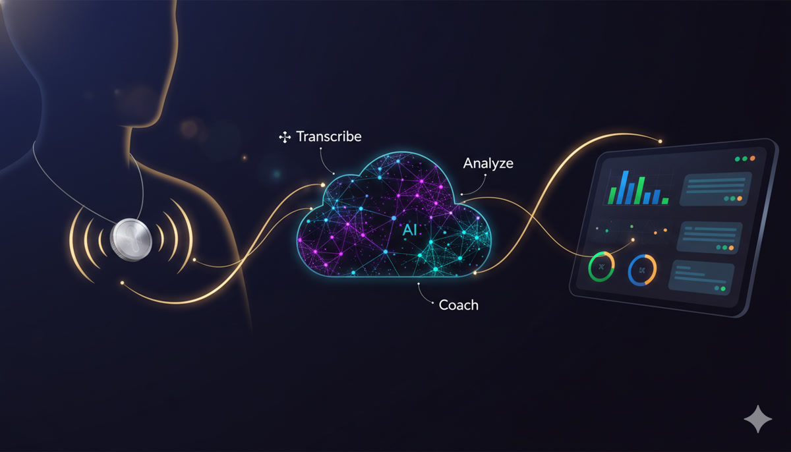{fig-align="center" width="100%"}

Before diving into the technical details, here's how all the pieces fit together:

```
┌─────────────────────────────────────────────────────────┐
│                    THE NUDGE PIPELINE                     │
│                                                           │
│   ┌──────────┐     ┌──────────┐     ┌──────────────┐    │
│   │  Omi /   │     │ Backend  │     │  Dashboard   │    │
│   │  Facade  │────▶│  Server  │────▶│  (SSE live)  │    │
│   │ (mic+    │     │ (FastAPI)│     │              │    │
│   │ whisper) │     │          │     │  Manager /   │    │
│   └──────────┘     └────┬─────┘     │  Kiosk view  │    │
│                         │           └──────────────┘    │
│                    ┌────▼─────┐                          │
│                    │  Claude  │                          │
│                    │   LLM    │                          │
│                    │          │                          │
│                    │ Analyze  │                          │
│                    │ against  │                          │
│                    │  SOPs    │                          │
│                    └──────────┘                          │
└─────────────────────────────────────────────────────────┘
```

**The flow:**

1. A wearable mic (Omi device or our laptop-based facade) captures conversation
2. Audio is transcribed to text (Whisper)
3. Text hits the backend via webhook
4. Backend runs an LLM analysis pipeline against domain-specific SOPs
5. Results stream to dashboards in real-time via Server-Sent Events

Simple in theory. The devil, as always, is in the details.

## The Facade Strategy: Demo Without Hardware

Here's the first interesting architectural decision. The hackathon was about building apps for the Omi wearable — but we didn't want to be blocked by hardware availability or Bluetooth connectivity issues on demo day. So we built a **facade**.

The facade is a separate service that mimics the Omi device's webhook behavior, but using the laptop's built-in microphone. From the backend's perspective, it's indistinguishable from a real Omi device.

```
┌─────────────────────────────────────────────────────┐
│              FACADE vs PRODUCTION                     │
│                                                       │
│  FACADE (Demo Mode)          PRODUCTION (Omi)        │
│  ┌──────────────┐            ┌──────────────┐        │
│  │ Laptop Mic   │            │ Omi Wearable │        │
│  │ (PipeWire    │            │ (BLE → Phone │        │
│  │  pw-record)  │            │  → Cloud)    │        │
│  └──────┬───────┘            └──────┬───────┘        │
│         │                           │                 │
│  ┌──────▼───────┐            ┌──────▼───────┐        │
│  │ Local Whisper│            │ Omi's Cloud  │        │
│  │ (port 2022)  │            │ Transcription│        │
│  └──────┬───────┘            └──────┬───────┘        │
│         │                           │                 │
│         └────────────┬──────────────┘                 │
│                      │                                │
│               ┌──────▼───────┐                        │
│               │   Backend    │  ← Same webhook        │
│               │ /webhook/    │     Same format         │
│               │ transcripts  │     Same analysis       │
│               └──────────────┘                        │
└─────────────────────────────────────────────────────┘
```

The facade uses **PipeWire** (`pw-record`) for audio capture — the native Linux audio system. It records at 16kHz mono (optimal for speech), then sends the audio to a local Whisper server for transcription. The transcribed text gets wrapped in exactly the same webhook payload format that Omi uses, and posted to the backend.

★ Insight ─────────────────────────────────────
**The facade strategy was a product philosophy, not just a workaround.** Building without the hardware first forced clarity about what actually mattered. It's a metaphor for product development: strip away the shiny thing and build the intelligence layer first. 100% of pre-hackathon time went into prompt engineering, domain design, and user experience — the parts that actually differentiate the product. When the Omi device arrived, integration took minutes.
─────────────────────────────────────────────────

The facade also handles **push-to-talk (PTT)** with role assignment. During a demo, you press a button, speak as "Waiter" or "Customer", and the facade prefixes the transcript accordingly. This lets a single person simulate a multi-party conversation.

## Deep Dive: The LLM Analysis Pipeline

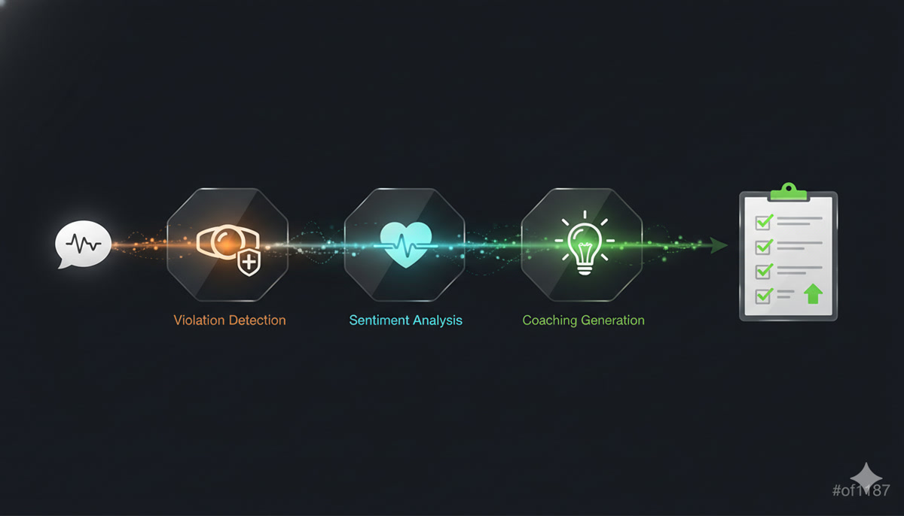{fig-align="center" width="100%"}

This is the heart of Nudge. Every transcript that arrives gets run through a multi-stage analysis pipeline, powered by Claude.

### The Pipeline Stages

```
┌─────────────────────────────────────────────────────────┐
│              ANALYSIS PIPELINE                            │
│                                                           │
│  Transcript arrives                                      │
│       │                                                   │
│       ▼                                                   │
│  ┌─────────────────┐                                     │
│  │ 1. BOUNDARY     │  "Is this a new customer            │
│  │    DETECTION    │   interaction, or continuing?"       │
│  └────────┬────────┘                                     │
│           │                                               │
│           ▼                                               │
│  ┌─────────────────┬─────────────────┐                   │
│  │ 2. VIOLATIONS   │ 3. SENTIMENT    │  ← parallel!     │
│  │    DETECTION    │    ANALYSIS     │                   │
│  │                 │                 │                    │
│  │ Compare against │ Rate staff tone │                   │
│  │ domain SOPs     │ 0-100 scale    │                   │
│  └────────┬────────┴────────┬────────┘                   │
│           │                 │                             │
│           └────────┬────────┘                             │
│                    ▼                                      │
│  ┌─────────────────────────┐                             │
│  │ 4. COACHING TIPS        │  Only if violations found   │
│  │    (conditional)        │  or sentiment < threshold   │
│  └─────────────────────────┘                             │
│                    │                                      │
│                    ▼                                      │
│           Results → SSE → Dashboard                      │
└─────────────────────────────────────────────────────────┘
```

A few design decisions worth calling out:

**Stages 2 and 3 run in parallel.** Violation detection and sentiment analysis are independent — they don't need each other's results. Running them concurrently with `asyncio.gather()` cuts the wall-clock time nearly in half.

**Stage 4 is conditional.** If there are zero violations and sentiment is high (the interaction went well), there's nothing to coach on. Skipping this stage saves an LLM call and ~3 seconds per clean interaction. In a typical restaurant shift, maybe 60-70% of interactions are clean — that's a lot of saved compute.

**Concurrency is carefully controlled.** LLM calls are expensive in both time and memory. A global semaphore limits concurrent Claude invocations, preventing the system from being overwhelmed when multiple transcripts arrive simultaneously (which happens — a busy restaurant might have five conversations happening at once).

### Violation Detection: Teaching an LLM to Be a Compliance Auditor

The violation detection stage is where the LLM earns its keep. The prompt engineering here went through many iterations. Some key challenges:

**The customer blame problem.** Early prompts would flag *customer* behavior — "Customer didn't say please." That's not an SOP violation. The system had to be explicitly instructed to ONLY analyze staff behavior, never customers.

**The severity calibration.** Not all violations are equal. Forgetting to upsell dessert is a `low` severity. Forgetting to ask about food allergies is `critical`. The severity guide in the prompt maps categories to severity levels based on actual restaurant risk:

| Severity | Examples | Score Impact |
|----------|----------|-------------|
| **Critical** | Safety violations, allergen warnings missed, hostile behavior | -25 points |
| **High** | Hygiene failures, negative team dynamics, profanity | -15 points |
| **Medium** | Service protocol missed, no table check-back | -8 points |
| **Low** | Upselling opportunity missed, greeting too brief | -3 points |

**The context sensitivity.** "Hi, welcome!" is a perfectly fine greeting at a casual restaurant. Early prompts flagged it as "greeting too brief." The system needed to understand that a short friendly greeting satisfies the SOP — you don't need a 30-second welcome speech.

**Prompt injection defense.** Since the input comes from real speech (transcribed), someone could theoretically say things designed to manipulate the LLM. The pipeline sanitizes transcripts before analysis, stripping patterns that look like prompt injection attempts.

### Sentiment Analysis: The Human Side

Beyond rule violations, sentiment analysis captures the *tone* of interactions. A waiter might follow every SOP perfectly but deliver it all with a monotone, disinterested voice. The sentiment score catches that.

The analysis rates staff tone on a 0-100 scale:

- **90-100** — Warm, enthusiastic, genuinely engaging
- **70-89** — Professional, friendly, good service
- **50-69** — Neutral, functional, could be warmer
- **30-49** — Curt, rushed, slightly dismissive
- **0-29** — Hostile, rude, unprofessional

The system also generates **improvement tips** — specific rewrites of what the staff actually said, with suggested alternatives. Not "be more friendly" (useless), but *"Instead of 'What do you want?', try 'What can I get for you today?'"*

### Three-Layer Resilience: Never Show "--"

LLM calls fail. Networks hiccup. Models return malformed JSON. And when they do, the dashboard must never show "--" for a sentiment score or silently drop violations. We discovered this the hard way: the analysis run would be marked "completed" even when the LLM returned nothing, leaving the UI permanently broken for that staff member.

The fix is a three-layer defense:

```
  Layer 1                    Layer 2                  Layer 3
  ACCURATE STATUS            RETRY                    FALLBACK
  ┌──────────────┐     ┌──────────────┐     ┌──────────────────┐
  │ LLM returned │     │ Retry once   │     │ Synthetic result │
  │ nothing?     │────▶│ (transient   │────▶│ score = 75       │
  │ Mark FAILED  │     │  errors fix  │     │ "Estimated"      │
  │ not complete │     │  themselves) │     │                  │
  └──────────────┘     └──────────────┘     │ UI always shows  │
                                            │ a number, never  │
                                            │ "--"             │
                                            └──────────────────┘
```

**Layer 1** tracks status accurately — a run that produced no data is marked "failed," not "completed." **Layer 2** retries once, because transient errors (rate limits, timeouts) often resolve on the second attempt. **Layer 3** injects a synthetic fallback (score 75 — neutral midpoint) so the UI always has something to show. 75 was chosen deliberately: neither alarming nor congratulatory.

Beyond retries, the pipeline uses:

- **Exponential backoff** — delays of 1s, 2s, 4s between attempts
- **Timeout caps** — 60 seconds for full analysis, 30 seconds for sentiment
- **JSON extraction** — A robust parser that handles LLM responses wrapped in markdown code blocks, extra whitespace, or partial outputs
- **Deduplication** — Hash-based dedup prevents the same violation from appearing twice when a transcript gets re-analyzed

## Deep Dive: Domain-as-JSON — One Codebase, Infinite Verticals

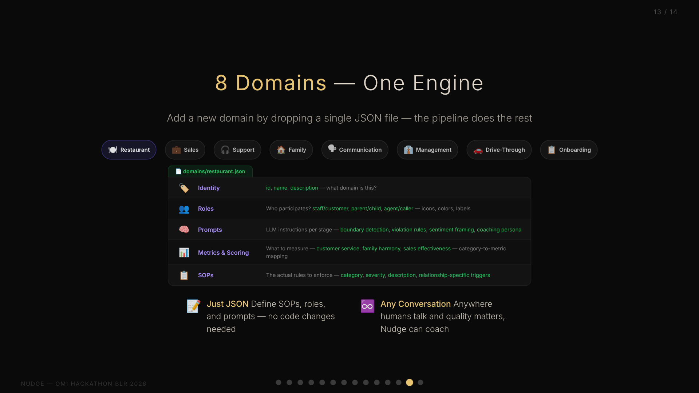{fig-align="center" width="100%"}

This might be the most interesting architectural decision in the entire project. Early on, we realized that "SOP compliance" isn't just a restaurant problem. Call centers have scripts. Hospitals have protocols. Even *families* have unwritten rules about communication.

The question was: do we build a restaurant SOP tool, or do we build a **platform**?

We chose platform. And the key enabler is what I call **Domain-as-JSON**.

### The Domain Schema

Every vertical — restaurant, family, sales, support — is defined entirely in a single JSON file. No code changes needed. The JSON contains:

```
┌─────────────────────────────────────────────────┐
│              DOMAIN JSON SCHEMA                   │
│                                                   │
│  ┌─────────────────────────────────────────────┐ │
│  │ Identity                                     │ │
│  │  • id, name, description                    │ │
│  │  • What domain is this?                     │ │
│  └─────────────────────────────────────────────┘ │
│  ┌─────────────────────────────────────────────┐ │
│  │ Roles                                        │ │
│  │  • Who participates? (staff/customer,       │ │
│  │    parent/child, agent/caller...)           │ │
│  │  • How to identify them in transcripts      │ │
│  │  • Display: icons, colors, labels           │ │
│  └─────────────────────────────────────────────┘ │
│  ┌─────────────────────────────────────────────┐ │
│  │ Prompts                                      │ │
│  │  • LLM instructions per analysis stage      │ │
│  │  • Boundary detection context               │ │
│  │  • Violation detection rules                │ │
│  │  • Sentiment analysis framing               │ │
│  │  • Coaching persona                         │ │
│  └─────────────────────────────────────────────┘ │
│  ┌─────────────────────────────────────────────┐ │
│  │ Metrics & Scoring                            │ │
│  │  • What to measure (customer service,       │ │
│  │    family harmony, sales effectiveness...)  │ │
│  │  • How to score violations                  │ │
│  │  • Category → metric mapping                │ │
│  └─────────────────────────────────────────────┘ │
│  ┌─────────────────────────────────────────────┐ │
│  │ SOPs                                         │ │
│  │  • The actual rules to enforce              │ │
│  │  • Category, severity, description          │ │
│  └─────────────────────────────────────────────┘ │
└─────────────────────────────────────────────────┘
```

### Restaurant vs. Family: Same Engine, Different Soul

The beauty of this approach becomes clear when you compare two domains:

**Restaurant domain:** 20+ SOPs covering greeting, hygiene, safety, upselling, team dynamics. Roles are Staff and Customer. Metrics track "Customer Service" and "Staff Sentiment." A `critical` violation is serving food without asking about allergies.

**Family domain:** This is where Nudge stopped being a business tool and became something personal. 10 core SOPs covering listening, gratitude, respect, patience, autonomy — plus 60+ relationship-specific SOPs that activate based on *who is speaking to whom*. Metrics track "Family Harmony" and "Warmth & Respect." A `critical` violation is comparing siblings — *"Why can't you be more like your sister?"*

The family domain isn't generic. It's modeled on a real family navigating a specific life stage: parents learning to treat adult children as peers, adult children practicing patience with aging parents, siblings maintaining trust. The SOPs capture the unique tensions of a household where everyone is an adult but relationships still carry decades of history.

Same analysis engine. Same dashboard. Same scoring system. Completely different *soul*. The technology that catches a waiter forgetting to ask about allergies also catches a parent dismissing their daughter's career autonomy. The architecture doesn't care about domain semantics — it just knows patterns of human interaction.

The prompts section is where the magic happens. The restaurant domain tells the LLM to be a "hospitality coach." The family domain tells it to be a "family counselor." The violation detection instructions for restaurant focus on service protocol; for family, they focus on emotional intelligence. These aren't just label changes — they fundamentally alter how the LLM interprets the same transcript.

### Relationship-Based SOPs: When Context Gets Personal

The domain-as-JSON system has one more trick: **relationship-based SOPs**. Human relationships aren't binary. A family has spouse dynamics, parent-child dynamics, sibling dynamics — each with fundamentally different norms.

The family domain defines relationship types with directional role pairs. When the system detects that a father is speaking to a daughter, it activates `parent_to_child` SOPs (empathy, autonomy, no comparison). When siblings are talking, `sibling` SOPs activate (sharing, no name-calling). The *same transcript* triggers different rules depending on *who is speaking to whom*.

This is a generic system — any domain could define relationship types. A management domain might have `peer_to_peer` vs `manager_to_report` SOPs. A sales domain might differentiate `cold_call` from `existing_customer`.

### Why AI Coaching Works: The Rama Framework

During development, we found validation for the approach in an unexpected place: an Economist podcast ([Boss Class S3E3](https://www.economist.com/)) profiling Glowforge's AI sales coach, which reportedly drove 50%+ productivity gains. The framework for where AI coaching succeeds maps perfectly to Nudge:

1. **Repetitive but not identical** — every conversation varies slightly, exactly where LLMs shine
2. **Tolerable correctness** — coaching suggestions, not clinical decisions. Being wrong 20% of the time is fine because a human reviews it
3. **Human already in the loop** — the manager console is a conversation starter, not a verdict
4. **Avoids the easy button** — coaching tips suggest improvements, they don't auto-correct

Nudge hits all four. It's not making medical diagnoses or legal judgments. It's offering suggestions that a shift manager can accept, modify, or ignore. The cost of a false positive is a 30-second conversation; the cost of a missed violation could be an allergic reaction.

### Eight Domains and Counting

At the time of the hackathon, we had built eight complete domain definitions:

| Domain | What It Monitors | Key Metric |
|--------|-----------------|------------|
| **Restaurant** | Food service staff compliance | Customer Service |
| **Family** | Household communication quality | Family Harmony |
| **Sales** | Sales call effectiveness | Deal Progress |
| **Support** | Customer support quality | Resolution Quality |
| **Communication** | General workplace communication | Communication Score |
| **Drive-Through** | Fast food drive-through efficiency | Speed & Accuracy |
| **Management** | Manager-to-team interactions | Team Morale |
| **Onboarding** | New employee training quality | Onboarding Score |

Adding a new domain takes about 30 minutes of writing JSON — no backend changes, no deployment, no code review. The entire personality of the system pivots based on a URL parameter: `?domain=family` vs `?domain=restaurant`.

★ Insight ─────────────────────────────────────
**The domain-as-JSON pattern is more than configuration.** It's a form of prompt engineering stored as data. Each domain JSON contains the entire "personality" of the system for that vertical — how it interprets speech, what it considers violations, how it coaches. This makes the system genuinely multi-tenant without any tenant-specific code.
─────────────────────────────────────────────────

## Deep Dive: Real-Time Architecture

A compliance tool that shows results 5 minutes later isn't very useful. Nudge needed to be **real-time** — from spoken word to dashboard alert in seconds, not minutes.

### The Webhook-to-SSE Pipeline

```
┌─────────────────────────────────────────────────────────┐
│              REAL-TIME DATA FLOW                          │
│                                                           │
│  Mic → Whisper → Webhook ──┐                             │
│                             │                             │
│                      ┌──────▼──────┐                     │
│                      │  Analysis   │                     │
│                      │   Queue     │  ← asyncio.Queue    │
│                      │             │    with semaphore    │
│                      └──────┬──────┘                     │
│                             │                             │
│                      ┌──────▼──────┐                     │
│                      │  Pipeline   │                     │
│                      │  (Claude)   │                     │
│                      └──────┬──────┘                     │
│                             │                             │
│                      ┌──────▼──────┐                     │
│                      │   Redis     │                     │
│                      │  Pub/Sub    │                     │
│                      └──────┬──────┘                     │
│                             │                             │
│              ┌──────────────┼──────────────┐             │
│              │              │              │              │
│        ┌─────▼─────┐ ┌─────▼─────┐ ┌─────▼─────┐       │
│        │ Dashboard │ │ Manager   │ │  Kiosk    │       │
│        │   (SSE)   │ │  (SSE)    │ │  (SSE)    │       │
│        └───────────┘ └───────────┘ └───────────┘       │
└─────────────────────────────────────────────────────────┘
```

**The webhook endpoint** accepts transcripts from both the facade and real Omi devices. It authenticates via either a shared secret header (facade) or a device-specific UID parameter (Omi). The transcript gets enqueued for analysis — not processed synchronously, because we don't want the webhook response to block while Claude thinks.

**The analysis queue** uses Python's `asyncio.Queue` with a worker that processes jobs sequentially per staff member but allows concurrent processing across different staff. A semaphore caps the total concurrent LLM calls — this is critical because Claude calls take 5-15 seconds each, and a busy shift might generate 20 transcripts in a minute.

**Redis Pub/Sub** bridges the gap between the analysis worker and connected dashboards. When the pipeline produces results (a new violation, an updated sentiment score, a coaching tip), it publishes to a Redis channel. Any number of SSE clients can subscribe to these channels.

**Server-Sent Events (SSE)** deliver updates to the browser. Unlike WebSockets, SSE is unidirectional (server→client) which is exactly what we need — the dashboard doesn't send data back, it just receives updates. SSE also reconnects automatically on network drops, which matters for a tool that runs during a full shift.

### The Concurrency Challenge

Here's a lesson learned the hard way: **SQLAlchemy async sessions are not safe for concurrent operations within a single transaction.**

Early in development, we tried to write violation results and sentiment results to the database concurrently (since they're computed in parallel). This caused intermittent database corruption. The fix: LLM calls run in parallel, but database writes are strictly sequential. The parallel computation saves wall-clock time; the sequential writes ensure data integrity.

```
  ✅ CORRECT                    ❌ WRONG

  LLM calls:                   LLM calls:
  ┌──────────┬──────────┐      ┌──────────┬──────────┐
  │Violations│Sentiment │      │Violations│Sentiment │
  └────┬─────┴────┬─────┘      └────┬─────┴────┬─────┘
       │          │                  │          │
  DB writes:                   DB writes:
  ┌────▼─────┐                 ┌────▼─────┬────▼─────┐
  │Violations│                 │Violations│Sentiment │
  └────┬─────┘                 └──────────┴──────────┘
  ┌────▼─────┐                      💥 Corruption!
  │Sentiment │
  └──────────┘
```

## Deep Dive: The Dashboard

All this backend machinery would be useless without a way to see the results. Nudge has three dashboard views, each designed for a different use case.

### The Main Dashboard

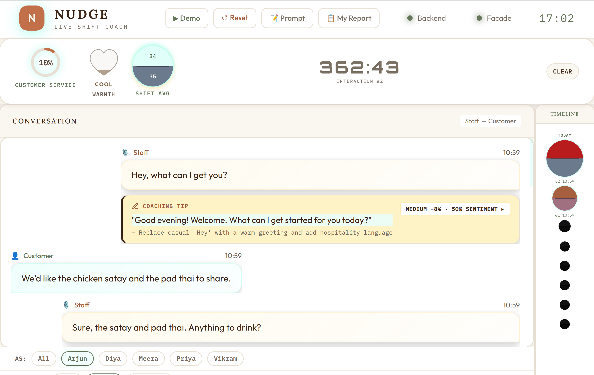{fig-align="center" width="100%"}

The dashboard is a single-page application built with vanilla HTML, CSS, and JavaScript — no React, no Vue, no build step. This was a deliberate choice for hackathon speed: zero toolchain overhead, instant reload, easy to deploy as a static file served by FastAPI.

Key elements:

- **Compliance gauges** — Real-time scores for each metric (customer service, sentiment) displayed as animated circular gauges
- **Staff timeline** — Each staff member's interactions plotted on a timeline, color-coded by violation severity
- **Violation feed** — Live stream of detected violations with severity badges, SOP references, and suggested fixes
- **Coaching tips** — AI-generated improvement suggestions, specific to what was actually said
- **Drill-down panels** — Click any staff member to see their individual interaction history, violations, and coaching tips

Everything updates live via SSE. No polling, no manual refresh.

### The Manager View

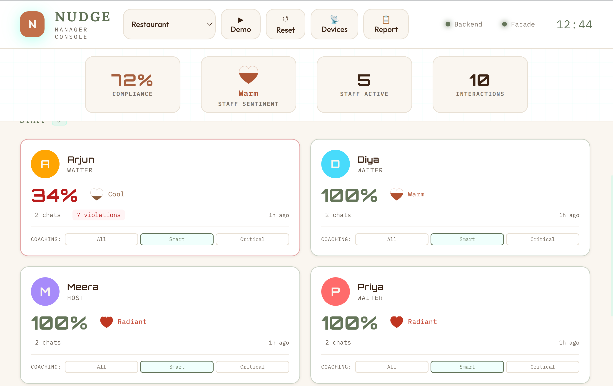{fig-align="center" width="100%"}

The manager view is designed for shift supervisors. It focuses on **per-staff performance** rather than individual violations. Key feature: the conversation replay. Managers can read the full transcript of any interaction and see exactly where violations were flagged — with the relevant SOP rule highlighted.

### The Heart Gauge: Visualizing Warmth

One design detail worth calling out: sentiment isn't shown as a number. It's shown as a **heart gauge** — an SVG heart that fills from bottom to top, with color interpolated through a 5-stop warmth palette:

| Score Range | Color | Descriptor |
|-------------|-------|------------|
| 0-15 | Slate | Cold |
| 16-35 | Mauve | Cool |
| 36-55 | Rose | Settling |
| 56-75 | Coral | Warm |
| 76-100 | Scarlet | Heartfelt / Radiant |

The color interpolation uses smoothstep (`t*t*(3-2*t)`) for perceptually smooth transitions. The heart pulses gently when the score is above 45. Each skin overrides the heart colors to match its palette. It's a small thing, but it transforms a clinical metric into something that *feels* human.

### The Kiosk View: The Break Room TV

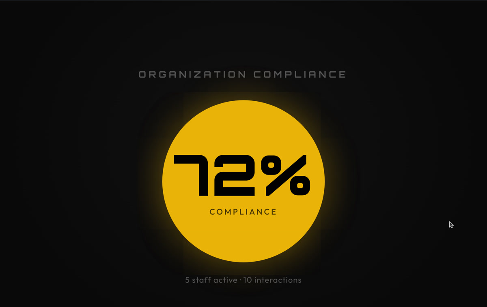{fig-align="center" width="100%"}

The kiosk view is designed for a TV mounted in the break room or kitchen. It's a "departure board" skin — giant text, auto-rotating slides, no interaction needed. Readable from 3 meters away.

The kiosk rotates through three slide types, all domain-driven:

- **Aggregate** — Giant compliance ring or heart gauge, staff count, interaction count. "How we're doing together."
- **Spotlight** — Individual staff member highlighted with their avatar, heart gauge, and an encouragement message
- **Nudge** — The most impactful coaching tip from the shift: "Instead of X, try Y" in large readable text

Each domain configures its own kiosk labels. The restaurant kiosk says "Everyone's on track!" when there are no violations. The family kiosk says "The household is in harmony today!" Same component, different soul.

## Multi-Domain in Action

Switching domains transforms the entire experience. Here's the family domain — same dashboard, completely different context:

::: {layout-ncol=2}
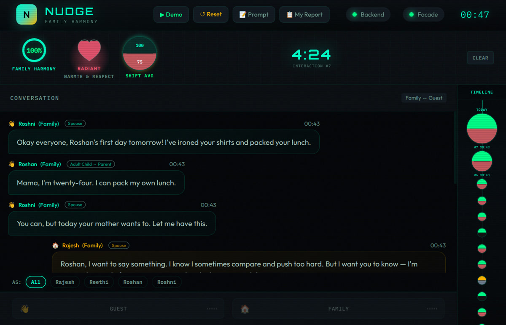{group="family"}

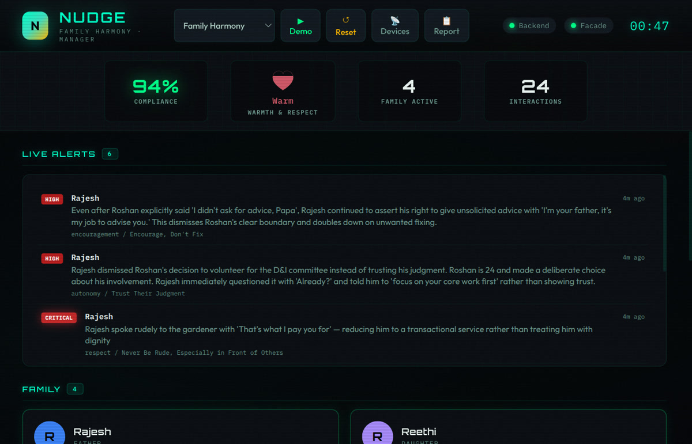{group="family"}
:::

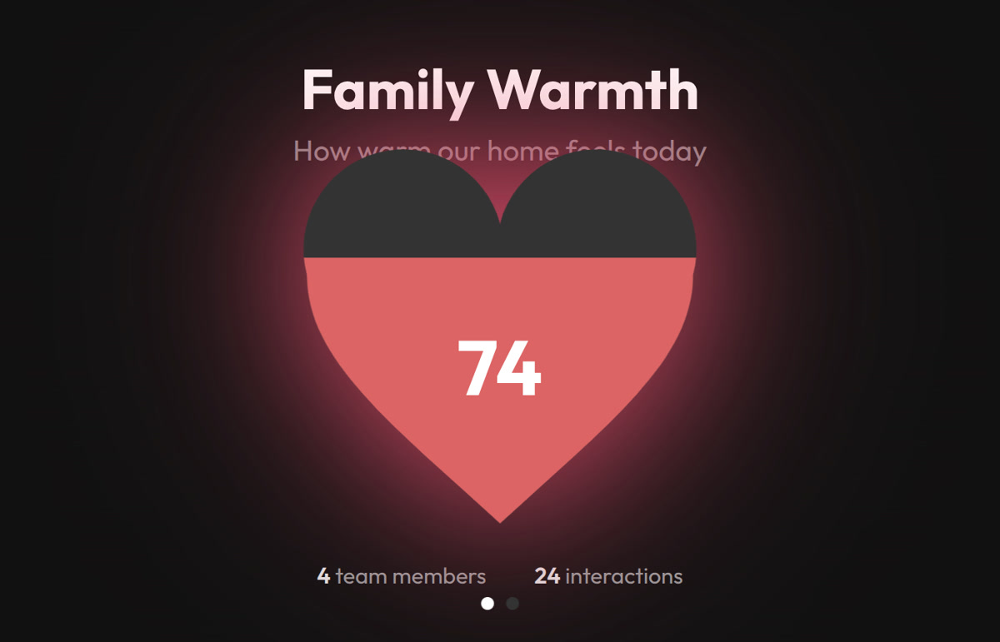{fig-align="center" width="80%"}

Notice how everything adapts: the role labels (Staff → Family), the metric names (Customer Service → Family Harmony), the icons, the color scheme, and most importantly — *what constitutes a violation*. In restaurant mode, not asking about allergies is critical. In family mode, comparing siblings is critical.

## Skins: 15 Visual Identities

Beyond domain switching, Nudge supports 15 visual skins — each with its own philosophy and aesthetic identity. This started as "let's add a dark mode" and escalated into a full design system.

::: {layout-ncol=2}
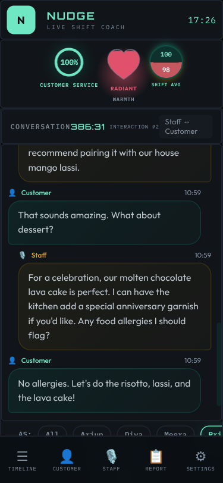{group="skins"}

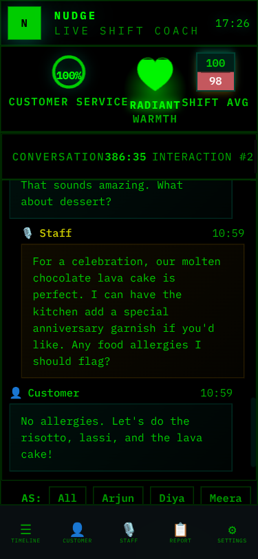{group="skins"}

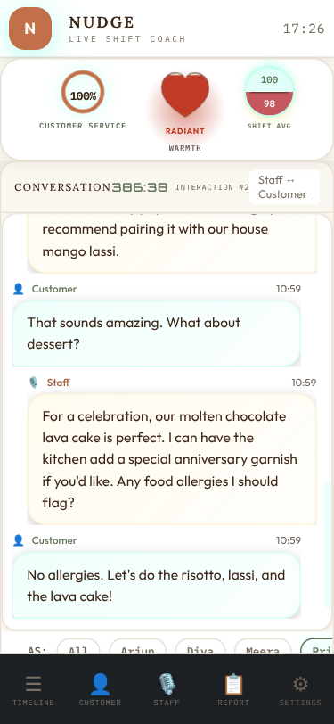{group="skins"}

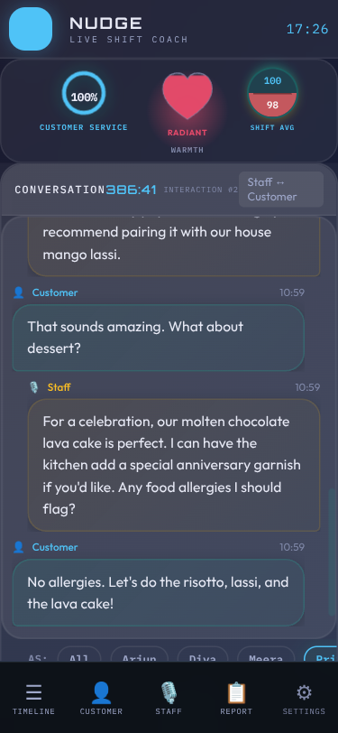{group="skins"}
:::

Each skin is pure CSS — no JavaScript changes. The skin system uses CSS custom properties (variables) for colors, fonts, and effects, switched via a `data-skin` attribute on the body element. A URL parameter (`?skin=terminal`) or the in-app skin switcher controls which skin is active.

Every skin answers a different "key question" — they're not just color swaps but philosophically distinct designs:

| Skin | Philosophy | Key Question |
|------|-----------|-------------|
| **Clean** | Matte control room | Does it feel calm and professional? |
| **Terminal** | Green-on-black log | Does it feel like reading server logs? |
| **Cafe** | Earthy, warm, inviting | Does it feel like a cozy menu board? |
| **Glass** | Frosted translucent | Does it feel like a premium glass UI? |
| **Neon** | Synthwave arcade | Does it feel like an 80s arcade? |
| **Porsche** | Precision luxury | Does it feel like a Taycan instrument cluster? |
| **Amazon** | Deep jungle canopy | Does it feel like the rainforest floor at dawn? |
| **Contrast** | Maximum readability | Can someone with low vision read everything? |

Domain and skin are **orthogonal** — any of the 15 skins works with any of the 8 domains. That's 120 visual combinations from one codebase.

★ Insight ─────────────────────────────────────
**Building 12 skins taught us more about CSS than any tutorial.** We discovered that `display: none` on a parent hides ALL children (including helpful "rotate to landscape" messages), that animation keyframes don't replay when DOM elements are recreated by polling, and that pastel colors that look great on dark backgrounds fail WCAG contrast on light backgrounds. Each skin was a crash course in CSS specificity, cascade, and accessibility.
─────────────────────────────────────────────────

## The Demo Inject: Hackathon Secret Weapon

Demo day at a hackathon is stressful. Network might be flaky. LLM API might be slow. Microphone might pick up the person next to you. You need a reliable fallback.

We built a **demo inject system** that pre-loads 10 realistic restaurant interactions with fully analyzed results — violations, sentiment scores, coaching tips, everything. One API call resets the database and hydrates it with the snapshot. The dashboard lights up with data instantly, no LLM calls needed, no network dependency.

The snapshots are generated offline: we run real conversations through the full pipeline, then serialize the database state to JSON. On demo day, it's a restore operation — fast, deterministic, and impressive.

Each domain has its own snapshot, so switching to `?domain=family` and hitting the demo button gives you a completely different dataset with family-appropriate interactions and violations.

## Deployment: Cloudflare Tunnel

For the hackathon demo, we needed the app accessible from a URL — judges might want to try it on their phones, and the Omi device needs a public webhook endpoint.

We chose **Cloudflare Tunnel** over ngrok for several reasons:

- **No interstitial page** — ngrok shows a "visit this site?" warning page in browsers that confuses non-technical users
- **Custom domain** — a clean, branded URL looks more professional than a random ngrok subdomain
- **No bandwidth caps** — ngrok's free tier has limitations that bite you mid-demo
- **Built-in rate limiting** — Cloudflare's rate limiting (30 req/min/IP) protects against accidental abuse

The tunnel exposes `localhost:8000` to the internet. The backend proxies PTT (push-to-talk) requests to the facade at `localhost:8001`, so everything is accessible through a single URL. Total setup time: about 10 minutes including DNS.

## Daily Reports: From Compliance to Empathy

Real-time alerts are useful *during* a shift. But what about *after*? Managers need a summary of the day. Staff need to know how they did. And here's where Nudge stops being a monitoring tool and starts being a *coach*.

### The Design Philosophy

The raw data is violations, scores, and compliance percentages. But imagine being a waiter who just worked a tough shift, and your phone shows: *"You had 7 violations and a 35% compliance score."* You'd feel judged. Defensive. You might never open the app again.

So we made a deliberate choice: the LLM prompt explicitly **bans** compliance language. Words like *violation, compliance, score, failure, non-compliant, penalty, infraction* never appear in reports. Instead, everything gets reframed through empathy:

| Compliance Framing | Empathetic Reframe |
|----------------|-------------------|
| "7 violations today" | "7 growth moments today" |
| "Compliance score: 35%" | Warmth level: "Warming Up" with hearts |
| "Failed to greet customer" | "Here's what you said" → "An idea for next time" |
| "Low sentiment detected" | "Room to add warmth" |
| "You need improvement" | "One thing to try tomorrow" |

The LLM is specifically prompted: *"You are a kind, experienced mentor writing a personal note. Lead with a win. Be specific. Reference their actual words."*

### The Staff Report: A Personal Note, Not a Scorecard

Every staff member gets their own daily report — a personal reflection on their shift. The structure follows a deliberate emotional arc:

1. **Greeting** — "Hey Priya, here's how your Wednesday went" (personal, warm)
2. **Your Win Today** — Always leads positive, even on a tough day. Arjun had 7 growth moments, but his report opens with: *"You handled two tables during a tough shift when the kitchen was slammed. You stayed on the floor, kept things moving — that reliability matters."*
3. **Day at a Glance** — Conversations count, moments captured, and a warmth label with hearts instead of percentages
4. **Highlights** — Specific moments from their actual transcripts, not generic praise
5. **Growth Moments** — Side-by-side speech bubbles: "What you said" → "An idea for next time," with context on *why* the alternative works
6. **Tomorrow's Focus** — One specific, actionable thing. Not three. One.
7. **Closing** — A quote and a personal sign-off using their name

<iframe src="reports/priya.html" width="100%" height="700px" style="border: none; border-radius: 12px; background: #0f1117;"></iframe>
<figcaption style="text-align: center; font-size: 0.85em; color: #666; margin-top: 0.5rem;">Priya's daily report — a "Shining" day with 5 hearts and specific highlights from her actual conversations</figcaption>

The warmth labels replace numerical scores entirely:

- **Shining** (80-100) — Celebration-heavy. Multiple highlights, maybe one optional polish suggestion. *"You're setting the standard for the whole team."*
- **Steady** (50-79) — Balanced. A couple highlights, one or two growth moments. *"Good day with room to grow."*
- **Warming Up** (0-49) — Growth-focused but *still genuinely positive*. The report finds something real to celebrate — they showed up, they kept the floor moving, they got the orders right. Then growth moments, max two, each with specific transcript evidence.

<iframe src="reports/arjun.html" width="100%" height="800px" style="border: none; border-radius: 12px; background: #0f1117;"></iframe>
<figcaption style="text-align: center; font-size: 0.85em; color: #666; margin-top: 0.5rem;">Arjun's daily report — "Warming Up" with growth moments shown as side-by-side speech bubbles</figcaption>

The speech bubble comparison is the heart of the design. It's not abstract advice ("be warmer") — it's *"You said 'Yeah the kitchen is backed up today. It's not my fault.' Try: 'I completely understand your concern. Our kitchen is experiencing higher than usual volume today, but I'm keeping a close eye on your order.'"* Then it explains *why*: *"This turns a tough moment into a chance to show guests you're on their team."*

A staff member reading this doesn't feel caught. They feel coached.

### The Manager Briefing: Patterns, Not Just Numbers

The manager gets a different report — analytical but still human. It opens with a one-line headline capturing the day's story, then provides:

- **Team Win** — What went well, with names
- **Today's Stars** — Who excelled and specifically why
- **Coaching Opportunities** — Who needs support, with the actual quote that triggered it, and a *concrete coaching suggestion* ("Pull him aside tomorrow and role-play handling wait time questions")
- **Today's Pattern** — The one theme across the team ("the warmth gap is our biggest opportunity")
- **Coaching Priorities** — Top 3 actionable items with who, what, and how
- **Individual Reports** — Cards linking to each person's private report

<iframe src="reports/team.html" width="100%" height="900px" style="border: none; border-radius: 12px; background: #0f1117;"></iframe>
<figcaption style="text-align: center; font-size: 0.85em; color: #666; margin-top: 0.5rem;">The manager team briefing — stars, coaching opportunities with actual quotes, and coaching priorities for tomorrow</figcaption>

The manager report includes direct transcript quotes in context. When it says Arjun needs coaching, it shows exactly what he said (*"Yeah the kitchen is backed up today. It's not my fault."*) and suggests exactly how to coach it (*"Practice the phrase: 'I completely understand — let me check on that for you right now.'"*). This isn't a dashboard metric — it's a conversation starter for tomorrow's pre-shift huddle.

### The Hybrid Prompt: 80% Cost Reduction

The key insight for reports: pre-aggregated metrics alone just restate dashboard numbers. Full transcripts are expensive and wasteful (most interactions are clean). The hybrid approach sends the LLM:

1. **ALL interactions** as compact score lines (number, compliance%, sentiment, violation count)
2. **FLAGGED interactions only** — key transcript excerpts around violations and coaching moments
3. **Existing coaching tips** so the LLM can spot patterns, not repeat advice
4. **Temporal ordering** so the LLM can discover trends ("improved after lunch")

This keeps prompts at ~2-3K tokens while giving the LLM enough context to discover cross-interaction patterns. Result: 80% cost reduction compared to sending full transcripts, with better output quality because the LLM can focus on what matters.

## What We Learned

### Technical Lessons

1. **Parallel LLM calls, sequential DB writes.** The async concurrency model matters. Getting this wrong causes subtle data corruption that's hard to debug.

2. **Skip work when possible.** Not every interaction needs coaching tips. Clean interactions (no violations + high sentiment) skip the coaching stage entirely. In a real deployment, this saves ~40% of LLM compute.

3. **Domain-as-JSON scales beautifully.** Adding a new vertical takes 30 minutes of JSON editing. The entire system personality — prompts, rules, metrics, scoring — lives in data, not code.

4. **SSE > WebSockets for dashboards.** When data flows only server→client, SSE is simpler, auto-reconnects, and works through proxies that sometimes break WebSocket upgrades.

5. **Facade pattern for hardware independence.** Building the facade first meant we could develop and test the entire pipeline without any hardware. When the Omi device arrived, integration took minutes.

### Design Lessons

1. **Skins are harder than they look.** CSS custom properties make color theming easy, but every skin needs testing across every page, viewport, and domain combination. We built [automated tooling](/studio-showcase/nudge/) for this.

2. **Severity calibration is everything.** The difference between a useful compliance tool and an annoying one is whether the severity levels match human intuition. Too many false positives and people ignore it. Too few and it misses real issues.

3. **Coaching tips must be specific.** "Be more friendly" is useless. "Instead of 'What do you want?', try 'What can I get for you today?'" is actionable. The LLM prompt engineering for coaching tips went through the most iterations of any component.

### The Hackathon Mindset

Our decisions log has exactly one entry: the day we chose the name. That's it. No second-guessing, no bikeshedding about tech stacks, no endless architecture debates. The remaining decisions — FastAPI over Flask, Claude over GPT-4, real-time over batch — were made quickly and never revisited. When you're building for a hackathon with a hard deadline, decision paralysis is the enemy. Trust your instincts, ship, test, iterate.

### The Bigger Picture

Nudge started as a restaurant SOP tool and became something broader. The domain-as-JSON architecture means it can be a **family communication coach**, a **sales call analyzer**, a **customer support quality monitor**, or a **new employee onboarding assistant** — all from the same codebase.

The wearable form factor is what makes it work. You can't ask people to talk into a phone or sit at a computer to get coached. But a small device clipped to their shirt that quietly listens and gently nudges? That fits into the flow of actual work and actual life.

The Omi device follows you from your shift at the restaurant to your drive home to your family dinner. Same device, different domains, same goal: helping you show up as the version of yourself you're proud of.

We're exploring the possibility of an ambient AI coach — a gentle nudge to make every human interaction a little better. At work. At home. Everywhere the wearable goes.

---

*Built for the [Omi Hackathon Bengaluru 2026](https://luma.com/jsl75ot5?tk=l93L0u). Try the [interactive presentation](/studio-showcase/nudge/).*
