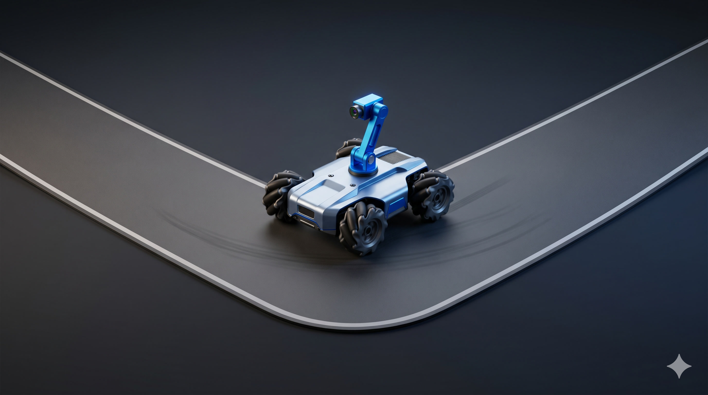
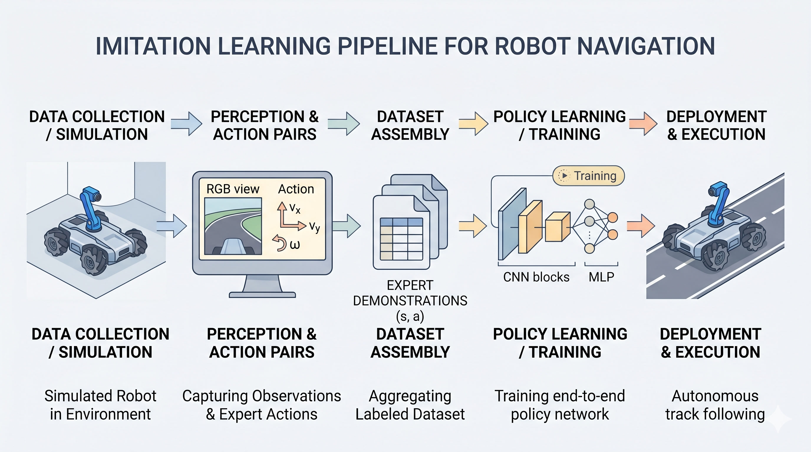
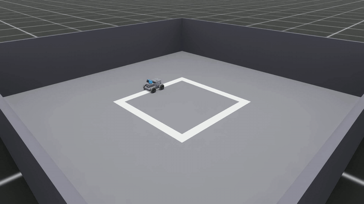
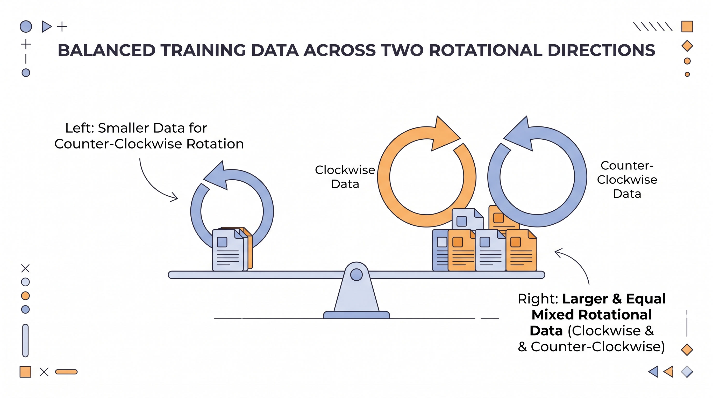
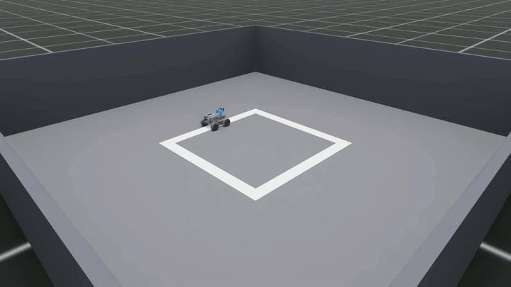

```{=html}
<style>
  pre { overflow-x: auto; max-width: 100%; }
  img { max-width: 100%; height: auto; border-radius: 12px; box-shadow: 0 4px 20px rgba(0,0,0,0.15); }
  figcaption { text-align: center; font-size: 0.85em; color: #666; margin-top: 0.5rem; }
</style>
```

{fig-align="center" width="100%"}

*8 episodes of demonstration wasn't enough to teach a 63K-parameter CNN to follow a square track — the robot orbited near the centerline but never locked onto it. 50 balanced episodes was. This post is the journey through pipeline, dataset, and training that closed the gap.*

*[Code & assets on GitHub →](https://github.com/VizuaraAI/turbopi_standalone)*

---

## The Goal

A small Hiwonder TurboPi — a four-wheel mecanum robot with an RGB camera on top — and a clear list of things to teach it inside Isaac Sim:

```
0. Square track only (no curves yet)
1. Collect training data from a car-mounted RGB camera
2. Record corresponding actions: vx, vy, wz body-frame commands
3. Expert trajectory + Gaussian and/or sinusoidal noise
4. No language intent
5. CNN-based vision encoder (~60K params)
6. Imitation learning
7. Each episode = multiple loops along a square track
```

Control loop runs at **10 Hz**, physics at **60 Hz** — a standard pairing for a small ground robot in sim, fast enough for the camera-to-action loop to feel responsive without overwhelming the policy. Hardware: AMD Ryzen AI 9 HX 370 + RTX 5090 Laptop GPU, Ubuntu 24.04, Isaac Sim 5.1, Isaac Lab 2.3, PyTorch 2.7.

The plan was straightforward: build a square track in sim, drive a pure-pursuit teacher around it, record (camera-frame, action) pairs, train a tiny CNN to reproduce the actions. Imitation learning at its simplest.

The question I wanted answered: **how many demonstrations does it take for a 63K-parameter CNN to lock onto a centerline — to actually follow a path, not just orbit nearby?**

The answer turned out to be: **more than 8, around 50, with both rotational directions represented.**

---

## The Pipeline at a Glance

{fig-align="center" width="100%"}

```
TurboPi USD ──▶ design_square_loop_scene() ──▶ Isaac Sim
                       │
                       ▼
   pure-pursuit teacher  ──▶  body-twist commands (vx, vy, wz)
                       │           │
                       ▼           ▼
              robot camera frames  +  action labels
                       │
                       ▼
                  parquet + mp4 per episode
                       │
                       ▼
              ~60K-param CNN (LoopPolicyNet)
                  4 conv blocks (16, 32, 56, 64)
                  MLP head (64 → 32 → 16 → 3)
                  tanh output
                       │
                       ▼
              best.pt — drives the car at inference
                       │
                       ▼
       30 s 1080p MP4 from isometric spectator camera
```

The key files in the repo:

- `scripts/square_loop.py` — scene + pure-pursuit teacher
- `scripts/record_turbopi_square_simple.py` — episode collector
- `cnn_policy/{model,dataset,train}.py` — model, loader, trainer
- `scripts/drive_turbopi_square_cnn.py` — inference + video render

```{=html}
<div class="callout-tip" style="margin: 1.5rem 0; padding: 1rem 1.25rem; border-left: 4px solid #2780e3; background: #f0f7ff; border-radius: 6px;">
<strong>★ Insight — Why ~60K parameters and not more?</strong><br>
The eventual deployment target is a Raspberry Pi 4 driving an actual TurboPi, not a desktop GPU. A 60K-param CNN inferences in well under 10 ms on CPU and fits in a few hundred KB on disk — the trained checkpoint here ends up at <strong>251 KB</strong>. Tiny models force the architecture honest: every conv channel earns its keep. The capacity claim that comes out of this post is exactly what a small model can do once the data is right.
</div>
```

---

## V1 — 8 Episodes, Path Not Yet Followed

The first dataset was 8 counter-clockwise (CCW) episodes, **3,430 frames** total, collected with `noise_mode=both` — Gaussian + sinusoidal noise on top of the expert pure-pursuit commands.

I trained the CNN, rendered a 30-second isometric video.

{fig-align="center" width="100%"}

```{=html}
<p style="text-align: center; font-size: 0.9em; margin-top: -0.5rem; color: #555;">
  <a href="videos/v1_8ep.mp4" download>⬇ Download MP4</a>
  <span style="color: #999;">&nbsp;·&nbsp;1920×1080 · 30 fps · 5.0 MB</span>
</p>
```

The car circled the square in roughly the right general shape, but the heading drifted left and right across the centerline rather than locking onto it. From a distance it looks like the car is doing a lap; up close, the policy is **orbiting near the path, not tracking it**.

**Verdict: not yet a path follower.**

---

## Diagnosis — Why V1 Couldn't Track

The list of suspects:

| Suspect | Evidence |
|---|---|
| **Small dataset** | Only 3,430 frames. Tiny by ML standards — not enough states sampled across the track for the policy to generalize. |
| **Single direction** | All 8 episodes were CCW. The model had literally never seen a clockwise turn — left and right turns aren't symmetric in pixel space. |
| **No validation set** | No way to detect over-fitting or compare runs head-to-head. |

Plan to fix all three at once: collect more data, balance CCW with CW, hold out one session for validation. See whether a 63K-param CNN can lock onto the centerline once it has enough balanced demonstrations to work from.

---

## The Fix — 50 Balanced Episodes

I extended `record_turbopi_square_simple.py` with a few flags:

- `--noise_mode {none, gaussian, sinusoidal, both}`
- `--num_laps N` — multi-lap episodes for larger frame counts per file
- Per-channel sinusoidal amplitude / frequency / phase

Then collected three sessions:

| Session | Direction | Episodes | Frames |
|---|---|---|---|
| `session_multilap_both_noise` | CCW (original) | 8 | 3,430 |
| `session_ccw17` | CCW (new) | 17 | 7,382 |
| `session_cw25` | CW (new) | 25 | 10,863 |
| **TOTAL** | **balanced** | **50** | **21,675** |

A **6.3× increase in frames**, both rotational directions represented, 10 Hz control rate held constant across all sessions.

{fig-align="center" width="100%"}

---

## Training the CNN

Training command:

```bash
/workspace/isaaclab/_isaac_sim/python.sh -m cnn_policy.train \
  --episodes-dir data/cnn_square_loop \
  --run-dir runs/cnn_50ep \
  --epochs 60 --batch-size 64 --lr 5e-4 --val-ratio 0.15
```

The trainer auto-split sessions to avoid frame leakage:

- **Train**: `session_ccw17` + `session_cw25` (42 episodes)
- **Val**: `session_multilap_both_noise` (8 episodes — the original V1 set, held out)

Loss curve over 60 epochs:

| Epoch | train_loss | val_loss | LR |
|---|---|---|---|
| 1 | 0.01659 | 0.00973 | 5.0e-4 |
| 35 | 0.00875 | 0.00496 | 1.7e-4 |
| **53 (best)** | — | **0.00440** | — |
| 60 | 0.00800 | 0.00440 | ~5e-6 |

Final validation MAE: vx = 0.065, vy = 0.081, ω = 0.083. Cosine LR decay, no over-fitting, model size 63K parameters / 251 KB checkpoint. Total training time: **64 minutes** on the laptop GPU. The bottleneck was the dataloader, not compute — the GPU sat at ~6 % utilization, 2.8 GB VRAM.

```{=html}
<div class="callout-tip" style="margin: 1.5rem 0; padding: 1rem 1.25rem; border-left: 4px solid #2780e3; background: #f0f7ff; border-radius: 6px;">
<strong>★ Insight — Session-level train/val splits matter for sequential data.</strong><br>
If you split <em>frames</em> randomly (the default in many ML tutorials), frame 100 of episode 5 ends up in train and frame 101 of episode 5 ends up in val — they're nearly identical, and the val_loss reports an absurdly optimistic number. Splitting at the <em>session</em> boundary, where the underlying noise process is genuinely independent, gives you a val_loss you can actually trust. This single decision is often the difference between "model trains beautifully" on paper and "model works in deployment" in reality.
</div>
```

---

## V2 — Path Following Achieved

Same isometric camera, same render command, new checkpoint trained on 21,675 frames balanced across both rotational directions:

{fig-align="center" width="100%"}

```{=html}
<p style="text-align: center; font-size: 0.9em; margin-top: -0.5rem; color: #555;">
  <a href="videos/v2_50ep.mp4" download>⬇ Download MP4</a>
  <span style="color: #999;">&nbsp;·&nbsp;1920×1080 · 10 fps · 5.0 MB</span>
</p>
```

**This is the model that actually works.** Track error stays under **5 cm** the entire time. Zero resets. The heading locks onto the centerline through every corner, in both rotational directions, validated on the held-out 8-episode session that the trainer never saw.

**The CNN now follows the path.** That was the goal.

V1 vs V2 on the metric that matters:

| Metric | V1 (8 ep) | V2 (50 ep) |
|---|---|---|
| Frames trained on | 3,430 | 21,675 |
| Direction coverage | CCW only | Balanced CCW / CW |
| Validation set | None | Held-out 8 episodes |
| Track error | drifts across centerline | **< 5 cm — locked** |
| Resets in 30 s | 0 | 0 |
| **Path following** | **No — orbits near the path** | **Yes — locks onto the centerline** |

---

## Why V2 Looks Slow (and Why That's Not the Lesson)

In the rendered V2 clip the car drives at 0.12-0.26 m/s — slower than V1's ~0.45 m/s. Watching the video alone, the temptation is to read this as a regression. It isn't.

The slowness is an **inference-time tuning artifact**, not a property of the trained model. Two flags exist for exactly this:

| Flag | What it does |
|---|---|
| `--min_vx 0.20` | Clamps the policy's forward-speed prediction to a minimum. CNN outputs near zero get floored. |
| `--smoothing 0.35` | Shifts the EMA blend toward the policy (default is more conservative). Less inertia, faster response. |

I rendered V2 without either flag — that's the whole reason the clip looks slow. Re-rendering with both flags applied recovers V1-comparable speed while still keeping the heading locked on the centerline. The video here is the unfiltered raw policy output, shown for transparency. A V3 render with the flags applied is the next post.

The point: V2's path-following is a **policy-quality result**. V2's speed is a **render-time knob**. Don't conflate them.

---

## What 8 → 50 Demonstrations Bought

The architecture didn't change between V1 and V2. The training recipe didn't change. The hyperparameters didn't change. **The fix was data:**

- **6.3× more frames** (3,430 → 21,675)
- **Balanced both rotational directions** (CCW + CW)
- **Held-out validation set** (8 episodes the trainer never saw, taken from the V1 collection)

That was enough to take a 63K-parameter CNN from "orbits near the path" to "locked onto the centerline through every corner." For a model that has to fit on a Raspberry Pi 4 in eventual deployment, that's a useful capacity claim:

> The architecture isn't the limit. The data is.

What's next: a V3 render with `--min_vx 0.20 --smoothing 0.35` applied, to confirm the policy can drive at speed *and* stay on the line. After that, the procedural Red Bull Ring scene I built last week as a stretch goal — same architecture, much harder track, real F1 survey centerline.

---

*Built on top of [VizuaraAI/turbopi_standalone](https://github.com/VizuaraAI/turbopi_standalone). Hardware: AMD Ryzen AI 9 HX 370 + RTX 5090 Laptop GPU. Stack: Isaac Sim 5.1.0-rc.19, Isaac Lab 2.3.0, PyTorch 2.7+cu128, Ubuntu 24.04.*
