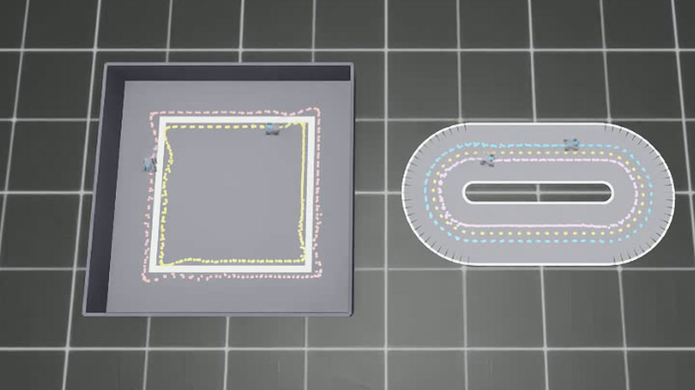
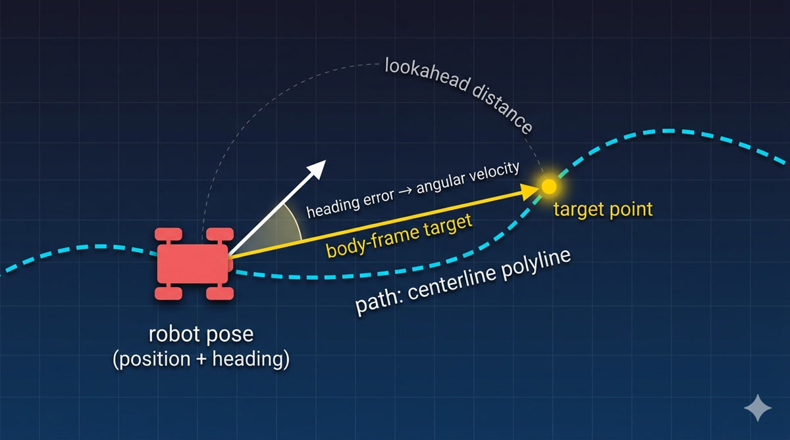
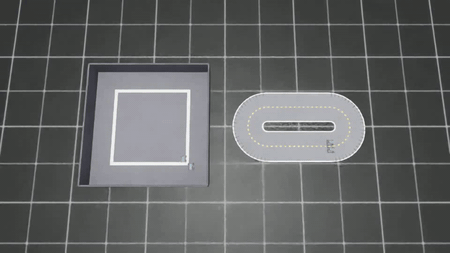

```{=html}
<style>
  pre { overflow-x: auto; max-width: 100%; }
  img { max-width: 100%; height: auto; border-radius: 12px; box-shadow: 0 4px 20px rgba(0,0,0,0.15); }
  figcaption { text-align: center; font-size: 0.85em; color: #666; margin-top: 0.5rem; }
</style>
```

{fig-align="center" width="100%"}

*On the left, the tape-on-dark square — the arena a CNN vision policy was trained on. On the right, an asphalt dogbone the policy has never seen. So what are our options? And how did we get the same robot circling a track no model was ever trained for — with no demonstrations, no retraining, no learning at all?*

---

## How we did it

The trick to driving a track no model has been trained for is this: **don't reach for the model. Reach for the geometry.**

The two cars circling the dogbone on the right are driven by a **pure-pursuit controller** — one of the oldest tricks in mobile robotics, formalized at Carnegie Mellon's NavLab project in the mid-1980s. (The two cars on the left run V2, the trained CNN driving its home arena — more on that in a moment.) The robot is a small Hiwonder TurboPi (four-wheel mecanum, ~13 cm wide), simulated in Isaac Lab on Isaac Sim 5.1. The PP controller is a few lines of math. No neural network. No training data. No learning of any kind.

Pure pursuit needs exactly two things to drive:

1. **The robot's pose in the world** — position and heading.
2. **A description of the path you want followed** — a sequence of `(x, y)` points along the centerline.

Then it runs the same four steps on every physics tick:

1. Find the nearest point on the path to the robot.
2. Look ahead a fixed arc-length distance and pick a *target* point.
3. Express that target in the robot's body frame — where is it relative to where the robot is currently pointing?
4. The heading error to that target becomes the angular velocity command. Forward speed scales with how much of the target is ahead vs to the side.

{fig-align="center" width="100%"}

*Pure-pursuit geometry: the robot's pose, the centerline polyline (cyan dashed), a lookahead arc to a target point on the path, and the heading error between the body-frame target and the robot's current heading. Four steps, no learning.*

That's the whole algorithm. Geometry, no learning. Hand the controller a new path — square, dogbone, oval, chicane — and it drives the new path on the next physics tick. **The cost of adding a new track is the cost of describing the new track.** No demonstrations to collect. No retraining. No transfer-learning hopes.

This is the answer to the question the lede poses: how do we drive the dogbone with no training? The CNN isn't driving the dogbone — it's on the left, circling the only arena it has been taught. The dogbone is geometry, not learning.

---

## So why train a CNN at all?

If pure pursuit is so cheap, why does V2 — the CNN vision policy on the left arena — even exist?

Because pure pursuit needs two things V2 doesn't: **the robot's world pose, and a hand-supplied map of the path**. Strip those away and PP cannot take a single step. It has nothing to compute against.

V2 takes a different bargain. It takes a single camera frame as input and outputs body-frame velocity commands directly. **No state. No map. No centerline. Only pixels.** That's a much weaker input requirement — pixels are always available, where world-pose and a hand-drawn map often aren't (think: a real TurboPi on a real classroom floor, with no motion-capture rig and no surveyor's drawing of the track).

The price V2 pays for that weaker input is everything PP got for free:

| Step | What V2 needs that PP doesn't |
|---|---|
| Episode collector | Code that drives the robot (with PP as the teacher) and dumps `(camera_frame, action)` pairs to disk |
| Demonstration sessions | Hours of simulator time per arena, with deliberate noise injection so the policy sees recoverable mistakes |
| Network architecture | A CNN small enough to fit on the deployment target — a Raspberry Pi 5 here. ~63K parameters, 251 KB checkpoint. |
| Training pipeline | Dataloader, loss, optimizer, learning-rate schedule, validation strategy |
| Validation set | Held-out demonstrations the trainer never sees, so val-loss is trustworthy |
| Training run | About an hour on a laptop GPU — for one arena |

The previous post in this series — [From Wobble to Track-Lock](../2026-05-02-from-wobble-to-track-lock/) — walked the V2 pipeline end-to-end. The headline number was **50 balanced demonstrations** to get a 63K-parameter CNN to lock onto the square centerline. The architecture wasn't the limit. The data was.

The asymmetry is the whole shape of the trade. **PP's cost is upfront and one-time** — write the controller once and it drives anything you can describe geometrically. **V2's cost is per-arena and recurring** — every new arena, every new lighting condition, every new camera mount potentially needs another collection-and-train cycle. Once V2 is trained, inference is cheap. Getting it trained is not.

---

## What side-by-side actually looks like

In the recording below, four cars drive simultaneously. The two on the left run **V2** — the CNN driving its training environment, a 2.0 m × 2.0 m tape-on-dark square. The two on the right run **PP** — pure pursuit driving a track V2 has never seen: a ~3 m asphalt dogbone with two semicircles connected by straights.

{fig-align="center" width="100%"}

```{=html}
<p style="text-align: center; font-size: 0.9em; margin-top: -0.5rem; color: #555;">
  <a href="videos/race.mp4" download>⬇ Download MP4</a>
  <span style="color: #999;">&nbsp;·&nbsp;960×540 · 30 fps · 5.9 MB</span>
</p>
```

What the recording demonstrates: each stack covers exactly the territory it is good at. V2 holds its line on the arena it was trained on — pixels-only, no map, no pose. PP holds its line on a track no model has ever been trained for — geometry-only, no images, no learning. Strip V2 of its training distribution and it drifts. Strip PP of its centerline polyline and it cannot start. **Neither stack would have been enough on its own. Side by side, each one fills in what the other lacks.**

---

## Lesson one — they are complementary, not competing

Once both stacks are understood as drivers, the comparison opens up across five axes at once:

| Axis | PP (pure-pursuit) | V2 (CNN vision policy) |
|---|---|---|
| **Input** | Privileged: world pose + full centerline polyline | Pixels from the on-board camera |
| **Generalization across track shapes** | Swap the centerline → drives any shape. Controller is shape-agnostic. | Trained on one specific arena. Will likely fail on a novel track or novel lighting. The policy *is* the arena. |
| **Failure mode** | Spins or stalls when its inputs are wrong | Drifts and wanders when its pixels are out-of-distribution |
| **Diagnosability** | One CSV + numpy. Cost: minutes. | Saliency maps, activation inspection, dataset coverage. Cost: hours-to-days. |
| **Cost to add a new track** | Define the centerline polyline. Done. | Collect demonstrations on the new track, retrain, hope it transfers. |

PP and V2 don't trade off neatly along a single axis — they trade differently along every axis at once. PP wins where map and pose are available; V2 wins where they're not. PP wins on diagnosability; V2 wins on input availability — pixels are usually around when a centerline polyline isn't. PP wins on track-shape generalization; V2 wins on visual fidelity to the real world (it sees the actual scene, not an idealized geometric path).

The first lesson the comparison surfaces: **these two stacks are not in competition**. They live in different regions of the input-availability and generalization-mode space. The right question to ask of any new task isn't "PP or V2?" — it's "which inputs do I have, and which costs am I willing to pay?"

```{=html}
<div class="callout-tip" style="margin: 1.5rem 0; padding: 1rem 1.25rem; border-left: 4px solid #2780e3; background: #f0f7ff; border-radius: 6px;">
<strong>★ Insight — PP is already V2's teacher.</strong><br>
V2's training data was produced by PP-style recorders driving the square track. Every PP improvement is implicitly a V2 training-data improvement, until V2 saturates against the teacher's quality. The two stacks aren't competing — one is the data source for the other. That's a present-tense observation about how they are already coupled, not a future plan.
</div>
```

---

## Lesson two — brittleness lives in different layers

The takeaway in one sentence: **PP's brittleness lives in the inputs. V2's brittleness lives in the model.**

PP is a faithful executor of whatever it's given. Hand it a clean centerline, it drives cleanly; hand it a broken one and it dutifully chases the discontinuity into the wall. PP cannot detect that its input is bad — there is no controller-side fix for an upstream error. The diagnostic layer for PP is the *signal feeding it*: the polyline, the pose estimate, the resampling step. Tuning gains will not save you from a broken polyline.

V2 fails at a different layer. The camera always works; what V2 cannot tell you is whether the pixels match the distribution it was trained on. Change the lighting, the floor texture, the arena shape — V2 will silently produce confident, smooth-looking commands and drive the robot off the track. The diagnostic layer for V2 is the *training distribution*: dataset coverage, saliency on out-of-distribution frames, embedding-space inspection.

These are completely different toolchains. PP debugging means geometry, signal processing, polyline arithmetic; V2 debugging means dataset analysis, feature visualization, distribution-shift detection. Treating PP and V2 as alternatives on a single quality axis hides the structure of the trade — and pushes you toward the wrong fix when one breaks.

---

## Conclusion — when to reach for which

Two practical rules come out of the lessons:

**Reach for PP** when you have privileged inputs (map + pose), the track shape might change, or you need it running today. PP's cost is one-time — once written, it's nearly free to deploy on any track you can describe geometrically. The dogbone in the recording is the proof: a track no controller had seen, driven cleanly on the first try.

**Reach for V2** when pixels are all you have, the arena is fixed, and you can pay the demonstration tax per environment. V2's cost is per-arena and recurring — in exchange, it needs nothing the camera can't deliver.

The choice between them isn't *algorithm or learning*. It's which inputs you actually have.

---

*Hardware: AMD Ryzen AI 9 HX 370 + RTX 5090 Laptop GPU. Stack: Isaac Sim 5.1.0-rc.19, Isaac Lab 2.3.0, PyTorch 2.7+cu128, Ubuntu 24.04.*
