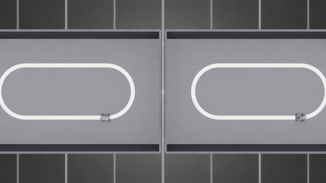
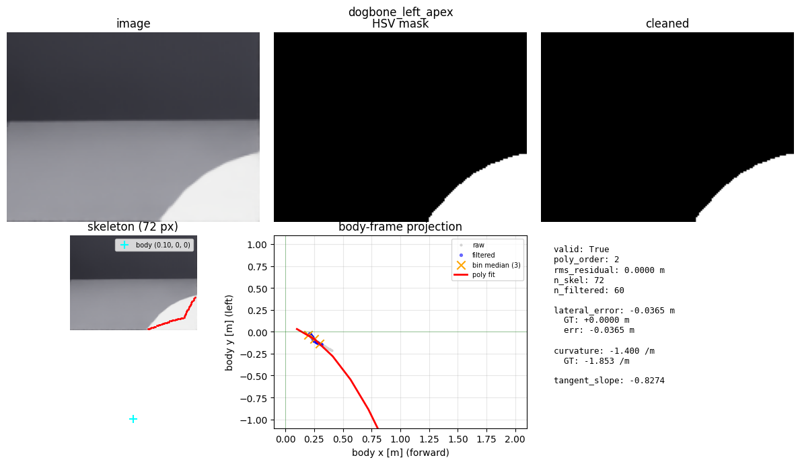

```{=html}
<style>
  pre { overflow-x: auto; max-width: 100%; }
  img { max-width: 100%; height: auto; border-radius: 12px; box-shadow: 0 4px 20px rgba(0,0,0,0.15); }
  figcaption { text-align: center; font-size: 0.85em; color: #666; margin-top: 0.5rem; }
</style>
```

{fig-align="center" width="100%"}

```{=html}
<p style="text-align: center; font-size: 0.9em; margin-top: -0.5rem; color: #555;">
  <a href="videos/dogbone_race.mp4" download>⬇ Download MP4</a>
  <span style="color: #999;">&nbsp;·&nbsp;1920×1080 · 30 fps · 13 MB</span>
</p>
```

*Both cars drive the same track. The car on the right is **PP-cheating** — short for "pure-pursuit, cheating". **Pure pursuit (PP)** is a classical, no-learning steering controller from 1980s mobile robotics: hand it a description of the path you want followed and it just drives, using geometry alone. The **"cheating"** part is what we feed it: the exact centerline of the track, copied straight out of the simulator. A real robot driving a real classroom floor would never get that — there's no oracle handing it a perfect map. So PP-cheating isn't deployable; it's a best-case baseline, the upper bound the previous post used to grade everything else against.*

*The car on the left, by contrast, **is not cheating.** Nobody hands it the centerline. It has to **work out the path for itself**, using only what it can see. On every frame, a small chain of classical computer-vision steps looks at the white tape in its dash-cam image and turns that into a path that pure pursuit can drive. The pure-pursuit controller underneath is bit-for-bit identical to the car on the right — same code, same gains, same math. The only thing that changed is where the path comes from: **pixels, through perception**, instead of a perfect copy from the simulator. No neural network. No training data. No learning anywhere in the loop. **Both cars finish 7 laps in 30 seconds. Lap times are within 1%.***

---

## How we did it

The previous post ended on a clean trade. **Pure pursuit** wins when you have a map and the robot's pose — it just drives. **A trained CNN** wins when all you have are pixels — but the policy *is* the arena it was trained on; show it a new track and it drifts.

**Here's a third option** — the one this research is about. Keep pure pursuit exactly as it was, and replace *only* the source of the path. Instead of looking the centerline up in a privileged map, let perception extract it from the dash-cam, frame by frame.

Think of perception as a small translator with one job: turn **"what the camera sees right now"** into **"about ten points up ahead, in the robot's own coordinates."** Pure pursuit doesn't care where those ten points came from. Hand it ten good points, it drives.

That's the whole architectural trick. The picture below shows what the translator's work looks like on a single frame — taken from the same recording at the top of this post. It's five visible stages on one page; walk through it left-to-right, top-to-bottom as you read what each step does.

{fig-align="center" width="100%"}

*The translator's worksheet on one frame. **Top row, left to right:** the raw dash-cam image, the white-pixels-only mask, the cleaned mask. **Bottom row:** the thinned-to-one-pixel "skeleton", and the result — body-frame ground points (gray), bin medians (orange ×), and the smooth red curve the controller will follow. The camera sees about a meter and a half ahead before the tape leaves the frame; the smooth curve stops where the camera stops.*

**1. Find the tape.** The tape is white. The floor is dark. The first step keeps only the bright pixels and throws the rest away. Anything above the camera horizon — wall, sky-dome, the bright line where they meet — gets zeroed. (Without that, the bright wall line at the top of every frame becomes a giant fake "road" the rest of the chain trips over.)

**2. Clean it up.** The mask comes out speckly and a little broken. Two quick passes — fill small gaps in the tape, then erase tiny dots that aren't tape — leave a clean white stripe.

**3. Thin it to one line.** A real piece of tape is several pixels wide. We want one line, one pixel wide — the spine of the snake.

**4. Walk the spine, but stop at corners.** Start at the bottom of the image, where the tape is closest to the robot. Walk upward along the spine. The moment the line bends sharply, stop.

Why? On a square track, a corner shows up as an "L": a forward leg, then a hard 90° turn into the perpendicular leg. If you keep walking past the bend, you end up trying to fit one smooth curve through both arms of the L, and the math goes sideways. Stopping at the bend keeps you on the *forward* part of the road — the part the controller actually needs to follow next.

**5. Translate from picture-coordinates to robot-coordinates.** What we have so far lives in pixels — *"row 47, column 82"*. Pure pursuit needs *meters*, in the robot's own frame — *"0.5 m ahead, 0.1 m to the left."* A bit of fixed geometry — where the camera is mounted on the mast, how it's tilted — converts each pixel back into a point on the ground.

**6. Smooth it and sample ten points.** The translated points are a little noisy. Group them by how-far-ahead they are, take the median in each group, and fit one smooth curve through the medians. Then sample about ten points along that curve, between roughly 10 cm and 1.5 m ahead of the robot.

One important rule for that last step: **do not extrapolate past where the camera could actually see**. If the tape ended a meter out, the polyline ends a meter out. (That rule turns out to matter a lot — see the square-failure section below.)

---

Output: ten points, in front of the robot, in meters.

Pure pursuit reads them and drives. The same nearest-point lookup, the same lookahead arc, the same heading-error-becomes-angular-velocity — every line of pure pursuit's controller — is unchanged from the previous post's privileged baseline. **The controller has no idea its input came from pixels instead of ground truth, and doesn't need to.**

That last sentence is the architectural lesson. The handoff between perception and control is one simple thing: a body-frame polyline. Ten points, in the robot's own coordinates. **Anything that can produce that handoff — classical CV today, a learned model tomorrow, a lidar after that — can stand in for ground truth without the controller noticing.** The seam is the lesson; the perception underneath it is replaceable.

---

## Why classical CV, not another CNN

A CNN could in principle learn the same input-to-output mapping (camera frame → body-frame polyline). The choice not to use one was deliberate.

**No training data.** The pipeline above has no learned weights. There is no demonstration corpus to collect, no dataset to label, no covariate-shift risk to monitor. Drop it onto a different track, or different lighting, or a different camera mount, and it either works or it visibly fails — without an intervening "we collected more data and retrained" cycle.

**Every failure has a visible intermediate.** When the classical pipeline produces a wrong polyline, the HSV mask, the cleaned mask, the skeleton, the projected ground points, and the polynomial fit are all there to look at. One of them is wrong, in a way you can see. Compare to a CNN that emits a noisy polyline: the diagnostic surface is the *training distribution* — saliency maps, embedding inspection, dataset coverage. Both are real tools, but their cost in a debugging loop is hours-to-days, where the classical pipeline's debug surface is a row of PNGs.

**The seam, not the perception, is the lesson.** Once the hybrid is wired, swapping the classical CV out for a CNN that emits the same polyline is a clean, one-module change. Pure pursuit keeps running. The result below still holds. Whether perception is HSV or a learned encoder is a downstream choice — and a downstream choice is exactly what you want, because it lets you upgrade perception without touching the controller.

---

## The curved track — the working result

Three trials, 30 simulated seconds each, on a 1.20 m track shaped like a stretched oval (two semicircles of radius ≈ 0.45 m connected by short straights — total arc length 6.75 m). Spawn rotated by ~120° between trials so perception sees three different camera headings.

| Trial | Perception+PP laps | PP-cheating laps | Perception+PP avg lap | PP-cheating avg lap | Perception+PP RMS dev | PP-cheating RMS dev |
|---|---|---|---|---|---|---|
| 1 | 7 | 7 | 3.939 s | 3.910 s | 0.021 m | 0.020 m |
| 2 | 7 | 7 | 3.919 s | 3.917 s | 0.021 m | 0.020 m |
| 3 | 7 | 7 | 3.942 s | 3.927 s | 0.023 m | 0.021 m |
| **median** | **7** | **7** | **3.939 s** | **3.917 s** | **0.021 m** | **0.020 m** |

7 laps to 7 laps, three trials in a row. Lap times within 0.5%. RMS deviation from the centerline 0.021 m vs 0.020 m — a 5% wider envelope, while running on a centerline polyline being extracted from the camera frame at 30 Hz. **Essentially indistinguishable from the privileged baseline on a track shape no learned model in this project has handled.**

The translator's worksheet shown earlier was a frame from this run: lateral error to the ground-truth centerline 3.65 cm, curvature estimate within 25% of ground truth. The polyline is biased a few centimeters and stops well short of the camera's far horizon — both expected, both fine for pure pursuit's lookahead.

---

## The square — and why it fails

The same hybrid, on a tighter track (0.9 m × 0.9 m square — what the trained CNN from the previous post was trained on) gets **0–1 laps**. PP-cheating on the same arena gets **4–6 laps in 15 seconds, 23 in 60 seconds**. Six independent attempts. Three controller-tuning sweeps — lower forward speed, anticipated-curvature slowdown, both combined — all produce the same failure: the car drives nearly straight off the first 90° corner.

The failure is **geometric, not algorithmic.**

The dash-cam is mounted with ~8.6° downward pitch on the mast. Its visible-ground horizon starts at body x = **0.21 m**. Anything closer is below the field of view.

On a 0.9 m × 0.9 m square, by the time the car is positioned to take the corner:

- The forward leg of the L-shaped tape is mostly *below* the camera horizon — the closest 0.21 m of tape is invisible.
- The post-corner perpendicular leg appears as a near-horizontal strip at body x ≈ 0.21–0.30 m, body y ≈ 0–0.13 m (limited by the lateral FOV at that distance).
- After binning by body x, only one or two buckets have skeleton points. Too few for the polynomial fit to indicate a kink.
- The fit returns "tape goes slightly off-axis", PP commands a small angular velocity, the car drives nearly straight off the corner.

By the time the camera *can* see the corner, the controller has roughly **150 ms** to execute a 90° turn. The perception+control loop adds 50–100 ms. There is no margin.

The oval track's gradual semicircles (κ ≈ 2.2 m⁻¹) live entirely inside the camera's visibility envelope. The square's corners (effectively-infinite κ) do not.

```{=html}
<div class="callout-tip" style="margin: 1.5rem 0; padding: 1rem 1.25rem; border-left: 4px solid #2780e3; background: #f0f7ff; border-radius: 6px;">
<strong>★ Insight — the hybrid does not fail because perception is wrong.</strong><br>
It fails because perception cannot see the corner in time. No amount of controller tuning changes that. Lower forward speed just stalls the car earlier. Anticipated-curvature slowdown waits for a curvature signal that isn't there. The failure is a structural property of dash-cam mount + corner radius + tape geometry, not a tuning deficiency.
</div>
```

That distinction is the architectural payoff. CNN failures usually look like *the policy outputs a noisy command*, and the diagnostic question is *why is the policy wrong here* — a question whose answer lives in the training distribution. Hybrid failures of this kind look like *the camera horizon and the corner radius are inconsistent*, and the diagnostic question is *can the sensor see what the controller needs* — a question whose answer lives in the geometry of the mount. Two completely different worlds, two completely different toolchains.

---

## When to reach for which

Three stacks, three sets of conditions. A cheat sheet:

| | **PP-cheating** | **Trained CNN** | **Perception + PP** (hybrid) |
|---|---|---|---|
| **Use it when** | You have a perfect map of the track *and* the robot's pose | All you have are pixels, and the arena never changes | All you have are pixels, the track shape may change, *and* your camera can see far enough ahead to spot turns in time |
| **Cost to add** | Write the controller once | Hours of demonstrations *per arena* | Write the perception pipeline once |
| **New track?** | Yes — drop in the new map and it drives | No — collect demos and retrain | Yes, *if* the new track's curves stay inside what the camera can see |
| **Breaks when** | The map is wrong or missing | Pixels go off-distribution: new arena, new lighting, new camera mount | Sharp corners hide under the camera's horizon |
| **Where you debug** | The polyline and the controller gains | The training distribution (saliency, dataset coverage) | Every step of the perception pipeline — each one has a visible intermediate you can look at |

The first two columns are from the previous post; they sorted the stacks by *what inputs you have*. **The hybrid adds a third dimension: *what your sensor can see*.** That's the new condition — and the one most likely to bite you. Pure pursuit by itself would never tell you the camera can't see the corner. Perception by itself would never tell you the controller needed those points ten centimetres earlier. The constraint only appears when you stand at the seam between them.

---

*Hardware: AMD Ryzen AI 9 HX 370 + RTX 5090 Laptop GPU. Stack: Isaac Sim 5.1.0-rc.19, Isaac Lab 2.3.0, PyTorch 2.7+cu128, Ubuntu 24.04. The numbers in this post come from a three-trial result on the oval track, a six-attempt result on the square, the classical-CV pipeline source, and the run protocol that produced both.*
